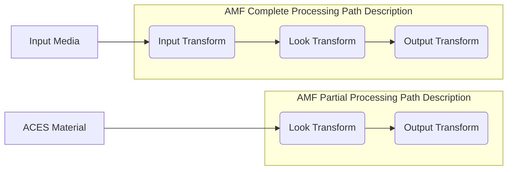
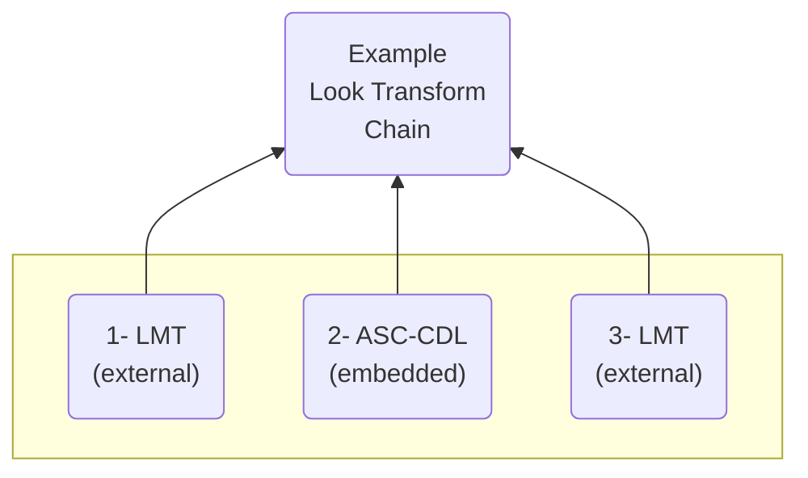
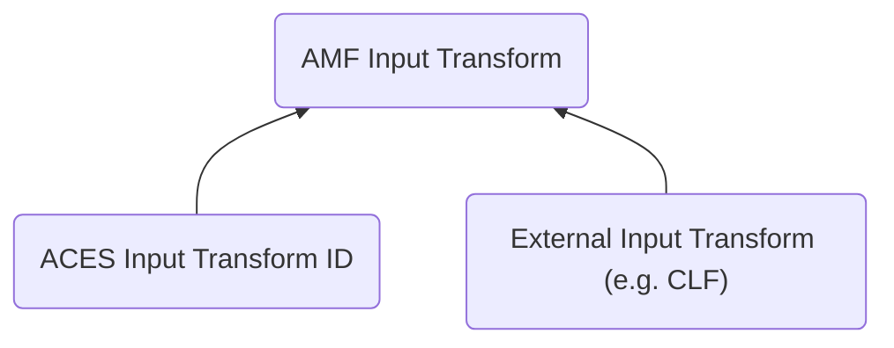

ACES Metadata File Implementation Guidelines and Best Practices 
================


Scope
----------------

This document provides implementation guidelines and best
practices related to the usage of the ACES Metadata File (AMF) in various
workflows.


Introduction 
----------------
The ACES Metadata File (AMF) is a sidecar file that describes the complete color pipeline for a piece of media. It specifies which ACES transforms—Input, Look, and Output—should be applied to an image or shot.

Using AMF ensures that color pipeline information can be exchanged consistently between different software applications and throughout the production process, preserving creative intent.

### Target Audience

This document targets both AMF users and AMF implementers because both groups
need the same level of understanding in order to design AMF-enabled workflows
and tools that support those workflows.

### Using the Official ACES Transform ID Registry
A critical aspect of ensuring interoperability with AMF is the consistent use of Transform IDs (`transformId`). Historically, different software applications sometimes used varying or proprietary identifiers for the same standard ACES transform, leading to inconsistencies when exchanging AMFs.

To solve this, the Academy now publishes an official **ACES Transform ID Registry**. This registry is the single source of truth for all standard ACES transforms. It is maintained as a machine-readable JSON file in the official ACES GitHub repository.

**Official ACES Transform ID Registry:** [https://github.com/ampas/aces/blob/main/transforms.json](https://github.com/ampas/aces/blob/main/transforms.json)

For maximum compatibility and predictability, implementations **must** use the URNs from this registry when referencing standard ACES transforms (Input, Look, and Output Transforms) within an AMF. Using registered `transformId`'s ensures that a transform reference is interpreted identically across all compliant software, fulfilling the core purpose of AMF.

When creating or parsing an AMF, software should validate `transformId`'s against this registry. If a `transformId` is not found in the registry, it should be treated as a custom or unknown transform.


What is AMF
----------------

AMF is an XML specification that describes the configuration of an ACES color
pipeline, together with the various input transforms, look transforms and output
transforms.

AMF is a "sidecar" element, usually accompanying some visual material such as a
video file, a sequence of frames, or a whole timeline. In the case of a
timeline, more than one AMF file can be used if the timeline requires different
configurations of the ACES pipeline. It is also worth mentioning that several
AMF files can reference the same visual material.

The opposite is equally true as all these visual elements can share a single AMF
file or a whole set of them. This of course is entirely dependent on the
workflow, and tools implementing AMF should be prepared to deal with this
flexibility.

In general, the relationship between the visual elements and the AMF files can
be described as a "many to many" relationship.


Why is AMF needed
----------------

The ACES framework is expanding and becoming richer in terms of input, look, and
output transforms. AMF describes the exact list of these different transforms,
in the order in which they have been or should be applied to obtain the desired
result.


 <figure markdown>
  <figcaption>AMF Processing Path Description</figcaption>
</figure>

This is a powerful feature because it can describe both configurations that must
be used to create a specific output, or configurations that have been used to
create a specific output.


<figure markdown>
  <figcaption>Example chain of looks, which can be ASC-CDLs or external LUTs.</figcaption>
</figure>

### The “applied” attribute

Each transform in an AMF can be tagged with the attribute called `applied` -
which indicates whether a transform **has already been applied**
(`applied=true`), in which case the transform has already been baked into the
image, or if the transform **has not been applied** (`applied=false`), in which
case the transform should be loaded as part of the viewing pipeline.

One use case of this might be when using the ACES Gamut Compression transform,
which may be baked into SMPTE ST 2065-1 ACES image data, and it is essential to
communicate to downstream software that it has already been applied, as to not
double-apply the transform, or invert it if necessary.


Lifecycle of AMF
----------------


This section describes the life cycle of an AMF and how it could be used within
each production stage.

### Camera

While on set, AMF could be imported in-camera and used to apply color pipeline
settings for video and file output, or exported to a camera card when using a
camera’s ACES viewing pipeline. See section 7 for more on cameras
reading/writing AMF.

### Monitor

Some professional monitors allow import of LUTs to apply looks in-device. AMF
could replace proprietary or uncommon LUT formats for improved interoperability.

### On-set live grading

An AMF may be read by on-set live grading software for the purpose of on-set
monitoring and color grading within ACES.

If anything is altered within the domain of the pipeline defined in the AMF, a
new AMF is created to reflect those modifications. For example, an ACES pipeline
is established in an AMF before production, then CDL adjustments are created
during production to create an updated AMF accordingly.

### Dailies

In a dailies tool, a pre-created AMF could be read and associated with OCF
(Original Camera Files) to apply pipeline settings (for viewing and rendering).
This could be done either by manual association or automatically.

In the process of creating the dailies, the color pipeline coming from an
existing AMF may be modified and updated. AMFs are written out with media to be
passed to editorial software. Commonly used interchange files (e.g. EDL or ALE)
can be used to conform AMF files with OCF, see below for more details.

### Editorial

Editorial software can apply pipeline settings provided by AMF(s) when importing
media to automatically set up viewing and rendering.

### VFX

Read AMF(s) when importing plates into VFX software and apply pipeline settings
for viewing. Given the prevalence of OpenColorIO across VFX software, it is
likely that a translation from AMF to OpenColorIO (OCIO) would be required.

### Color Grading

When in color grading, AMF could be conformed to a timeline and associated with
OCF to apply pipeline settings (for viewing and rendering). These applications
should also allow for look development in ACES and subsequent exporting of AMF.

### Review

Review software could automatically apply ACES pipeline settings for viewing
purposes by reading AMF(s) when importing media or by manually applying AMF(s)
to imported media.

### Mastering and Archiving

Read AMF(s) when importing media and apply pipeline settings for viewing.

Consolidate AMF(s) to meet specific archival delivery requirements.


Considerations on reading/writing AMF
----------------

This section outlines various scenarios related to the reading and writing of AMF files.

| Scenario | Read - An AMF is read when importing media and used to populate a color pipeline for viewing and rendering. | Write - A new AMF is written in order to be passed along to the next production stage. If a new AMF is done from a previous AMF, the previous pipeline might be archived in the <archived> section. |
|---|---|---|
| RAW Clips | AMF does not include any metadata for demosaic settings. Implementations need to ensure that the image is demosaicked to the appropriate color space before the Input Transform defined in the AMF is applied. User input may be required.<br>If software chooses to directly demosaic a RAW image to ACES, the Input Transform defined in the AMF must be ignored. | n/a |
| Input Transform Conflict | A clip has already been loaded into the software, and an Input Transform is already applied. Default behaviour should be to override that Input Transform with what’s specified in the AMF, but the user should be prompted. | n/a |
| Output Transform Conflict | If the AMF specifies an Output Transform that is in conflict with the respective shot’s Output Transform, then this conflict must be handled. The default behaviour should be to stick with the project-wide Output Transform, but it may be useful to indicate a conflict to the user.<br>Example: An AMF is generated from a software platform that uses the Rec709_100nits transform, and is then read by a software platform that is using an HDR Output Transform. | The Output Transform that was indeed used for viewing should be specified in the AMF. |
| Manual AMF Batch Import/Export | Consider the use of commonly used interchange files (e.g. EDL or ALE) to batch import AMF’s to a timeline.<br>Ideally, the software would allow for a partial import of only the Input, Look, or Output Transforms of a given AMF. | When exporting a batch of AMF’s for an entire timeline, consider exporting commonly used interchange files (e.g. EDL or ALE) to create an association between Clips and the exported AMF files. |
| Inter-AMF Output Transform Conflict | If AMF’s are batch imported into a single timeline, and at least two of them have different Output Transforms defined, consider prompting the user if this inconsistency exists, and provide appropriate options to address. This has the assumption that the user will only be using one Output Transform at a time for an entire timeline. | n/a |
| Pipeline Override | If an AMF has already been applied to a shot, or if project/timeline settings apply, and a subsequent AMF is read for that shot, consider prompting the user before overriding pipeline.<br>Ideally, the software would allow for a partial import of only the Input, Look, or Output Transforms of a given AMF. | Consider including multiple AMF transform pipelines by making use of AMF’s `aces:archivedPipeline` element. |
| Updating Look Transforms | n/a | Local changes to transforms in the AMF should not affect any other transforms if the pipeline structure doesn’t change, e.g. when only updating CDL values, but none of the other transforms change, the AMF structure should not be changed and only the CDL values should be updated. Any changes to the transform pipeline will result in a new AMF and global values, e.g. the `dateTime` element, are therefore expected to change. If CLF(s) are used in the pipeline, consider using CLF UUID and/or its hash to make sure that the CLF has not changed. |
| Look Transform Support | If an AMF references a Look Transform with a format that the application does not support reading, consider notifying the user that the format is unsupported, so it is clear the error is unrelated to the AMF itself. | When producing a new Look Transform for an AMF export, consider defaulting to CLF, a format that ensures high interoperability,, especially for any operations other than ASC CDL. It’s important to consider what to do when using CDL operations vs other grading operations and how these should be reflected in the AMF document: in elaborated pipeline where CDL are “in between” other more sophisticated grading operations, it might be required to let the user identify and decide over what CDL operations should be treated as such and which ones can be baked with other operations into a consolidated CLF |
| Cameras | Import AMF in-camera and apply pipeline settings for video and file output.<br>An AMF loaded in camera could specify over SDI how to treat the incoming signal (ie Output Transform)<br>There are reasonable expectations that any in-camera processing, for the foreseeable future, will be done utilizing small 3D LUTs at the highest complexity. Therefore, applications of an ACES pipeline in-camera may be limited in precision. | When should a camera generate an AMF?<br>If a camera generates an AMF, where should it be written?<br><br>#1 Preferred Method:<br>* Embedded in the OCF, e.g.REDCODE RAW R3D <br><br>#2 Preferred Method:<br>* AMF should live in the same directory as its associated clip<br><br>#3 Preferred Method:<br>* A single folder with all AMF files |
| Metadata Population | Parse the AMF for its filename and `aces:uuid` and write these to the appropriate metadata fields for each clip. | If the AMF associated with a clip changes, the value relative to the AMF metadata fields within the editorial software should change and adopt the new values. So when writing<br>commonly used interchange files (e.g. EDL or ALE) the correspondent values are correct. |
| Applied Tag | When reading an AMF file that has the `applied=true` attribute for a specific transform, the software should NOT apply the transform to the file, since it has already been applied to the image itself. Consider reporting it to the user if applicable (e.g. a “history” log of the transforms is accessible for each clip) | When exporting AMF’s from a timeline of clips that have not been rendered yet, each transform in the AMF should be tagged as `applied=false`.<br>However, when rendering new files, consider having the ability to export new AMF’s files simultaneously as part of the same deliverable and, in this case, each transform that is actually baked in should be tagged as `applied=true` in the AMF (e.g. the Input Transform if rendering OpenEXR ACES 2065-1 VFX pulls, or everything when exporting 709 proxies for editorial). |
| Archived Pipelines | Consider allowing the user to toggle between different ACES pipelines that are recorded in the `aces:archivedPipeline` element.<br>Otherwise, `aces:archivedPipeline` elements should be preserved for any new AMF’s subsequently created for the same shots. | If the software is updating a pre-existing AMF, the written AMF should include the appropriate `aces:archivedPipeline` element. |


Structure of AMF
----------------


AMF is a specification based on the XML markup language. It is fully described
in [Academy Specification S-2019-001](https://aces.mp/S-2019-001). The
specification also comes with an XML Schema that can be used to validate the AMF
documents.

The XML Schema is publicly available here:
https://github.com/ampas/aces-amf/tree/main/schema

It is strongly recommended to use the specification as a reference in order to
better understand the concepts described here.

### AMF document sections

AMF documents are mainly divided in 3 sections:

 1. `aces:amfInfo` - this section provides descriptive information about the AMF
    itself. 
 2. `aces:clipId` - this section provides a reference to the visual material
    (OCF or rendered images) that this AMF is applicable for. 
 3. `aces:pipeline` - this section describes the ACES pipeline configuration.

### General descriptive information

The `aces:amfInfo` element contains various sub-elements that provide
descriptive information about the AMF document but also a mechanism to help
identification. More specifically two sub-elements deserve some consideration:

* `aces:dateTime` 
* `aces:uuid`

The mandatory `aces:dateTime` element contains the creation and modification date.
The `aces:uuid` element is also required, and is designed to carry a Universally Unique
Identifier (also known as Globally Unique Identifier, or GUID on some systems).
The Universally Unique Identifier is specified in IETF RFC 4122 as well as other
ISO and ITU documents.

Both `aces:dateTime` and `aces:uuid` elements are not filled in by a human
operator but rather automatically generated by the tool used to create the AMF
document.

#### AMF naming and identification

In general, the most common method that everyone uses to distinguish between two
files is by comparing file names and/or their creation and/or modification date
in the file system. However, this method quickly reveals itself ineffective when
files are exchanged between various computers and operating systems because
these file properties can easily be changed without any sort of warning.

As explained above, AMF files usually come in large numbers and are moved across
various systems and processed by various tools during their life cycle. Because
of this situation, a better approach is to make good use of the information
contained in the document itself.

However, to avoid common pitfalls like overwriting files, the following file
naming convention is recommended:

AMF files should conform to the following file naming convention:

`<description>_<date>_<time>.amf`

`<description>` should describe the following, if applicable:

* Purpose: the use case of the AMF file (eg. “dailies”, “SDR_709”, “VFX-Pull”) 
* Clip: Clip ID as in the AMF specification 
* Show Name: Title or other identifiers of the associated show 
* Author: Author of the AMF

`<date>` is the date of creation, using the format YYYY-MM-DD `<time>` is the
time of creation, using the format HHMMSSZ (trailing “Z” indicating “Zulu” time,
see below)

Values for `<date>` and `<time>` are determined at the start of the operation
that results in the creation of the AMF file and the values are represented
using the Coordinated Universal Time (UTC) standard.

Example: `Dailies_ShowName_A002R2EC_2019-01-07_080228Z.amf`

#### Using date and time mechanism 

As mentioned above, the `aces:dateTime` is a mandatory element and it is defined
using the standard XML type `xs:dateTime.` Because this definition is very
flexible, it is strongly recommended for the tools to always use the most
explicit form that includes the year, month and day, the time of the day in
hours, minutes and seconds as well as the time zone. This practice ensures that
the creation and modification dates and times are giving a good indication on
the location where the document was created/modified.

#### Using the unique identifier mechanism 

A primary identification mechanism is the required `aces:uuid` element. The UUID is a much safer tool to distinguish between two AMF documents than file names or dates alone. UUIDs are automatically generated by the authoring software and must never be hand-crafted.

#### Combining several identification mechanisms

In order to improve the identification mechanism, one can combine both the UUID
checks and creation/modification times. This might be helpful if two AMF
documents contain the same UUID but have different creation/modification dates.

In practice, when using dedicated tools to create and manage AMF files, such
situations should not occur, but AMF files can still be manually altered. If
this is the case, further inspection of the AMF documents can help to
distinguish them. Such advanced methods will be discussed later in the document.

It is worth mentioning here that there are situations where two or more AMF
documents can have the same unique identifier but have different creation dates
and time. It is then recommended that tools encountering this situation switch
to the most recent version of the AMF document based on the date and time.

#### Informing the user and logging conflicts

Because of the large number of AMF documents involved in a workflow, it might
not be practical to inform the user of every error encountered. However these
errors should be logged by the tools using AMF and options should be offered to
select the various identification rules, e.g. unique identifier first (if
available), then the creation date and time.

### Clip information and association

As described in the previous sections, AMF can be used with different targets,
i.e. single file video clips, image sequences, compositions, etc.

This flexibility implies that the AMF specification does not prescribe a
specific way to create the connection with the target material. Instead, the
specification offers different connection mechanisms via the `aces:clipId,` an
optional structure that in turn contains child elements to help with the
handling of the various situations.

The first important observation to make is that the `aces:clipId` element itself
is defined as optional. In this context, optional does not mean that the
presence or absence of the `aces:clipId` element does not affect the workflow and
how tools that support AMF behave. The term optional must be understood as a
switch between two categories of workflow: the first does not connect an AMF
file to a specific visual material and the second does connect an AMF file to a
specific visual material.

Depending on the workflow in use, an implementation must handle the presence or
absence correctly and report errors if necessary. Typically, the XML validation
only will not be enough to distinguish between a valid AMF file and an invalid
one, since the `aces:clipId` element is optional.

In other words, the `aces:clipId` does not dictate how the AMF document is
handled. It is the workflow that dictates the behavior.

#### `aces:clipId` is not present

The absence of the `aces:clipId` element is important when the connection between
the AMF document and the visual material is handled by a higher level protocol.


The simplest higher level protocol that comes immediately to mind is the use of
the file system and some sort of naming convention. For instance, a folder can
contain a video clip and the related AMF file like this:

```
./myVideoClip.mxf 
./myVideoClip.amf
```

In this simple situation, an implementation that can read the the myVideoClip
file could also look for a secondary file named myVideoClip.amf and if it is
present and if it is a valid AMF document consider that there is a "connection"
between the two files and act accordingly.

While this seems to be a natural thing to do, it is certainly something to
avoid. First of all, this kind of "connection" would work in a limited number of
situations and then it would also prevent more elaborated workflows from
existing. 

Consider the following modified example:

```
./myVideoClip.mxf 
./myVideoClip.mov 
./myVideoClip.amf
```
In this variant, it's impossible to guess if myVideoClip.amf is related to
myVideoClip.mxf or to myVideoClip.mov or to both files.

To solve this problem, the `aces:clipId` element must be used to establish the
desired connection between the AMF document and the correct targeted visual
material.

A single AMF document can be "shared" by multiple video clips or image sequences
or even compositions. While it's certainly possible to invent a solution based
on the file system naming capabilities via a fixed folder/file structure and
naming convention, it is not recommended.

In practice, workflows that involve multiple visual material elements, and one
or more AMF documents, shared or not, make use of a control file that acts like
a database, describing the complex relationships that may exist.

This handbook defines the use of AMF in conjunction with some popular commonly
used interchange files:

1. [Avid Log Exchange (ALE)](#avid-log-exchange-ale-support)
2. [CMX3600 Edit Decision List (EDL)](#edit-decision-list-edl-support)

The AMF Implementation Group explored the use of AMF with higher level protocols
as well and those will eventually be described in a future version of this
handbook.  A future version may also describe the use of AMF with OpenTimelineIO.

#### `aces:clipId` is present

When present, the `aces:clipId` element provides a reference to the visual material (e.g., OCF or rendered images) to which the AMF applies. The `aces:clipId` element must contain:

1.  A mandatory `aces:clipName` element.
2.  Exactly one of the following elements to identify the media:
    *   `aces:file`: References a single media file.
    *   `aces:sequence`: References a sequence of image files.
    *   `aces:uuid`: References the media via a Universally Unique Identifier.

The choice between `aces:file`, `aces:sequence`, and `aces:uuid` is mutually exclusive; only one can be used within a single `aces:clipId` element. This allows the AMF to be linked to a specific piece of media in a way that best suits the workflow.

#####  `aces:clipName`
The `aces:clipName` is used to carry the name of the target visual material
element, but not the file name of that element. Typically `aces:clipName` is the
same as the file name but without the file extension or the frame number digits
in the case of a file sequence.

```xml
<aces:clipId>
    <aces:clipName>A001C001</aces:clipName>
</aces:clipId>
```

##### `aces:file`

The `aces:file` element is used to carry the actual file name of the target visual
material element. It can carry the full absolute path and the file name, a
relative path and the file name or simply the file name (base name and
extension) of the target visual material element.

In practice, the filename itself is used, like the example below:

```xml
<aces:clipId>
    <aces:clipName>A001C001</aces:clipName>
    <aces:file>A001C001.mxf</aces:file>
</aces:clipId>
```

##### `aces:sequence`

The `aces:sequence` is similar to `aces:file,` however it is primarily designed to
handle image sequences. Image sequences usually follow a file name pattern and
the only difference between two files of the same sequence, is a number which
indicates the file's position in the sequence. Moreover, the number is using a
fixed number of digits where the unused digits are replaced with zeroes. `aces:sequence` 
requires three different attributes to fully define a sequence of files:

* `idx`: a special character that the filename pattern uses to represent digits
(e.g.#) 
* `min`: a number that represents the first file in the sequence 
* `max`: a number that represents the last file in the sequence

In other words, min and max define a range of frame numbers and they are both
part of the sequence (included).

##### `aces:uuid`

The last method for connecting the AMF document to a visual material element is
by using `aces:uuid.` In this particular case, the connection between the AMF
document and the actual visual material element is clearly handled elsewhere and
not at the file system level. Various workflows will be described later that
make use of the `aces:uuid` instead of `aces:file` or `aces:sequence.` However it's
important to note that **using UUID is probably the safest method**, especially
when the workflow is distributed across multiple tools, operating systems and
even geographic locations.

### ACES pipeline configuration

The ACES pipeline section is a list of ordered elements that define various
steps of the ACES color pipeline. The pipeline is described by the
`aces:pipeline` element. In turn, this element contains a list of sub-elements
that describe the configuration of the various color processing stages that
exist in the ACES color processing framework. Below is the list of sub-elements
that can be found in the `aces:pipeline` element:

* `aces:pipelineInfo` 
* `aces:inputTransform` 
* `aces:lookTransform` 
* `aces:outputTransform` 

These elements must appear in this exact order.

Although these steps are described separately, this does not imply that a system
has to process all pixels in a frame of visual material one step at a time. Some
systems might do it while some others might need to crunch the various
processing steps into a single transform, typically a 3D Lookup Table (3D LUT).
Moreover a system may choose to optimize the processing of the various steps,
depending on the given situation. The only constraint is that the color
processing must follow the steps in the order described above.

#### `aces:pipelineInfo`

The `aces:pipelineInfo` element extends the set of properties found in the AMF
document identification by adding an element to define the ACES system version.

The role of this element is to specify the ACES system version targeted by this
AMF file in order to produce the correct output. The system version is a crucial
piece of information as it allows us to achieve interoperability and
archivability.

The `aces:pipelineInfo` element can (and should) be used to validate the AMF
document itself. The following sections that describe the use of the input
transforms, look transforms and output transforms mention the use of transform
identifiers. Transform identifiers are also "tagged" with the ACES system
version to ensure a match between the pipeline system version and the various
transform identifiers.

The validity of transform identifiers within the scope of a given ACES system
version will be described later in a dedicated section.

#### `aces:inputTransform`

This element defines the input transform that is optionally applied to the
source material referenced by `aces:clipId.` 
The input transforms can be either standard transforms defined within the ACES
framework or custom transforms.

Custom transforms can be referenced by their transform ID or referenced as
external files/resources.

Standard transforms can only be referenced by their transform ID.


<figure markdown>
  <figcaption>AMF Input Transform Support<br>AMF can describe one IDT as a transformID<br>or external IDT file (e.g. CLF)</figcaption>
</figure>


An important observation must be made here: the `aces:inputTransform` is entirely
optional. This implies that an AMF document can work in different environments,
i.e with sources made of raw material, color pre-processed material and ACES
only material. These different use cases will be discussed later in this
document.

If an `aces:inputTransform` element is present, then it must also define the
"applied" attribute that will allow an AMF-aware tool to know if the input
transform is provided for informational purposes only or if it needs to be
applied.

#### `aces:lookTransform` 
This element is repeated for every step that defines a custom color processing
in the ACES color space (e.g. color grading). There are 3 kinds of look
transforms:

1. Standard transforms defined within the ACES framework (such as Gamut
Compression) ○ Standard transforms can only be referenced by their transform id.
2. Embedded ASC-CDL transforms
    * Embedded ASC-CDL transforms carry their parameters within the file and do
not rely on any external information.
3. External transforms stored in various formats (ASC CDL XML, CLF, etc)
    * External transforms can be referenced by either a unique ID or by a file
name, described later in this document.
 `aces:lookTransform` elements are optional, and therefore AMF documents do not
mandate any color processing beyond the processing provided by the ACES color
processing framework.

If an `aces:lookTransform` element is present, then it must also define the
"applied" attribute that will allow an AMF-aware tool to know if the look
transform is provided for information purposes only or if it needs to be
executed.

#### `aces:outputTransform` 
Finally, this element closes the list and defines both the RRT and ODT (or a
combined Output Transform) to use in order to produce a presentable result.

The RRT and ODT can be either specified independently of each other:

```xml
<aces:outputTransform> 
    <aces:referenceRenderingTransform>
        <aces:transformId>urn:ampas:aces:transformId:v1.5:RRT.a1.0.3</aces:transformId>
    </aces:referenceRenderingTransform>
    <aces:outputDeviceTransform>
        <aces:transformId>urn:ampas:aces:transformId:v1.5:ODT.Academy.P3D60_48nits.a1.0.3</aces:transformId>
    </aces:outputDeviceTransform>
</aces:outputTransform>
```

or combined:

```xml
<aces:outputTransform>
<aces:transformId>urn:ampas:aces:transformId:v1.5:RRTODT.Academy.Rec2020_1000nits_15nits_ST2084.a1.1.0</aces:transformId>
</aces:outputTransform>
```

The RRT and ODT (as well as the combined versions) are standard color transforms
defined within the ACES framework. 


AMF & external LMT referencing rules
----------------


### Using `<aces:file>`

The simplest way to reference external LMTs is to use the `aces:file` element.
However, some care must be taken, depending on the workflow and also on the
system or device generating the AMF document.

```xml
<aces:lookTransform applied="false">
    <aces:file>MyLook.clf</aces:file>
</aces:lookTransform>
```

The `aces:file` element is defined as an XML standard type called `xs:anyURI.` This
type allows a very large set of possibilities by using the Uniform Resource
Identifier (URI) syntax: file access on a local or remote file system, HTTP or
FTP access and much more. All of these possibilities are identified by a scheme,
which is a predefined syntax to allow unambiguous interpretation of the URI.
Although there are situations where this might not be possible.This document
will mainly focus on the file access on computer file systems or embedded file
systems (e.g. in-camera).

File access is accomplished by the use of the file:// scheme as a prefix to the
file location. It is assumed that in a file system centric workflow, the
omission of the file:// scheme means that the URI is the actual file name of the
external resource, i.e. the LMT. This is probably the most common use.

Resolving the file location by the means of the file name may still be
problematic, especially because of how various file systems identify disks or
volumes. In order to simplify the file name resolution, the following rules are
recommended:

1. Avoid the use absolute file names, i.e. file names that contain the full path
from the root of the disk or volume
2. Avoid using external LMTs in folders that exist at a higher level in the file
system hierarchy than the location of the AMF document
3. Avoid the use of "current path" and "one level up" path segments as they
might not be interpreted correctly by the systems and/or devices that need to
work with the AMF document and its externally referenced resources.

Example:

For an AMF file with the following location:

`C:\MyAMFDocuments\myAMF.amf`

The external resources, i.e. LMTs, should be located either at the same level,
like this:

```
C:\MyAMFDocuments\myAMF.amf 
C:\MyAMFDocuments\myLookTransform.clf
```

or in a sub-folder like this:

```
C:\MyAMFDocuments\myAMF.amf 
C:\MyAMFDocuments\myAMFLooks\myLookTransform_First.clf 
C:\MyAMFDocuments\myAMFLooks\myLookTransform_Second.clf
```

In addition to the recommendations listed above, it is also highly recommended
to avoid deep hierarchies for the sub-folders as these can easily cause trouble
when the files are moved to a file system with limitations on the file path
length.

>NOTE: If external transforms cannot be stored in the same folder as the AMF
document or in sub-folders relative to the AMF document's location, the
software should provide some user interface
means to allow the selection of the location, or a configuration file
to specify the location.
### File Naming Conventions

To avoid issues when moving files between different operating systems, it is recommended to follow these file naming guidelines for external LMTs:

1.  Keep filenames under 128 characters, including the extension.
2.  Use a standard, 3-character alphabetical extension (e.g., `.clf` for the Common LUT Format).

### File naming conventions

AMF does not impose a strict file naming convention on the external resources.
However it is also highly recommended that a proper and meaningful one is
adopted when naming those resources.

### Retrieving external LMTs via HTTP

The resources identified by a URI using the "http" or "https" schemes can be
retrieved as the response to a GET request to the URI. When working with
CLF-based LMTs, care must be taken to clearly indicate the content type in the
HTTP headers. For instance AMF and CLF are XML-based specifications and HTTP
allows the content type to signal XML in many different ways. Two popular ones
are:

1. `text/xml`
2. `application/xml`

These should be preferred in a HTTP transaction when working with AMF and CLF.

HTTP transactions can require authentication in order to access the AMF and the
LMTs. Authentication and encryption topics are outside the scope of this
document. Nevertheless it's important to consider these issues in a workflow
that is distributed around various locations as not all systems/devices support
the HTTP security features

### Using `<aces:uuid>`

CLF ProcessList root element shall have the id attribute set with the sameUUID, e.g:

AMF
```xml
<aces:uuid>urn:uuid:1258F89C-0ED7-4A79-0E2-36F97E8FF9F1</aces:uuid>
```
CLF
```xml
<ProcessList
xmlns="urn:AMPAS:CLF:v3.0" id="urn:uuid:1258F89C-0ED7-4A79-B0E2-36F97E8FF9F1" compCLFversion="3.0">
</ProcessList>
```
The CLF files can be located anywhere and the product supporting AMF+CLF must
provide the configuration options to locate the CLFassets, or,search for the CLF
files in the local folder for the corresponding CLF files•recursive search in
subfolders should be supported (option)

## Annex

### Avid Log Exchange (ALE) support

The Avid Log Exchange (ALE) format supports custom metadata elements through the
definition of dedicated columns in the ALE table. In order to support AMF
linkage through ALE, the following columns are defined:

```
AMF_UUID 
AMF_NAME
```

These two columns enable the linkage of AMF files, independently for every clip
listed in the ALE file. Both `AMF_UUID` and `AMF_NAME` are defined as optional. The
linkage rules are described below.

#### `AMF_UUID`

The `AMF_UUID` column shall be used to convey the AMF UUID from the amf:Info/uuid
element. The format of the column entries must use the canonical textual
representation, the 16 octets of a UUID are represented as 32 hexadecimal
(base-16) digits, displayed in 5 groups separated by hyphens, in the form
8-4-4-4-12 for a total of 36 characters (32 alphanumeric characters and 4
hyphens):

`afe122be-59d3-4360-ad69-33c10108fa7a`

The `AMF_UUID` column is optional.

#### AMF_NAME

AMF_NAME shall be used to convey the AMF file name located in the same folder as
the .ale source file:

`clip_001.amf`

The `AMF_NAME` is optional. When present, it should indicate the file name of the
AMF document related to the clip. The AMF file must reside locally in the same
folder as the ALE file. No sub-folder structure is permitted.
While AMF files can have any name, it is recommended to follow the restrictions
imposed by the ALE Specification, i.e. to use the UNC Path syntax.

#### Linkage Rules

Since both `AMF_UUID` and `AMF_NAME` are optional, there are four possible
combinations that can occur:

`AMF_UUID` and `AMF_NAME` are both absent:

In this case, no AMF file can be associated with the clip and is treated like a
regular ALE file `AMF_UUID` is present and `AMF_NAME` is absent:

In this case the host product must look for the corresponding AMF files into a
database, using the UUID as a key to match the AMF file and the corresponding
clip. Please note that the word "database" does not imply any specific
implementation. This feature many not be supported by the host product

`AMF_UUID` is absent and `AMF_NAME` is present:

In this case, the `AMF_NAME` column contains file names for AMF files that should
be located at the same level in the file system (i.e. same folder) as the ALE
file, or in a subfolder. The linkage is based on the file name and the UUID of
the AMF files (if present) is ignored

`AMF_UUID` and `AMF_NAME` are both present:

In this case, the host product can select between the methods described in 2)
and 3). **However, it is recommended to rely on the UUID in priority.** The host
product can provide an option to select the matching rule (UUID or file name).
It is desirable to also provide a matching rule that checks both the UUID and
file name.

#### Remarks

Since the ALE file can reference a large number of clips, it is recommended that
the host product presents the issues encountered during the linkage and
validation process as a log.

ALE files can carry inline ASC parameters. When using AMF with ALEs, the inline
ASC parameters should be absent to avoid confusion, or ignored if present.

AMF files can have an optional `aces:clipId` element that is used to identify the
clip that the AMF is related to. The `aces:clipId` element can carry a reference
using different methods (e.g. file name, UUID, etc). It is strongly recommended
that the clip identification method used in AMF correlates with the method used
in the ALE files (e.g. file name).

If the same AMF file is shared by multiple clips, it is recommended to avoid the
use of `aces:clipId` or ignore it.

A validation process can log any differences and present the results to the user
of the product/tool processing the ALE+AMF files

### Edit Decision List (EDL) support

The CMX3600 Edit Decision List (EDL) format supports custom extensions through
the definition of dedicated directives following the edit statements in the
decision list. In order to support AMF linkage through EDL, the following
directives are defined:

```
AMF_UUID
AMF_NAME
```

These two directives enable the linkage of AMF files, independently for every
clip listed in the EDL file. Both `AMF_UUID` and `AMF_NAME` are defined as optional.
The linkage rules are described below.

#### `AMF_UUID`

The `AMF_UUID` column shall be used to convey the AMF UUID from the amf:Info/uuid
element. The format of the column entries must use the canonical textual
representation, the 16 octets of a UUID are represented as 32 hexadecimal
(base-16) digits, displayed in 5 groups separated by hyphens, in the form
8-4-4-4-12 for a total of 36 characters (32 alphanumeric characters and 4
hyphens):

`afe122be-59d3-4360-ad69-33c10108fa7a`

The `AMF_UUID` column is optional. When present, it should indicate a path to the
AMF file that is relative to the folder where the ALE file is located. The path
hierarchy MUST not contain the parent folder or local folder distinguished
values, i.e. ".." and "." to avoid any confusion.
The path and AMF file name must use characters from the set a-z, A-Z, 0-9, -
(dash), _ (underscore) and ".". No path segment shall use more than 128
characters and the total length shall not exceed 1024 characters.

#### `AMF_NAME`

`AMF_NAME` shall be used to convey the AMF file name located in the same folder as
the .edl source file:

`clip_001.amf`

The `AMF_NAME` is optional. When present, it should indicate the file name of the
AMF document related to the clip. The AMF file must reside locally in the same
folder as the EDL file. No sub-folder structure is permitted.
While AMF file can have any name, it is recommended to use the same base name as
the clip file that the AMF document relates to. Moreover to ensure portability
across file systems and operating systems it is recommended to use characters
from the set a-z, A-Z, 0-9, - (dash), _ (underscore) and ".".
The AMF file name should use no more than 1024 characters.

#### Linkage Rules

Since both `AMF_UUID` and `AMF_NAME` are optional, there are four possible
combinations that can occur:

`AMF_UUID` and `AMF_NAME` are both absent

In this case, no AMF file can be associated with the clip `AMF_UUID` is present
and `AMF_NAME` is absent

In this case the host product must look for the corresponding AMF files into a
database, using the UUID as a key to match the AMF file and the corresponding
clip. Please note that the word "database" does not imply any specific
implementation. This feature many not be supported by the host product

`AMF_UUID` is absent and `AMF_NAME` is present

In this case, the `AMF_NAME` column contains file names for AMF files that should
be located at the same level in the file system (i.e. same folder) as the EDL
file, or in a subfolder. The linkage is based on the file name and the UUID of
the AMF files (if present) is ignored

`AMF_UUID` and `AMF_NAME` are both present

In this case, the host product can select between the methods described in 2)
and 3). However, it is recommended to rely on the UUID in priority. The host
product can provide an option to select the matching rule (UUID or file name).
It is desirable to also provide a matching rule that checks both the UUID and
file name.

#### EDL event example

```
...
010 Clip1 V C 05:40:12:18 05:40:14:09 01:00:29:16 01:00:31:07 
* AMF_NAME clip_001.amf
* AMF_UUID afe122be-59d3-4360-ad69-33c10108fa7a
...
```

#### Remarks

Since each entry in the EDL file can use any of the combinations of `AMF_UUID` and
`AMF_NAME` described above, it is recommended that the host product presents the
issues encountered during the linkage and validation process as a log.

EDL files can carry inline ASC parameters. When using AMF with EDLs, the inline
ASC parameters should be absent to avoid confusion, or ignored if present.

AMF files can have an optional `aces:clipId` element that is used to identify the
clip that the AMF is related to. The `aces:clipId` element can carry a reference
using different methods (e.g. file name, UUID, etc). It is strongly recommended
that the clip identification method used in AMF correlates with the method used
in the EDL files (e.g. file name).

If the same AMF file is shared by multiple clips, it is recommended to avoid the
use of `aces:clipId` or ignore it.

A validation process can log any differences and present the results to the user
of the product/tool processing the EDL+AMF files.


References
----------------


The following standards, specifications, articles, presentations, and texts are referenced in this text:

* [Academy S-2019-001, ACES Metadata File (AMF)](https://aces.mp/S-2019-001)
* [IETF RFC 4122, A Universally Unique IDentifier (UUID) URN Namespace](https://standards.globalspec.com/std/1524451/RFC%204122)


<!-- Include section numbering -->
<style>
    @import "../../stylesheets/sections.css"
</style>
