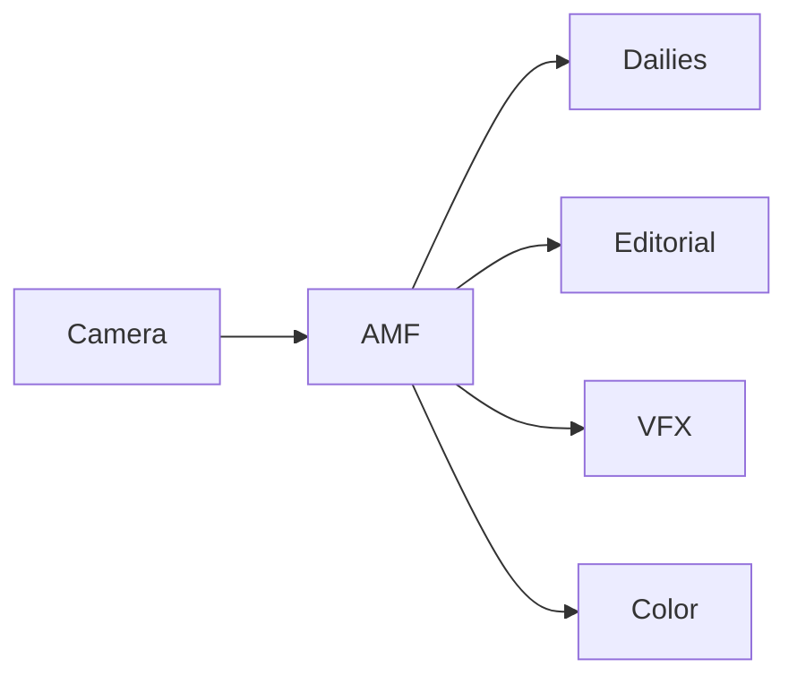
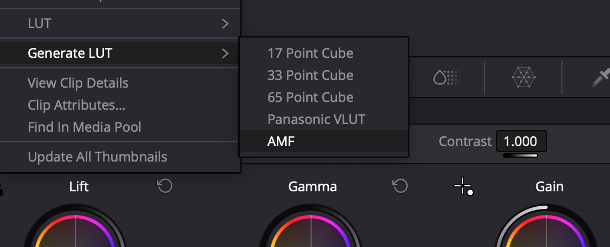
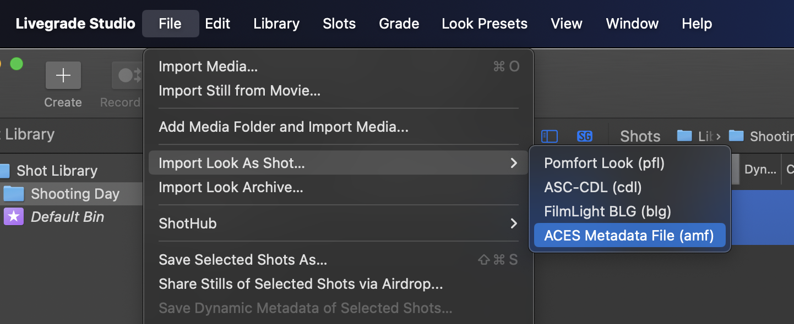

<!-- SPDX-License-Identifier: CC-BY-4.0 -->
<!-- Copyright Contributors to the ACES Documentation -->


Introduction to ACES Metadata File (AMF)
========================================
*A practical guide for production workflows*


## What is AMF?
Think of AMF as a "color recipe" that travels with your footage. Just as a recipe ensures a dish tastes the same no matter who cooks it, AMF ensures your footage looks the same across different tools and systems.

ACES provides the ingredients, and AMF is the "recipe" to put it all together. 

It is a sidecar XML file (`.amf`) that is both human-readable and machine-readable.



## How AMF Works
AMF contains three main ingredients:

1. `inputTransform`: "How to interpret the camera footage"
2. `lookTransform`: "What creative look to apply"
3. `outputTransform`: "How to display the result"


## Exporting AMFs


AMFs can be exported from major tools such as:

- Pomfort (Livegrade & Silverstack)
- Colorfront (ExD, OSD & Transkoder)
- Davinci Resolve v19.1 and newer
- Baselight 6.0 and newer

*(list last updated July 21, 2025)*

!!! info
    This will take any CDLs or looks and store it in the AMF, along with the Input and Output Transforms that were active when creating it.


## Importing AMFs

AMFs can be imported individually (as shown above) or in some cases using a bulk-import feature.

Depending on the tool, this may leverage `clipId` inside the AMFs if they are located next to the clips. Or, a timeline can be populated if you have an EDL or ALE with `AMF_NAME` or `AMF_UUID` associating each clip with an AMF.

```xml
<aces:clipId>
    <aces:clipName>A008C001_250209_RODV</aces:clipName>
    <aces:file>A008C001_250209_RODV</aces:file>
</aces:clipId>
```

## What about my LUT? Can I use CDLs?
The most important ingredient in an AMF is your "creative look" - or in AMF terms, the `<lookTransform>` - and AMF supports both CDL-based looks and more advanced LUT-based looks.


### Example AMF with CDL (applied in ACEScct)
```xml
<aces:lookTransform applied="false">
    <aces:cdlWorkingSpace>
        <aces:toCdlWorkingSpace>
            <aces:transformId>urn:ampas:aces:transformId:v1.5:ACEScsc.Academy.ACES_to_ACEScct.a1.0.3</aces:transformId>
        </aces:toCdlWorkingSpace>
        <aces:fromCdlWorkingSpace>
            <aces:transformId>urn:ampas:aces:transformId:v1.5:ACEScsc.Academy.ACEScct_to_ACES.a1.0.3</aces:transformId>
        </aces:fromCdlWorkingSpace>
    </aces:cdlWorkingSpace>
    <cdl:ASC_SOP>
        <cdl:Slope>0.978203 0.948227 0.91041</cdl:Slope>
        <cdl:Offset>0.0493211 0.0478098 0.045903</cdl:Offset>
        <cdl:Power>1.07553 0.983128 0.954579</cdl:Power>
    </cdl:ASC_SOP>
    <cdl:ASC_SAT>
        <cdl:Saturation>0.964</cdl:Saturation>
    </cdl:ASC_SAT>
</aces:lookTransform>
```

### Example AMF with LUT
```xml
<aces:lookTransform applied="false">
    <aces:description>Creative Look LUT</aces:description>
    <aces:file>creative_look.clf</aces:file>
</aces:lookTransform>
```

!!! note
    For more information about the `applied` tag, see the AMF Implementation guide. 


### Why CLF instead of Cube LUTs?
To make the creative look compatible across cameras and display outputs, AMF requires all look transforms to be applied in ACES (AP0 linear) colorspace, aka an LMT (Look Modification Transform). Traditional cube LUTs are typically designed for log colorspaces and aren't suitable for linear workflows. This is where Common LUT Format (CLF) comes in.


### What Makes CLF Special?
- Works natively with linear color spaces like ACES
- Capable of handling extended-range floating-point images
- Supports powerful color operations (not just 1D or 3DLUTs)
- Contains colorspace information in the header


## Common Workflows

### Look Development / Colorist Workflow
1. Colorist creates a look during pre-production
2. Look is exported as AMF
3. DIT imports AMF into on-set color system
4. AMF travels with footage to dailies
5. Dailies facility loads AMF automatically

### On-set / DIT Workflow
1. DIT creates a look
2. Look is saved as AMF
3. AMF travels with footage to dailies
4. Dailies facility loads AMF automatically

### VFX Workflow
1. Color decisions made in dailies
2. AMF exported with EXR plates
3. VFX facility uses AMF to re-create dailies color
4. Artist view & editorial renders match original intent

---
*This guide focuses on practical usage. For technical specifications and best practices, please refer to the full AMF Implementers guide.*
