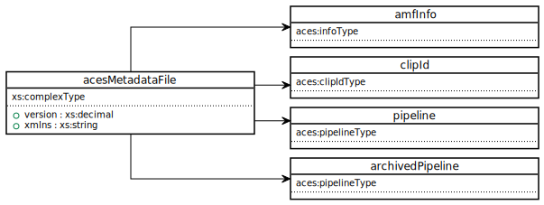
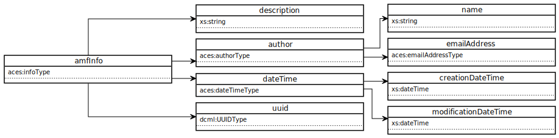
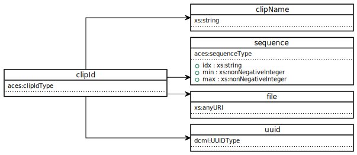
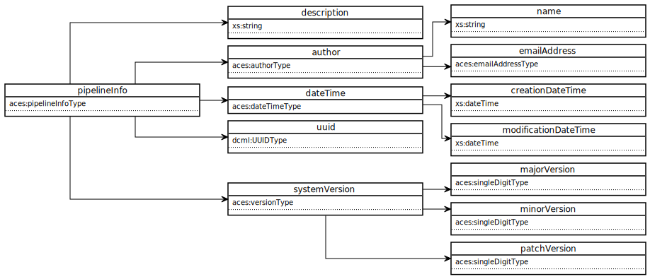
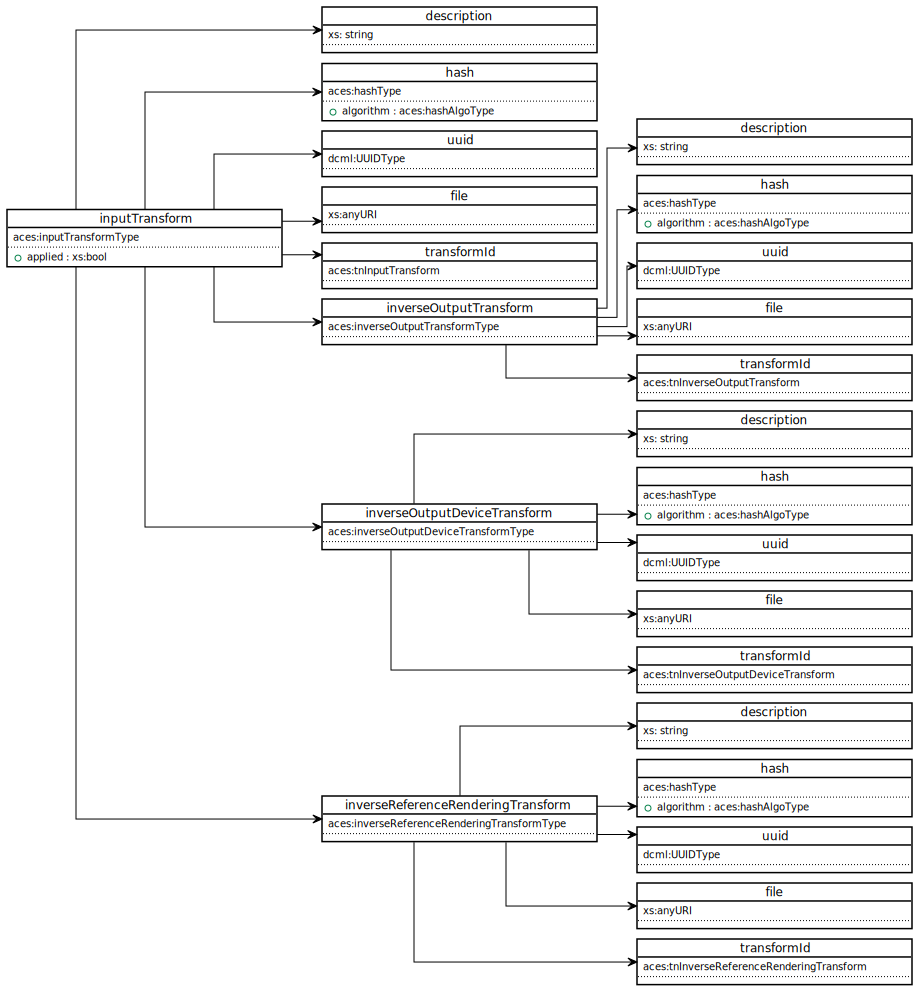
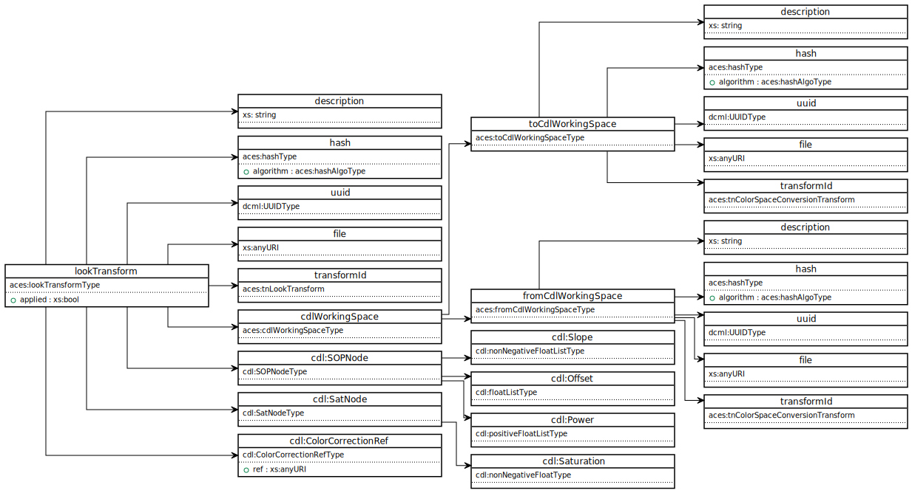
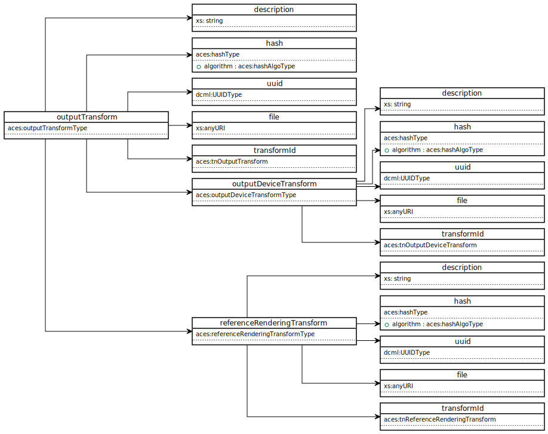

Specification
==========

This section describes the data intended for use within the ACES Metadata file.

## Namespace

All top level structures shall be tagged as being within the `aces` namespace with urn `urn:acesMetadata:acesMetadataFile:v1.0`

## UML Diagram
The following UML diagrams are segments of the complete UML diagram which is not included in this document due to space constraints.  To view the entire UML diagram in SVG format visit [https://aces.mp/amf\_uml](https://aces.mp/amf\_uml).

### acesMetadataFile
<figure align="center" markdown>
  
</figure> 

### amfInfo
<figure align="center" markdown>
  
</figure>

### clipId
<figure align="center" markdown>
  
</figure>

### pipeline
<figure align="center" markdown>
  
</figure>

### pipelineInfo
<figure align="center" markdown>
  
</figure>

### inputTransform
<figure align="center" markdown>
  
</figure>

### lookTransform
<figure align="center" markdown>
  
</figure>

### outputTransform
<figure align="center" markdown>
  
</figure>


## Components
The various elements, attributes, and simple & complex types defined for use within the AMF XML file. These can be validated with the XSD schema. 

### Simple Types

#### aces:emailAddressType
**Description:** Type definining a restricted string conforming to an email address.  
**Base type:** Restriction of `xs:string`  
**Restrictions:**  
`xs:pattern value="[^@]+@[^/.]+/..+"`  

#### aces:hashAlgoType
**Description:** Type defining valid hash algorithms that can be used to validate specified transforms. The allowed algo-
rithms are specified by the enumerated URIs in this type.  
**Base type:** Restriction of `xs:anyURI`  
**Restrictions:**  
`xs:enumeration value="http://www.w3.org/2001/04/xmlenc\#sha256"`  
`xs:enumeration value="http://www.w3.org/2001/04/xmldsig\#sha1"`  
`xs:enumeration value="http://www.w3.org/2001/04/xmldsig-more\#md5"`  

#### aces:singleDigitType
**Description:** Type defining a single digit integer.  
**Base type:** Restriction of `xs:integer`  
**Restrictions:**  
`xs:totalDigits value="1"`  
`xs:totalDigits value="0"`  
`xs:totalDigits value="9"`  

#### aces:tnColorSpaceConversionTransform
**Description:** Type defining valid transformID strings for Color Space Conversion transforms.  
**Base type:** Restriction of `xs:string`  
**Restrictions:**  
`xs:pattern value="urn:ampas:aces:transformId:v1.5:(ACEScsc\.\S+\.\S+\.a\d+\.v\d+|ACEScsc\.Academy\.\S+\.a\d+\.\d+\.\d+)"`  
`xs:pattern value="urn:ampas:aces:transformId:v2.0:CSC\.\S+\.\S+\.a\d+\.v\d+"`

#### aces:tnInputTransform
**Description:** Type defining valid transformID strings for InputTransform transforms.  
**Base type:** Restriction of `xs:string`  
**Restrictions:**  
`xs:pattern value="urn:ampas:aces:transformId:v1.5:(IDT\.\S+\.\S+\.a\d+\.v\d+|ACEScsc\.\S+\.a\d+\.\d+\.\d+)"`  
`xs:pattern value="urn:ampas:aces:transformId:v2.0:(Input\.\S+\.\S+\.a\d+\.v\d+|CSC\.\S+\.a\d+\.v\d+)"`  

#### aces:tnLookTransform
**Description:** Type defining valid transformID strings for Look Transforms.  
**Base type:** Restriction of `xs:string`  
**Restrictions:**  
`xs:pattern value="urn:ampas:aces:transformId:v1.5:(LMT\.\S+\.\S+\.a\d+\.v\d+|LMT\.Academy\.\S+\.a\d+\.\d+\.\d+)"`  
`xs:pattern value="urn:ampas:aces:transformId:v2.0:Look\.\S+\.\S+\.a\d+\.v\d+"`  


#### aces:tnOutputTransform
**Description:** Type defining valid transformID strings for Output Transforms.  
**Base type:** Restriction of `xs:string`  
**Restrictions:**  
`xs:pattern value="urn:ampas:aces:transformId:v1.5:(InvRRTODT\.\S+\.\S+\.a\d+\.v\d+|InvRRTODT\.Academy\.\S+\.a\d+\.\d+\.\d+)"`  
`xs:pattern value="urn:ampas:aces:transformId:v2.0:InvOutput\.\S+\.\S+\.a\d+\.v\d+"`  

#### aces:tnReferenceRenderingTransform
**Description:** Type defining valid transformID strings for Reference Rendering Transforms.  
**Base type:** Restriction of `xs:string`  
**Restrictions:**  
`xs:pattern value="urn:ampas:aces:transformId:v1.5:RRT\.a\d+\.\d+\.\d+"`  

#### aces:tnOutputDeviceTransform
**Description:** Type defining valid transformID strings for Output Device Transforms.  
**Base type:** Restriction of `xs:string`  
**Restrictions:**  
`xs:pattern value="urn:ampas:aces:transformId:v1.5:(ODT\.\S+\.\S+\.a\d+\.v\d+|ODT\.Academy\.\S+\.a\d+\.\d+\.\d+)"`  

#### aces:tnInverseOutputTransform
**Description:** Type defining valid transformID strings for Inverse Output Transforms.  
**Base type:** Restriction of `xs:string`  
**Restrictions:**  
`xs:pattern value="urn:ampas:aces:transformId:v1.5:(InvRRTODT\.\S+\.\S+\.a\d+\.v\d+|InvRRTODT\.Academy\.\S+\.a\d+\.\d+\.\d+)"/>`  
`xs:pattern value="urn:ampas:aces:transformId:v2.0:InvOutput\.\S+\.\S+\.a\d+\.v\d+"/>`  

#### aces:tnInverseOutputDeviceTransform
**Description:** Type defining valid transformID strings for Inverse Output Device Transforms.  
**Base type:** Restriction of `xs:string`  
**Restrictions:**  
`xs:pattern value="urn:ampas:aces:transformId:v1.5:(InvODT\.\S+\.\S+\.a\d+\.v\d+|InvODT\.Academy\.\S+\.a\d+\.\d+\.\d+)"`  

#### aces:tnInverseReferenceRenderingTransform
**Description:** Type defining valid transformID strings for Inverse Reference Rendering Transforms.  
**Base type:** Restriction of `xs:string`  
**Restrictions:**  
`xs:pattern value="urn:ampas:aces:transformId:v1.5:InvRRT\.a\d+\.\d+\.\d+"`  


### Complex Types

#### aces:authorType
**Description:** Type defining a sequence of elements used to communicate information about the author of the AMF file.  
**Base type:** `xs:sequence`  
**Children:** `aces:emailAddress`, `aces:name`  

#### aces:cdlWorkingSpaceType
**Description:** Type defining the elements to communicate information about the transforms to and from the ASC-CDL working space.
**Base type:** `xs:sequence`  
**Children:** `aces:fromCdlWorkingSpace`, `aces:toCdlWorkingSpace`  

#### aces:clipIdType
**Description:** Type defining elements used to communicate information about the essence associated with the AMF.  
**Base type:** `xs:sequence`  
**Children:** `aces:clipName`, `aces:file`, `aces:sequence`, `aces:uuid`  

#### aces:dateTimeType
**Description:** Type defining the elements to communicate information about the creation and modification date and time associated with various AMF elements.  
**Base type:** `xs:sequence`  
**Children:** `aces:creationDateTime`, `aces:modificationDateTime`  

#### aces:hashType
**Description:** Type defining the element to communicate information about a cryptographic file hash associated with a file referenced by the AMF.
**Base type:** extenstion of `xs:base64Binary`  
**Children:** `algorithms`    

#### aces:infoType
**Description:** Type defining the elements to communicate description, date and time, and UUID information.  
**Base type:** `xs:sequence`  
**Children:** `aces:dateTime`, `aces:description`, `aces:uuid`  

#### aces:inputTransformType
**Description:** Type defining the elements to communicate information about an ACES Input Transform associated with an ACES viewing pipeline.  
**Base type:** extension of `aces:transformType`  
**Children:** `aces:description`, `aces:hash`, `aces:transformId`  
**Attributes:** `applied`

#### aces:inverseOutputDeviceTransformType
**Description:** Type defining the elements to communicate information about an ACES Inverse Output Device Transform. This type is used to define an inverse ACES pipeline to specifiy how output-referred image data should be conversted to ACES 2065-1.  
**Base type:** extension of `aces:transformType`  
**Children:** `aces:description`, `aces:hash`, `aces:transformId`  

#### aces:inverseOutputTransformType
**Description:** Type defining the elements to communicate information about an ACES Inverse Output Transform. This type is used to define an inverse ACES pipeline to specifiy how output-referred image data should be conversted to ACES 2065-1.  
**Base type:** extension of `aces:transformType`  
**Children:** `aces:description`, `aces:hash`, `aces:transformId`  

#### aces:inverseReferenceRenderingTransformType
**Description:** Type defining the elements to communicate information about an ACES Inverse Reference Rendering  Transform. This type is used to define an inverse ACES pipeline to specifiy how output-referred image data should be conversted to ACES 2065-1.  
**Base type:** extension of `aces:transformType`  
**Children:** `aces:description`, `aces:hash`, `aces:transformId`  

#### aces:lookTransformType
**Description:** Type defining the elements to communicate information about an ACES Look Transform associated with an ACES viewing pipeline.  
**Base type:** extension of `aces:transformType`  
**Children:** `aces:description`, `aces:hash`, `aces:lookTransformWorkingSpace`, `aces:transformId`, `aces:uuid`, `cdl:ColorCorrectionRef`, `cdl:SOPNode`, `cdl:SatNode`  
**Attributes:** `applied`

#### aces:outputDeviceTransformType
**Description:** Type defining the elements to communicate information about an ACES Output Device Transform associated with an ACES viewing pipeline.  
**Base type:** extension of `aces:transformType`  
**Children:** `aces:description`, `aces:hash`, `aces:transformId`  
**Attributes:** `applied`

#### aces:outputTransformType
**Description:** Type defining the elements to communicate information about an ACES Output Transform associated with an ACES viewing pipeline.  
**Base type:** extension of `xs:choice`  
**Children:** `aces:description`, `aces:hash`, `aces:uuid`, `aces:file,` `aces:transformId`, `aces:outputDeviceTransform`, `aces:referenceRenderingTransform`  
**Attributes:** `applied`

#### aces:pipelineInfoType
**Description:** Type defining the elements to communicate description, author, date and time, UUID information, and ACES version information.  
**Base type:** extension of `aces:infoType`  
**Children:** `aces:author`, `aces:dateTime`, `aces:description`, `aces:systemVersion,` `aces:uuid`  

#### aces:pipelineType
**Description:** Type defining a sequence of elements used to communicate an ACES viewing pipeline.  
**Base type:** `xs:sequence`  
**Children:** `aces:pipelineInfor`, `aces:inputTransform`, `aces:lookTransform`, `aces:outputTransform`  

#### aces:referenceRenderingTransformType
**Description:** Type defining elements used to communicate the ACES Reference Rendering Transform associated with an ACES viewing pipeline.   
**Base type:** extension of `aces:transformType`  
**Children:** `aces:description`, `aces:hash`, `aces:transformId`  

#### aces:sequenceType
**Description:** Type defining elements used to communicate information about a file sequence associated with an AMF.  
**Base type:** extension of `xs:string`  
**Attributes:** `idx`, `min`, `max`  

#### aces:transformType
**Description:** Type defining elements used to communicate information about ACES transforms. This type is used as the basis for other complex types.  
**Base type:** `xs:sequence`  
**Children:** `aces:description`, `aces:hash`  

#### aces:versionType
**Description:** Type defining elements used to communicate ACES system version information.  
**Base type:** `xs:sequence`  
**Children:** `aces:majorVersion`, `aces:minorVersion`, `aces:patchVersion`

#### aces:workingSpaceTransformType
**Description:** Type defining elements used to communicate the Color Space Conversion Transform used to convert between the working color space associated with a particular look transform and ACES 2065-1.  
**Base type:** extenxtion of `aces:transformType`  
**Children:** `aces:description`, `aces:hash`, `aces:transformId`  


## Elements (by type)
The following elements are defined for use with the AMF XML file and are validated with the [XSD schema](https://github.com/ampas/aces-amf/blob/main/schema/acesMetadataFile.xsd). 

### `aces:acesMetadataFile`

#### `aces:acesMetadataFile`
**Description:** The top level element of an ACES Metadata File. This element defines first level child elements.  
**Diagram:**  
  
**Type:**  `xs:element`  
**Required or Optional:**  Required  
**Occurences:**  Min: 1, Max: 1  
**Attributes:**  
&nbsp;&nbsp;&nbsp;&nbsp; Required: `version="1.0", xlmns:aces="urn:ampas:aces:amf:v1.0"`  
&nbsp;&nbsp;&nbsp;&nbsp; Optional: `xmlns`, `xsi:schemaLocation`  
**Parent:**  None  
**Children:**  `aces:amfInfo`, `aces:archivedPipeline`, `aces:clipId`, `aces:pipeline`  
**Example:**  
```   
<aces:MetadataFile  
xmlns:aces="urn:ampas:aces:amf:v1.0"  
xsi:schemaLocation="urn:ampas:aces:amf:v1.0 file:acesMetadataFile.xsd"  
xmlns:cdl="urn:ASC:CDL:v1.01"  
xmlns:xsi="http://www.w3.org/2001/XMLSchema-instance"  
version="1.0">
...
</aces:MetadataFile>
```

#### `aces:acesMetadataFile / aces:amfInfo`
**Description:** This element contains all the elements containing information about the AMF itself including author elements, date and time elements, a decription element, and a UUID element.  
**Diagram:**  
  
**Type:**  `aces:infoType`  
**Required or Optional:**  Required  
**Occurences:**  Min: 1, Max: 1  
**Attributes:**  
&nbsp;&nbsp;&nbsp;&nbsp; Required: none  
&nbsp;&nbsp;&nbsp;&nbsp; Optional: none  
**Parent:**  `aces:acesMetadataFile`  
**Children:**  `aces:author`, `aces:dateTime`, `aces:description`, `aces:uuid`  

#### `aces:acesMetadataFile / aces:archivedPipeline`
**Description:** This element contains all the elements describing an ACES viewing pipeline archived for historical purposes.  
**Diagram:**  
  
**Type:**  `aces:pipelineType`  
**Required or Optional:**  Optional  
**Occurences:**  Min: 0, Max: unbounded  
**Attributes:**  
&nbsp;&nbsp;&nbsp;&nbsp; Required: none  
&nbsp;&nbsp;&nbsp;&nbsp; Optional: none  
**Parent:**  `aces:acesMetadataFile`  
**Children:**  `aces:inputTransform`, `aces:lookTransform`, `aces:outputTransform`, `aces:pipeline`  

#### `aces:acesMetadataFile / aces:clipId`
**Description:** This optional element contains all the elements describing the location of the media files associated with the AMF.  
**Diagram:**  
  
**Type:**  `aces:clipIdType`  
**Required or Optional:**  Optional  
**Occurences:**  Min: 0, Max: 1  
**Attributes:**  
&nbsp;&nbsp;&nbsp;&nbsp; Required: none  
&nbsp;&nbsp;&nbsp;&nbsp; Optional: none  
**Parent:**  `aces:acesMetadataFile`  
**Children:**  `aces:clipName`, `aces:file`, `aces:sequence`, `aces:uuid`  

#### `aces:acesMetadataFile / aces:pipeline`
**Description:** This element contains all the elements describing the ACES viewing pipeline.  
**Diagram:**  
  
**Type:**  `aces:pipelineType`  
**Required or Optional:**  Required  
**Occurences:**  Min: 1, Max: 1  
**Attributes:**  
&nbsp;&nbsp;&nbsp;&nbsp; Required: none  
&nbsp;&nbsp;&nbsp;&nbsp; Optional: none  
**Parent:**  `aces:acesMetadataFile`  
**Children:**  `aces:inputTransform`, `aces:lookTransform`, `aces:outputTransform`, `aces:pipelineInfo`  


### `aces:authorType`

#### `aces:authorType / aces:emailAddress`
**Description:** This element is used to communicate the AMF author's email address.  
**Diagram:**  
  
**Type:**  `aces:pipelineType`  
**Required or Optional:**  Required  
**Occurences:**  Min: 1, Max: 1  
**Attributes:**  
&nbsp;&nbsp;&nbsp;&nbsp; Required: none  
&nbsp;&nbsp;&nbsp;&nbsp; Optional: none  
**Parent:**  `aces:author`  
**Children:**  None  
**Example:** 
`<aces:emailAddress>joe@onset.com</aces:emailAddress>` 

#### `aces:authorType / aces:name`
**Description:** This element is used to communicate the name of the AMF author.  
**Diagram:**  
  
**Type:**  `xs:string`  
**Required or Optional:**  Required  
**Occurences:**  Min: 1, Max: 1  
**Attributes:**  
&nbsp;&nbsp;&nbsp;&nbsp; Required: none  
&nbsp;&nbsp;&nbsp;&nbsp; Optional: none  
**Parent:**  `aces:author`  
**Children:**  None  
**Example:** 
`<aces:name>Joe Onset</aces:name>` 


### `aces:cdlWorkingSpaceType`

#### `aces:cdlWorkingSpaceType / aces:fromCdlWorkingSpace`
**Description:** This element contains all the elements describing the ACES Color Space Conversion transform used to convert from the Look Transform working color space in whice an ASC-CDL is applied to ACES 2065-1.  
**Diagram:**  
  
**Type:**  `aces:workingSpaceTransformType`  
**Required or Optional:**  Required  
**Occurences:**  Min: 1, Max: 1  
**Attributes:**  
&nbsp;&nbsp;&nbsp;&nbsp; Required: none  
&nbsp;&nbsp;&nbsp;&nbsp; Optional: none  
**Parent:**  `aces:cdlWorkingSpace`  
**Children:**  `aces:description`, `aces:file`, `aces:hash`, `aces:transformId`, `aces:uuid`  

#### `aces:cdlWorkingSpaceType / aces:toCdlWorkingSpace`
**Description:** This element contains all the elements describing the ACES Color Space Conversion transform used to convert from ACES2065-1 to the Look Transform working color space in whice an ASC-CDL is applied. This transform shall be included when the working color space for the ASC-CDL transform is not a working color space described in on of the Color Space Conversion transforms included in the ACES core transforms. When the working color space for the ASC-CDL transform is a working color space described in one of the Color Space Conversion transforms included in the ACES core transforms, the `aces:toCdlWorkingSpace` is optional.
**Diagram:**  
  
**Type:**  `aces:workingSpaceTransformType`  
**Required or Optional:**  Optional  
**Occurences:**  Min: 0, Max: 1  
**Attributes:**  
&nbsp;&nbsp;&nbsp;&nbsp; Required: none  
&nbsp;&nbsp;&nbsp;&nbsp; Optional: none  
**Parent:**  `aces:cdlWorkingSpace`  
**Children:**  `aces:description`, `aces:file`, `aces:hash`, `aces:transformId`, `aces:uuid`  


### `aces:clipIdType`

#### `aces:clipIdType / aces:clipName`
**Description:** This element is used to communicate the clip name associated with the media files.  
**Diagram:**  
  
**Type:**  `xs:string`  
**Required or Optional:**  Required  
**Occurences:**  Min: 1, Max: 1  
**Attributes:**  
&nbsp;&nbsp;&nbsp;&nbsp; Required: none  
&nbsp;&nbsp;&nbsp;&nbsp; Optional: none  
**Parent:**  `aces:clipId`  
**Children:**  none  
**Example:**  
`<aces:clipName>A001C012</aces:clipName>`

#### `aces:clipIdType / aces:file`
**Description:** This element is used to communicate the name of the media file. Care should be taken when using the file name as an identifier as file locations and names typically change during production and post-production.  
**Diagram:**  
  
**Type:**  `xs:anyURI`  
**Required or Optional:**  Choice of `aces:file`, `aces:sequence`, or `aces:uuid` is required  
**Occurences:**  Min: 1, Max: 1  
**Attributes:**  
&nbsp;&nbsp;&nbsp;&nbsp; Required: none  
&nbsp;&nbsp;&nbsp;&nbsp; Optional: none  
**Parent:**  `aces:clipId`  
**Children:**  none  
**Example:**  
`<aces:file>file:///foo.mxf</aces:file>`

#### `aces:clipIdType / aces:sequence`
**Description:** This element is used to communicate the file sequence information associated with the media files. The file sequence includes an index indicated by the `idx` attribute (.e.g #) that is used to denote the location of frame numbers within the sequence string. The `min` and `max` attributes are used to indicate the minimum frame number and maximum frame number of the sequence.  
For example, if the sequence string is `movieFrame####.exr` and attributes of `aces:sequence` are `idx='#'`, `min='0'`, `max='1000'` then the media files associated with the AMF would be the frames numbered `movieFrame0000.exr` through `movieFrame1000.exr`.
**Diagram:**  
  
**Type:**  `aces:sequenceType`  
**Required or Optional:**  Choice of `aces:file`, `aces:sequence`, or `aces:uuid` is required  
**Occurences:**  Min: 1, Max: 1  
**Attributes:**  
&nbsp;&nbsp;&nbsp;&nbsp; Required: `idx`, `min`, `max`  
&nbsp;&nbsp;&nbsp;&nbsp; Optional: none  
**Parent:**  `aces:clipId`  
**Children:**  none  
**Example:**  
`<aces:sequence idx="#" min"1" max"240">A01_C012_AE0306_###.exr</aces:sequence>`

#### `aces:clipIdType / aces:uuid`
**Description:** This element is used to communicate a UUID associated with the media files referred to in the clip ID.  
**Diagram:**  
  
**Type:**  `dcml:UUIDType`  
**Required or Optional:**  Choice of `aces:file`, `aces:sequence`, or `aces:uuid` is required  
**Occurences:**  Min: 1, Max: 1  
**Attributes:**  
&nbsp;&nbsp;&nbsp;&nbsp; Required: none  
&nbsp;&nbsp;&nbsp;&nbsp; Optional: none  
**Parent:**  `aces:clipId`  
**Children:**  none  
**Example:**  
`<aces:uuid>urn:uuid:797c7cd8-4eb1-4f67-afce-af2b0a1d0285</aces:uuid>`


### `aces:dateTimeType`

#### `aces:dateTimeType / aces:creationDateTime`
**Description:** This element is used to communicate the creation date and time of an AMF file or an ACES pipeline.  
**Diagram:**  
  
**Type:**  `xs:dateTime`  
**Required or Optional:**  Required  
**Occurences:**  Min: 1, Max: 1  
**Attributes:**  
&nbsp;&nbsp;&nbsp;&nbsp; Required: none  
&nbsp;&nbsp;&nbsp;&nbsp; Optional: none  
**Parent:**  `aces:dateTime`  
**Children:**  none  
**Example:**  
`<aces:creationDateTime>2020-11-10T13:20:00Z</aces:creationDateTime>`

#### `aces:dateTimeType / aces:modificationDateTime`
**Description:** This element is used to communicate the most recent modification date and time of an AMF file an ACES pipeline.  
**Diagram:**  
  
**Type:**  `xs:dateTime`  
**Required or Optional:**  Required  
**Occurences:**  Min: 1, Max: 1  
**Attributes:**  
&nbsp;&nbsp;&nbsp;&nbsp; Required: none  
&nbsp;&nbsp;&nbsp;&nbsp; Optional: none  
**Parent:**  `aces:dateTime`  
**Children:**  none  
**Example:**  
`<aces:modificationDateTime>2020-11-10T13:20:00Z</aces:modificationDateTime>`


### `aces:infoType`

#### `aces:infoType / aces:author`
**Description:** This element contains all the elements describing the AMF author information.  
**Diagram:**  
  
**Type:**  `xs:sequence`  
**Required or Optional:**  Optional  
**Occurences:**  Min: 1, Max: unbounded  
**Attributes:**  
&nbsp;&nbsp;&nbsp;&nbsp; Required: none  
&nbsp;&nbsp;&nbsp;&nbsp; Optional: none  
**Parent:**  `aces:amfInfo`  
**Children:**  `aces:name`, `aces:emailAddress`  

#### `aces:infoType / aces:dateTime`
**Description:** This element contains all the elements describing the date and time of the creation and modification of the AMF or an AMF pipeline.  
**Diagram:**  
  
**Type:**  `xs:sequence`  
**Required or Optional:**  Required  
**Occurences:**  Min: 1, Max: 1  
**Attributes:**  
&nbsp;&nbsp;&nbsp;&nbsp; Required: none  
&nbsp;&nbsp;&nbsp;&nbsp; Optional: none  
**Parent:**  `aces:amfInfo`, `aces:pipelineInfo`  
**Children:**  `aces:creationDateTime`, `aces:modificationDateTime`  

#### `aces:infoType / aces:description`
**Description:** This element is used to communicate description information for an AMF file or an ACES pipeline.  
**Diagram:**  
  
**Type:**  `xs:string`  
**Required or Optional:**  Optional  
**Occurences:**  Min: 0, Max: 1  
**Attributes:**  
&nbsp;&nbsp;&nbsp;&nbsp; Required: none  
&nbsp;&nbsp;&nbsp;&nbsp; Optional: none  
**Parent:**  `aces:amfInfo`, `aces:pipelineInfo`  
**Children:**  none
**Examples:**  
`<aces:description>Example movie</aces:description>`  
`<aces:description>Theatrical deliverable pipeline</aces:description>`  

#### `aces:infoType / aces:uuid`
**Description:** This element is used to communicate a UUID associated with the AMF or an AMF pipeline.  
**Diagram:**  
  
**Type:**  `dcml:UUIDType`  
**Required or Optional:**  Required  
**Occurences:**  Min: 1, Max: 1  
**Attributes:**  
&nbsp;&nbsp;&nbsp;&nbsp; Required: none  
&nbsp;&nbsp;&nbsp;&nbsp; Optional: none  
**Parent:**  `aces:amfInfo`, `aces:pipelineInfo`  
**Children:**  none   
**Example:**  
`<aces:uuid>urn:uuid:797c7cd8-4eb1-4f67-afce-af2b0a1d0285</aces:uuid>`


### `aces:inputTransformType`

#### `aces:inputTransformType / aces:file`
**Description:** This element is used to communicate the location of a file used as an ACES Input Transform that transforms images encoded in a color space of a camera native file to ACES2065-1.  
**Diagram:**  
  
**Type:**  `xs:anyURI`  
**Required or Optional:**  Required  
**Occurences:**  Min: 1, Max: 1  
**Attributes:**  
&nbsp;&nbsp;&nbsp;&nbsp; Required: none  
&nbsp;&nbsp;&nbsp;&nbsp; Optional: none  
**Parent:**  `aces:inputTransform`  
**Children:**  none   
**Example:**  
`<aces:file>file:///inputTransform.clf</aces:file>`

#### `aces:inputTransformType / aces:inverseOutputDeviceTransform`
**Description:** This element contains all the elements describing the transforms associatied with an inverse output device transform used to convert output-referred images to OCES. This element is used in combination with `aces:inverseReferenceRenderingTransform` to convert output-referred images to ACES2065-1.  
**Diagram:**  
  
**Type:**  `aces:inverseOutputDeviceTransformType`  
**Required or Optional:**  Required  
**Occurences:**  Min: 1, Max: 1  
**Attributes:**  
&nbsp;&nbsp;&nbsp;&nbsp; Required: none  
&nbsp;&nbsp;&nbsp;&nbsp; Optional: none  
**Parent:**  `aces:inputTransform`  
**Children:**  `aces:description`, `aces:file`, `aces:hash`, `aces:transformId`, `aces:uuid`   

#### `aces:inputTransformType / aces:inverseOutputTransform`
**Description:** This element contains all the elements describing the transforms associatied with an inverse output transform used to convert output-referred images to ACES2065-1.  
**Diagram:**  
  
**Type:**  `aces:inverseOutputTransformType`  
**Required or Optional:**  Required  
**Occurences:**  Min: 1, Max: 1  
**Attributes:**  
&nbsp;&nbsp;&nbsp;&nbsp; Required: none  
&nbsp;&nbsp;&nbsp;&nbsp; Optional: none  
**Parent:**  `aces:inputTransform`  
**Children:**  `aces:description`, `aces:file`, `aces:hash`, `aces:transformId`, `aces:uuid`   

#### `aces:inputTransformType / aces:inverseReferenceRenderingTransform`
**Description:** This element contains all the elements describing the transforms associatied with an inverse reference rendering transform used to convert OCES images to ACES2065-1. This element is used in combination with `aces:inverseOutputDeviceTransform` to convert output-referred images to ACES2065-1.  
**Diagram:**  
  
**Type:**  `aces:inverseReferenceRenderingTransformType`  
**Required or Optional:**  Required  
**Occurences:**  Min: 1, Max: 1  
**Attributes:**  
&nbsp;&nbsp;&nbsp;&nbsp; Required: none  
&nbsp;&nbsp;&nbsp;&nbsp; Optional: none  
**Parent:**  `aces:inputTransform`  
**Children:**  `aces:description`, `aces:file`, `aces:hash`, `aces:transformId`, `aces:uuid`  

#### `aces:inputTransformType / aces:transformId`
**Description:** This element is used to communicate the TransformID of an ACES Input Transform that transforms images encoded in a color space of a camera native file to ACES2065-1.  
Valid transforms for this element are Input Transforms or Color Space Conversion Transforms. The element is restricted to enforce the use of transformIDs that follow the naming conventions in the [TransformID Specification](). Manufacturer or user-created transforms shall be assigned a transformID according to the patterns specificfied.  
**Diagram:**  
  
**Type:**  `aces:tnInputTransform`  
**Required or Optional:**  Required  
**Occurences:**  Min: 1, Max: 1  
**Attributes:**  
&nbsp;&nbsp;&nbsp;&nbsp; Required: none  
&nbsp;&nbsp;&nbsp;&nbsp; Optional: none  
**Parent:**  `aces:inputTransform`  
**Children:**  none
**Examples:**  
`<aces:transformId>urn:ampas:aces:transformId:v1.5:IDT.Sony.F65.a1.v1</aces:transformId>`  
`<aces:transformId>urn:ampas:aces:transformId:v2.0:CSC.Arri.ACES_to_LogC4.a2.v1</aces:transformId>`

#### `aces:inputTransformType / aces:uuid`
**Description:** This element is used to communicate the UUID of an ACES Input Transform that transforms images to ACES2065-1.  
**Diagram:**  
  
**Type:**  `dcml:UUIDType`  
**Required or Optional:**  Required  
**Occurences:**  Min: 1, Max: 1  
**Attributes:**  
&nbsp;&nbsp;&nbsp;&nbsp; Required: none  
&nbsp;&nbsp;&nbsp;&nbsp; Optional: none  
**Parent:**  `aces:inputTransform`  
**Children:**  none
**Examples:**  
`<aces:uuid>urn:uuid:797c7cd8-4eb1-4f67-afce-af2b0a1d0285</aces:uuid>`


### `aces:inverseOutputDeviceTransformType`

#### `aces:inverseOutputDeviceTransformType / aces:file`
**Description:** This element is used to communicate the location of a file used as an ACES Inverse Output Device Transform that transforms images encoded in OCES color space to ACES2065-1.  
**Diagram:**  
  
**Type:**  `xs:anyURI`  
**Required or Optional:**  Required  
**Occurences:**  Min: 1, Max: 1  
**Attributes:**  
&nbsp;&nbsp;&nbsp;&nbsp; Required: none  
&nbsp;&nbsp;&nbsp;&nbsp; Optional: none  
**Parent:**  `aces:inputTransform`  
**Children:**  none   
**Example:**  
`<aces:file>file:///inverseOutputDeviceTransform.clf</aces:file>`

#### `aces:inverseOutputDeviceTransformType / aces:transformId`
**Description:** This element is used to communicate the TransformID of an ACES Inverse Output Device Transform that transforms images encoded in an output-referred color space to OCES.  
Valid transforms for this element are Inverse Output Device Transforms. The element is restricted to enforce the use of transformIDs that follow the naming conventions in the [TransformID Specification](). Manufacturer or user-created transforms shall be assigned a transformID according to the patterns specificfied.  
**Diagram:**  
  
**Type:**  `aces:tnInputTransform`  
**Required or Optional:**  Required  
**Occurences:**  Min: 1, Max: 1  
**Attributes:**  
&nbsp;&nbsp;&nbsp;&nbsp; Required: none  
&nbsp;&nbsp;&nbsp;&nbsp; Optional: none  
**Parent:**  `aces:inputTransform`  
**Children:**  none
**Examples:**  
`<aces:transformId>urn:ampas:aces:transformId:v1.5:InvODT.Rec709_100nits_dim.a1.v1</aces:transformId>`  

#### `aces:inverseOutputDeviceTransformType / aces:uuid`
**Description:** This element is used to communicate the UUID of an ACES Inverse Output Device Transform that transforms images encoded in an output-referred color space to OCES.  
**Diagram:**  
  
**Type:**  `dcml:UUIDType`  
**Required or Optional:**  Required  
**Occurences:**  Min: 1, Max: 1  
**Attributes:**  
&nbsp;&nbsp;&nbsp;&nbsp; Required: none  
&nbsp;&nbsp;&nbsp;&nbsp; Optional: none  
**Parent:**  `aces:inputTransform`  
**Children:**  none
**Examples:**  
`<aces:uuid>urn:uuid:797c7cd8-4eb1-4f67-afce-af2b0a1d0285</aces:uuid>`

### `aces:inverseOutputTransformType`

### `aces:inverseReferenceRenderingTransformType`

### `aces:lookTransformType`

### `aces:outputDeviceTransformType`

### `aces:outputTransformType`

### `aces:pipelineInfoType`

### `aces:pipelineType`

### `aces:referenceRenderingTransformType`

### `aces:transformType`

### `aces:versionType`

### `aces:workingSpaceTransformType`

## Imported Elements


<!-- Include section numbering -->
<style>
    @import "../../stylesheets/sections.css"
</style>
