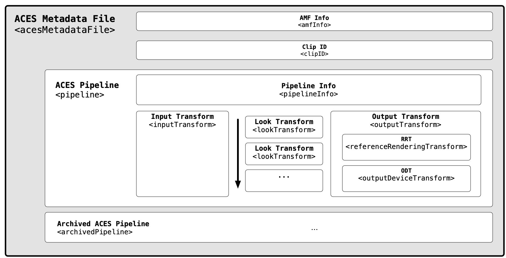

Introduction 
============

## Why is metadata needed for ACES?

ACES establishes a standard color color encoding (SMPTE ST 2065-1) for exchange of images. It also defines Input Transforms to convert different image sources to ACES and Output Transforms to display ACES files across different types of displays.

However, during production, critical information required to fully define the viewing pipeline or the "creative intent" of an image is often missing. Examples of such essential details include:

* ACES Version – _Which version of ACES was used?_
* Look Transform – _Was a creative look applied?_
* Output Transform – _How was the image viewed on a display?_

Transporting this information is vital for maintining consistent color appearance throughtout the production process. Moreover, it serves as an unambiguous archive of the creative intent.

## What is AMF
The ACES Metadata File (“AMF”) is a sidecar XML file intended to exchange the metadata required to recreate ACES viewing pipelines. It describes the transforms necessary to configure an ACES viewing pipeline for a collection of related image files.

An AMF may have a specified association with a single frame or clip. Alternatively, it may exist without any association to an image, and one may apply it to an image. An application of an AMF to an image would translate its viewing pipeline to the target image.

Images are formed at several stages of production and post-production, including:

* Digital cameras
* Film scanners
* Animation and VFX production
* Virtual production
* Editorial and color correction systems

AMF can be compatible with any digital image, and is not restricted to those encoded in the ACES (SMPTE ST 2065-1). They may be camera native file formats or other encodings if they have associated Input Transforms (IDTs) (using the `<inputTransform>` element) so they may be displayed using an ACES viewing pipeline.

AMFs may also embed creative look adjustments as one or more LMTs (using the `<lookTransform>` elements). These looks may be in the form of ASC CDL values, or a reference to an external look file, such as a CLF (Common LUT Format). Multiple `<lookTransform>` elements are allowed, and the order of operations in which they are applied shall be the order in which they appear in the AMF.

AMFs can also serve as effective archival elements. When paired with finished ACES image files, they form a complete archival record of how image content is intended to be viewed (for example, using the	`<outputTransform>` and `<systemVersion>` elements).

AMFs do not contain “timeline” metadata such as edit points. Timeline management files such as Edit Decision Lists (EDLs) or Avid Log Exchange files (ALEs) may reference AMFs, attaching them to editing events and thus enable standardized color management throughout all stages of production.

<figure align="center" markdown>
  
<figcaption align="center">
	<b>Figure 1.</b> Overall structure of an AMF in simplified form.
</figcaption> 
</figure>
