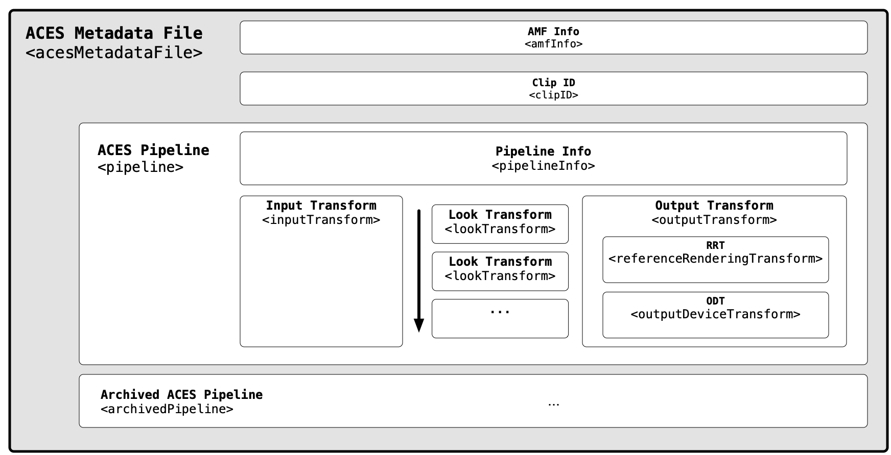

ACES Metadata File (AMF) Specification
========================================================================================

Scope
-----
This document specifies the ACES Metadata File (“AMF”), a ‘sidecar’ XML file intended to exchange the metadata required to recreate ACES viewing pipelines. 

This specification supersedes "TB-2014-009 – Academy Color Encoding System – (ACES) Clip-level Metadata File Format Definition and Usage (“ACESclip”)". TB-2014-009 is now considered obsolete.

Introduction 
----------------
### Why is metadata needed for ACES?

ACES establishes a standard color color encoding (SMPTE ST 2065-1) for exchange of images. It also defines Input Transforms to convert different image sources to ACES and Output Transforms to display ACES files across different types of displays.

However, during production, critical information required to fully define the viewing pipeline or the "creative intent" of an image is often missing. Examples of such essential details include:

* ACES Version – _Shich version of ACES was used?_
* Look Transform – _Was a creative look applied?_
* Output Transform – _How was the image viewed on a display?_

Transporting this information is vital for maintining consistent color appearance throughtout the production process. Moreover, it serves as an unambiguous archive of the creative intent.

### What is AMF
The ACES Metadata File (“AMF”) is a sidecar XML file intended to exchange the metadata required to recreate ACES viewing pipelines. It describes the transforms necessary to configure an ACES viewing pipeline for a collection of related image files.

An AMF may have a specified association with a single frame or clip. Alternatively, it may exist without any association to an image, and one may apply it to an image. An application of an AMF to an image would translate its viewing pipeline to the target image.

Images are formed at several stages of production and post-production, including:

* Digital cameras
* Film scanners
* Animation and VFX production
* Virtual production
* Editorial and color correction systems

AMF can be compatible with any digital image, and is not restricted to those encoded in the ACES (SMPTE ST 2065-1). They may be camera native file formats or other encodings if they have associated Input Transforms (IDTs) (using the `<inputTransform>` element) so they may be displayed using an ACES viewing pipeline.

AMFs may also embed creative look adjustments as one or more LMTs (using the `<lookTransform>` elements). These looks may be in the form of ASC CDL values, or a reference to an external look file, such as a CLF (Common LUT Format). Multiple `<lookTransform>` elements are allowed, and the order of operations in which they are applied shall be the order in which they appear in the AMF.

AMFs can also serve as effective archival elements. When paired with finished ACES image files, they form a complete archival record of how image content is intended to be viewed (for example, using the	`<outputTransform>` and `<systemVersion>` elements).

AMFs do not contain “timeline” metadata such as edit points. Timeline management files such as Edit Decision Lists (EDLs) or Avid Log Exchange files (ALEs) may reference AMFs, attaching them to editing events and thus enable standardized color management throughout all stages of production.

<figure align="center" markdown>
  
<figcaption align="center">
	<b>Figure 1.</b> Overall structure of an AMF in simplified form.
</figcaption> 
</figure>

Use Cases
----------------
ACES Metadata Files (AMFs) are intended to contain the minimum required metadata for transferring information about ACES viewing pipelines during production, post-production, and archival.

Typical use cases for AMF files are the application of “show LUT” LMTs in cameras and on-set systems,the capture of shot-to-shot looks generated on-set using ASC-CDL, and communication of both to dailies,editorial, VFX, and post-production mastering facilities.

AMF supports the transfer of looks by embedding ASC-CDL values within the AMF file or by referencingsidecar look files containing LMTs, such as CLF (Common LUT Format) files.

### Look Development
The development of a creative look before the commencement of production is common. Production uses this look to produce a pre-adjusted reference for on-set monitoring. The creative look may be a package of files containing a viewing transform (also known as a “Show LUT”), CDL grades, or more. There are no consistent standards specifying how to produce them, and exchanging them is complex due to a lack of metadata.

AMF contains the ability to completely specify the application of a creative look. This automates the exchange of these files and the recreation of the look when applying the AMF. In an ACES workflow, one specifies the creative look as one or more Look Modification Transforms (LMT). AMF can include references to any number of these transforms, and maintains their order of operations.

The input and output of an LMT is always a triplet of ACES RGB relative exposure values, as defined in SMPTE ST 2065-1. This will likely need a robust transform, such as CLF, that can handle linear input data and output data.

AMF offers an unambiguous description of the full ACES viewing pipeline for on-set look management software to load and display images as intended.

### On Set
Before production begins, an AMF may be created and shared with production as a "look template" for use during on-set monitoring or look management.

Cameras with AMF support can load or generate AMFs to configure or communicate the viewing pipeline of images viewed out of the camera's live video signal.

On-set color grading software can load or generate AMFs, allowing the communication of the color adjustments created on set.

### Dailies
Dailies can apply AMFs from production to the camera files to reproduce the same images seen on set. There is no single method of exchange between production and dailies. AMFs should be agnostic to the given exchange method.

It is possible, or even likely, that one will update AMFs in the dailies stage. For example, a dailies colorist may choose to balance shots at this stage and update the look. Another example could be that dailies uses a different ODT than the one used in on-set monitoring.

This specification does not define how one should transport AMFs between stages. Existing exchange formats may reference them, or image files themselves may embed them. One may also transport AMFs independently of any other files.

### VFX
The exchange of shots for VFX work requires perfect translation of each shot’s viewing pipeline, or ‘color recipe’. If the images cannot be accurately reproduced from VFX plates, effects will be created with an incorrect reference.

AMF provides a complete and unambiguous translation of ACES viewing pipelines. If they travel with VFX plates, they can describe how to view each plate along with any associated looks.

VFX software should have the ability to read AMF to configure its internal viewing pipeline. Or, AMF will inform the configuration of third party color management software, such as OpenColorIO.

### Finishing
In finishing, the on-set or dailies viewing reference can be automatically recreated upon reading an AMF. This stage typically uses a higher quality display, which may warrant the use of a different ODT than one specified in an ingested AMF.

AMF can seamlessly provide the colorist a starting point that is consistent with the creative intent of the filmmakers on-set. This removes any necessity to recreate a starting look from scratch.

### Archival
AMF enables the ability to establish a complete ACES archive, and effectively serves as a snapshot of creative intent for preservation and remastering purposes. All components required to recreate the look of an ACES archive are meaningfully described and preserved within the AMF.

One possible method for this could be the utilization of SMPTE standards such as ST.2067-50 (IMF App \#5) -- commonly referred to as "ACES IMF" -- and SMPTE RDD 47 (ISXD) -- a virtual track file containing XML data -- in order to form a complete and flexible ACES archival package.

Another method could be to use SMPTE ST.2067-9 (Sidecar Composition Map) which would allow linking of a single AMF to a CPL (Composition Playlist) in the case where there is a single AMF for an entire playlist.

Data Model
----------------
This section describes the data intended for use within the ACES Metadata file.

All top level structures shall be tagged as being within the `aces` namespace with urn `urn:acesMetadata:acesMetadataFile:v1.0`

### UML Diagram
The following UML diagrams are segments of the complete UML diagram which is not included in this document due to space constraints.  To view the entire UML diagram in SVG format visit [https://aces.mp/amf\_uml](https://aces.mp/amf\_uml).

#### acesMetadataFile
<figure align="center" markdown>
  
  
</figure> 

#### amfInfo
<figure align="center" markdown>
  
</figure>

#### clipId
<figure align="center" markdown>
  
</figure>

#### pipeline
<figure align="center" markdown>
  
</figure>

#### pipelineInfo
<figure align="center" markdown>
  
</figure>

#### inputTransform
<figure align="center" markdown>
  
</figure>

#### lookTransform
<figure align="center" markdown>
  
</figure>

#### outputTransform
<figure align="center" markdown>
  
</figure>

### Types
The following types are defined for use within the AMF XML file and are validated with the XSD schema included in Appendix A.  The types are used as the basis to form the elements listed in section X in the schema.

\input{sec-types.tex}

### Elements (by type)
The following elements are defined for use with the AMF XML file and are validated with the XSD schema included in Appendix A. 

References
----------
The following standards, specifications, articles, presentations, and texts are referenced in this text:

* [Academy S-2014-002, Academy Color Encoding System - Versioning System](https://www.dropbox.com/s/cnrak5pvu4agfk4/S-2014-002.pdf?dl=0)
* [SMPTE ST 2065-1:2021, Academy Color Encoding Specification (ACES)](https://doi.org/10.5594/SMPTE.ST2065-1.2021)
* [SMPTE ST 2065-4:2013, ACES Image Container File Layout](https://doi.org/10.5594/SMPTE.ST2065-4.2013)
* [Academy TB-2014-010, Design, Integration and Use of ACES Look Modification Transforms (LMTs)](https://www.dropbox.com/s/grjoi885tv78e70/TB-2014-010.pdf?dl=0)
* [ISO 8601:2004, Data elements and interchange formats – Information interchange – Representation of datesand times](https://www.iso.org/standard/40874.html)
* [ISO/IEC 11578:1996, Information technology – Open Systems Interconnection – Remote Procedure Call(RPC)](https://www.iso.org/standard/2229.html)
* [SMPTE ST 2067-50, Interoperable Master Format — Application #5 ACES](https://doi.org/10.5594/SMPTE.ST2067-50.2018)
* [SMPTE RDD 47, Interoperable Master Format — Isochronous Stream of XML Documents (ISXD) Plugin](https://doi.org/10.5594/SMPTE.RDD47.2018)
* [SMPTE ST.2067-9, Interoperable Master Format — Sidecar Composition Map](https://doi.org/10.5594/SMPTE.ST2067-9.2018)

<!-- Include section numbering -->

