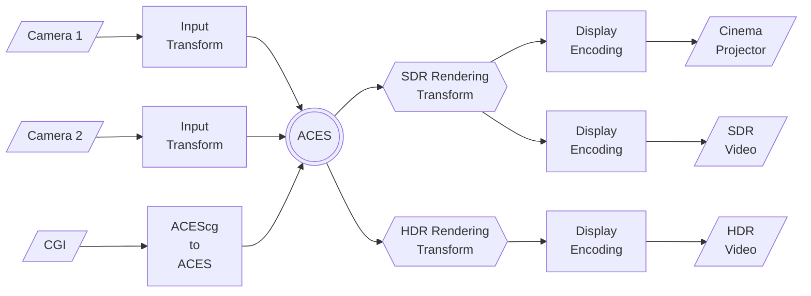

System Overview 
===============

ACES at a Glance
----------------
The framework provided by ACES is centered around a standardized scene-referred color encoding specification known as the Academy Color Encoding Specification (ACES)[^1]. [Figure 1](#aces-diagram) depicts a simple generalized workflow for ACES and demonstrates how disparate inputs are conformed to the uniform ACES color encoding, and then processed through Output Transforms to be viewed on different displays.

<figcaption align="center" markdown=1>
**Figure 1:** The ACES Color Encoding Specification with Multiple Inputs and Outputs
</figcaption>

In practice, most real production workflows will be more complex than this, with additional in/out points, on-set, VFX, color correction, compositing, archival, etc. Nonetheless, the ACES color encoding specification remains at the heart of the workflow no matter how complex the workflow diagram becomes. The ACES system provides recommended intermediate encodings and transforms for working on each of these post-production phases. Users may also choose to utilize encodings or transforms outside the "vanilla ACES" approach by making use of the Academy Metadata File (AMF) to document how images were transformed and viewed.

Components
----------

The Academy Color Encoding System (ACES) defines a framework with standard components for managing color  across the motion picture and television industries. ACES users can utilize standard ACES components to construct workflows as simple or as complex as their project demands. [Figure 2](#sample-workflow) shows an example workflow enabled by ACES.

<figure markdown="span">
  
  
</figure>
<figcaption align="center" markdown>**Figure 2:** A sample workflow using ACES components</figcaption>

The ACES system includes several key component categories:

### Transforms
Transforms are fixed, sequential operations that convert between different ACES encodings and color spaces. The primary types of ACES transforms are:

- **Input Transforms (IDTs)**: Convert camera-native data into ACES2065-1
- **Color Space Conversion Transforms (CSCs)**: Convert between color encodings. (1) 
- **Output Transforms (ODTs)**: Prepare scene-linear ACES data for display. (2) 
- **Look Transforms (LMTs)**: Apply technical or creative adjustments to scene-referred ACES2065-1.
    - **Reference Gamut Compression** - A technical Look Transform introduced in ACES 1.3 that helps to corral out-of-gamut values in source images

1.  Input Transforms are a specific type of CSC-one that converts from a camera-native encoding to ACES2065-1
2.  Output Transforms consist of:  
    A "Rendering Transform" that prepares scene-linear image data for a display-referred color space target (i.e. how should the image appear?).  
    This is followed by a "Display Encoding Tansform" that prepares the rendered colorimetry to be sent to a display, such that it will appear correctly when the display decodes the on-the-wire signal.

### Encodings 
Encodings are numeric representations of image data relative to defined color spaces, including:

  - **ACES2065-1**: Linear encoding in a wide-gamut RGB color space (AP0); the core interchange encoding in ACES.
  - **ACEScg**: Linear encoding using AP1 primaries, optimized for computer graphics rendering and compositing.
  - **ACEScct**: Logarithmic encoding using AP1 primaries, designed for scene-referred color grading.
  - **APD (Academy Printing Density)**: A printing-density-based encoding derived from spectral characteristics film print stocks and printer light source.
  - **ADX**: Integer-based (10-bit or 16-bit) encoding of APD, intended for film negative and inter-negative scanning workflows.

### Metadata Files 
Metadata files contain information used to track the color processing history, transform versions, and viewing context. 

  - **ACES Metadata File (AMF)**: Tracks the transforms used to process ACES images in a production, including Input Transform(s), Look Transform(s), and Output Transform(s).

### File Formats
Various file formats have been defined 

  - **ACES OpenEXR**: ACES-compliant image format used for interchange and archival of ACES2065-1 images
  - **Common LUT Format (CLF)**: A flexible XML-based format that can communicate an arbitrary chain of color operators, including 1D and 3D LUTs, matrices, ASC-CDL values, log and exponential shaper functions, and range scaling. While not ACES specific, CLF has seen increasing use in carrying CSC and Look Transforms. 

!!! note
    Many ACES encodings and file formats have been formally standardized through SMPTE. Refer to [SMPTE ACES Standards](https://www.smpte.org/standards/aces-standards) for a complete list of related documents.