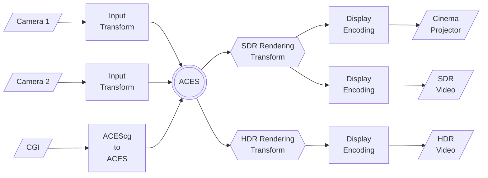

{ align=left }

Academy Color Encoding System Documentation
===========================================

What is ACES?
-------------
The Academy Color Encoding System (ACES) is an industry standard for managing color and digital files throughout the lifecycle of almost any media production, from motion pictures to television, video games, or immersive storytelling projects. ACES can ensure a consistent color experience to preserve the creator's vision through all phases of prodution - from image capture through editing, VFX, mastering, public presentation, archiving, and future remastering. 

ACES is free and open-source and dozens of companies have built ACES components into their tools.

ACES at a Glance
----------------
The framework provided by ACES is centered around a standardized scene-referred color encoding specification known as the Academy Color Encoding Specification (ACES)[^1]. [Figure 1](#aces-diagram) depicts a simple generalized workflow for ACES and demonstrates how disparate inputs are conformed to the uniform ACES color encoding, and then processed through Output Transforms to be viewed on different displays.

<figcaption align="center" markdown=1>
**Figure 1:** The ACES Color Encoding Specification with Multiple Inputs and Outputs
</figcaption>

In practice, most real production workflows will be more complex than this, with additional in/out points, on-set, VFX, color correction, compositing, archival, etc. Nonetheless, the ACES color encoding specification remains at the heart of the workflow no matter how complex the workflow diagram becomes. The ACES system provides recommended intermediate encodings and transforms for working on each of these post-production phases. Users may also choose to utilize encodings or transforms outside the "vanilla ACES" approach by making use of the Academy Metadata File (AMF) to document how images were transformed and viewed.

Why use ACES?
-------------
ACES can help to:

- simplify camera matching in DI;
- preserve original camera fidelity;
- remove ambiguity in communcation of image files in multi-vendor workflows; 
- add reliability to the color viewing pipeline; 
- streamline the creation of multiple outputs; 
- create a "known quantity" master for the archive

<!-- Explore
----------

-   :material-text-box-multiple-outline:{ .lg .middle } __ACES Components__

    ---

    Introductory information about the color encodings, file formats, transforms, and recommendations that comprise the ACES system.
    
    [:octicons-arrow-right-24: Specifications](./background/overview.md)

-   :material-wrench-cog-outline:{ .lg .middle } __ACES Concepts__

    ---

    The "how" and "why" behind the ACES specifications. Users looking to dig into the inner workings and/or rationale behind certain design decisions should look here.

    [:octicons-arrow-right-24: Technical Details](#)

-   :material-text-box-plus-outline:{ .lg .middle } __User Guides__

    ---

    Designed to provide hands on guidance to use ACES in real tools. And to establish best practices to answer "how do I use ACES?"

    [:octicons-arrow-right-24: Customization](#)

-   :material-file-document-check-outline:{ .lg .middle } __Standards__

    ---

    Certain components of the ACES system have been established as international standards.

    [:octicons-arrow-right-24: Standards](#)

 -->

[^1]: This color-encoding space has been standardized in SMPTE ST 2065-1.