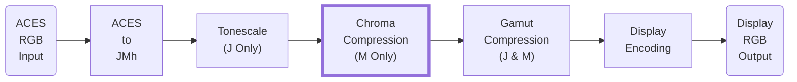
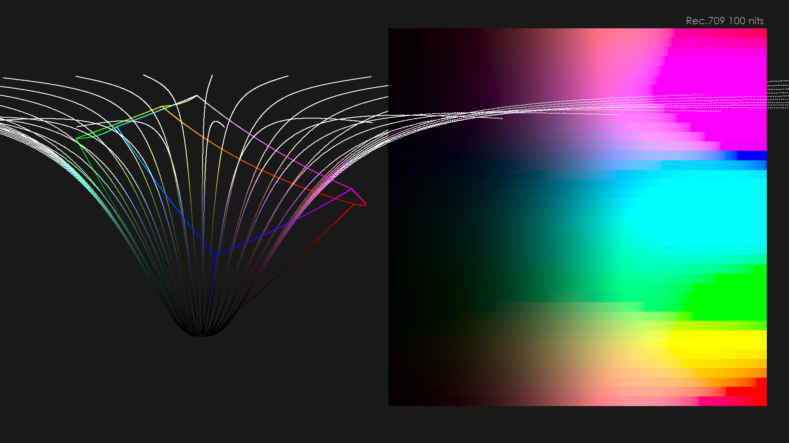
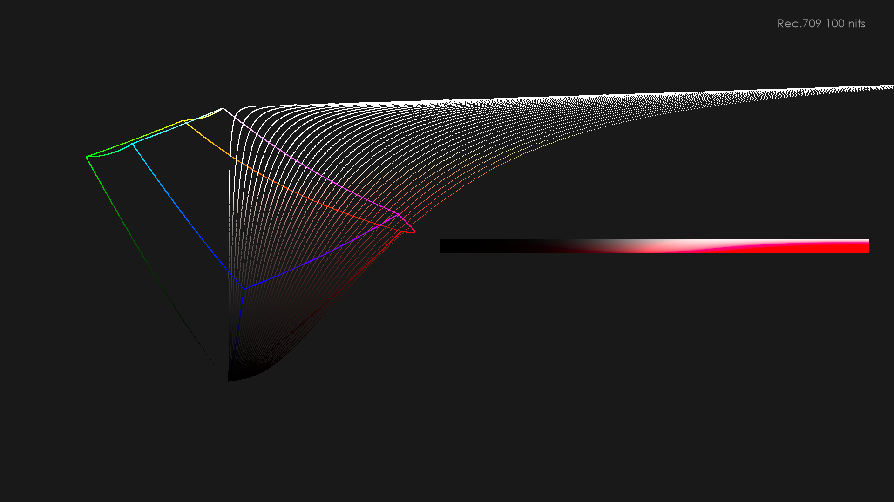
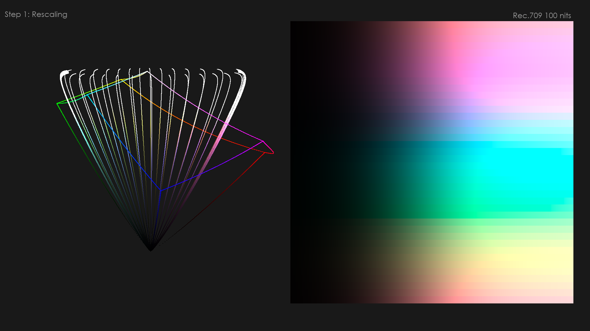
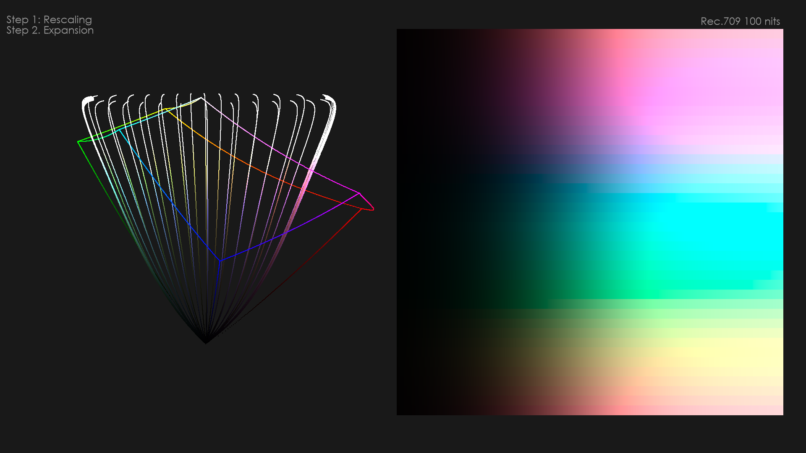
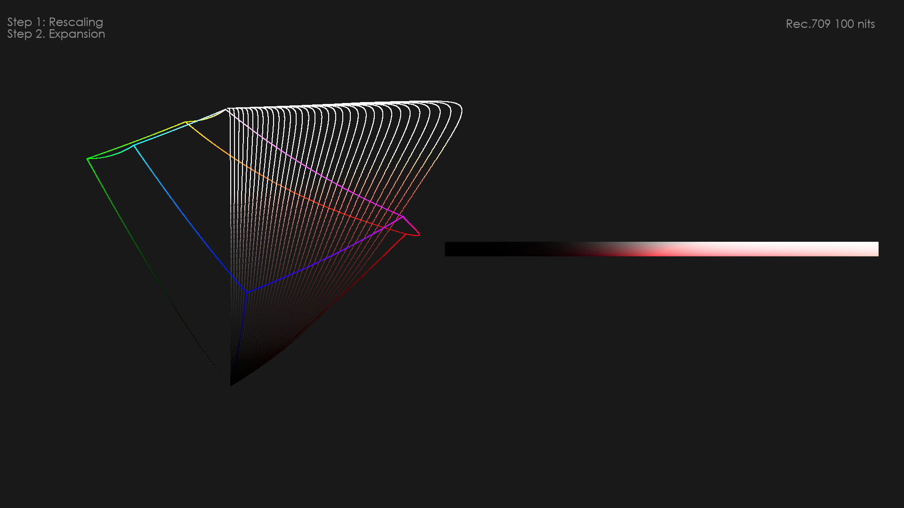
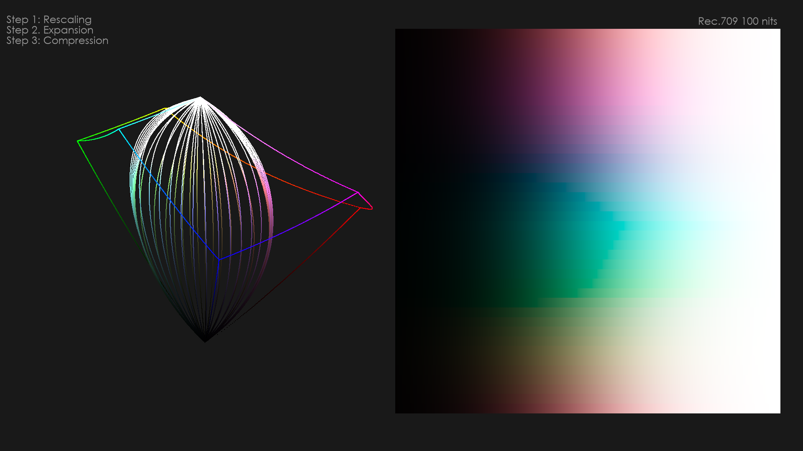
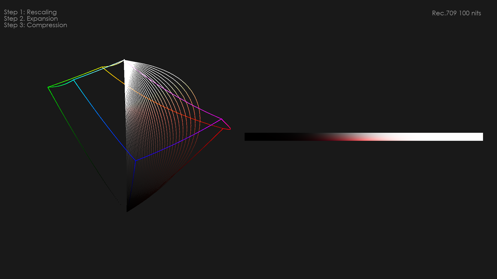

Chroma Compression
==================

### Introduction

Chroma Compression is a hue-preserving invertible photographic colour rendering technique.  Together with Tone Mapping, Chroma Compression creates the photographic base look for the transforms.  Throughout the Chroma Compression lightness (J) and hue (h) remains constant and only the colorfulness (M) is compressed.

Chroma Compresson is a non-linear expansion and compression of M over both the J axis and M axis. That is, the amount of expansion and compression of M depends on both J and M.  Compression increases as J values increase, and reduces as M values increase. This means shadows are compressed less than highlights, and less saturated colours are compressed more than pure colours.

The limiting display gamut boundary is not taken into consideration.  All out of gamut colorus will be mapped into the limiting gamut later by the gamut mapper.  The Chroma Compression mainly affects the interior of the gamut.

### Forward Procedure

The forward direction of the Chroma Compression performs the following operations in order.  At the heart of the operations is a $toe$ function defined in later section.

#### Rescaling

The Tone Mapping step has compressed J to the target display peak luminance.  This means that the M correlate must also be compressed or rescaled down to that same range. This is done by using the $\frac{1}{cz}$ exponent defined in Hellwig2022 model in order maintain the correct M to J ratio. Maintaining the correct ratio keeps the chromaticities constant. The rescaling method is the following:

$$
M_s = M\cdot\left(\frac{J_{t}}{J}\right)^{\frac{1}{cz}}
$$

where,

$J_t$ is the tonescale compressed J

$J$ is the original J correlate

$c$ and $z$ are constants defined in the Hellwig2022 model

<figure markdown="span">
  
  <figcaption>Example hue sweep without chroma compression</figcaption>
</figure>

<figure markdown="span">
  
  <figcaption>Example hue slice without chroma compression</figcaption>
</figure>

<figure markdown="span">
  
  <figcaption>Effect of rescaling M</figcaption>
</figure>

<figure markdown="span">
  
  <figcaption>Effect of rescaling M</figcaption>
</figure>

#### Normalization

The purpose of the normalization step is to establish the maximum compression and expansion limit as a normalized distance, and to normalize the M value with a hue dependent AP1 gamut cusp value.

The maximum distance is limited to AP1.  That is, the compression and expansion will not affect M values beyond what would be AP1 in chromaticity space.  Values outside AP1 will later be clipped by the transform.  This makes AP1 effectively the rendering space of the transform.  The limit value used in the $toe$ function is calculated as follows:

$$
limit = \frac{J_{t}}{J_{max}}^{\frac{1}{cz}}\cdot\frac{AP1ReachM[h]}{AP1_{cusp}}
$$

where,

$AP1ReachM$ is a hue dependent lookup table of AP1 M values of $J_{max}$

$AP1_{cusp}$ is  hue dependent curve that approximates AP1 gamut cusp M value

The $AP1_{cusp}$ hue dependent curve is the following formula that was derived by fitting against the actual AP1 gamut cusp M values for different peak luminances:

$$
AP1_{cusp} =\\ 
(11.34072\cdot cos(h) +16.46899\cdot cos(2\cdot h) + 7.88380\cdot cos(3\cdot h) + \\ 
14.66441\cdot sin(h) - 6.37224\cdot sin(2\cdot h) + 9.19364\cdot sin(3\cdot h) + 77.12896) \cdot\\ 
(\left(0.03379 \cdot L_{peak}\right) ^ {0.30596} - 0.45135)
$$

!!! note
    The $h$ in the hue dependent curve is in radians.

The normalization of M with $AP1_{cusp}$ makes the compression and expansion operations hue dependent.  The normalization is done as follows:

$$
M_n =\frac{M_s}{AP1_{cusp}}
$$

!!! note
    The normalization and denormalization steps are the same in forward and inverse directions of the transform.

#### Expansion

The expansion step is crucial to bring “life” into the image. After the rescaling step the colors come out dull in the mid-tones and shadows are very desaturated. The expansion step increases saturation in the shadows and mid-tones but not in the highlights.

The expansion applies the $toe$ function in *reverse direction* with the following parameters:

$$
c_1 = saturation\cdot(1.0-\frac{J_{t}}{J_{max}})
$$

$$
c_2 = \sqrt{\frac{J_{t}}{J_{max}}^{2}+threshold}
$$

The $saturation$ parameter defines how aggressive the expansion is.  It scales down based on higher peak luminance for better appearance match with different displays.  It scales down because the model naturally gets more colorful with higher peak luminance.

The $threshold$ parameter is used to reduce expansion of noise by making the toe of the toe function less aggressive near black. It too scales down but because deep shadows get more desaturated with higher peak luminance.  They are defined as follows:

$$
expand = 1.3
$$

$$
saturation= max(0.2,  expand - expand \cdot 0.69 \cdot  \log_{10}\left(\frac{L_{peak}}{100}\right))
$$

$$
threshold = \frac{0.5}{L_{peak}}
$$

<figure markdown="span">
  
  <figcaption>Effect of expansion of M</figcaption>
</figure>

<figure markdown="span">
  
  <figcaption>Effect of expansion of M</figcaption>
</figure>

!!! note
    The illustrations show the intermediate results with the normalization and denormalization steps always applied.

#### Compression

The compression step creates the saturation roll-off in the highlights. It compresses less saturated colors more and more saturated colors less, preserving pure colors from compression. The compression affects highlights and mid-tones and does not compress shadows.  The compression step has a large effect on skin tone rendering and how they desaturate at higher intensity levels.

The compression applies the $toe$ function in *forward direction* with the following parameters:

$$
c_1 =compression\cdot \frac{J_{t}}{J_{max}}
$$

$$
c_2 = 1.0-\frac{J_{t}}{J_{max}}
$$

The $compression$ parameter defines how aggressive the compression is. The parameter scales up based on higher peak luminance for better appearance match with different displays.  It scales up because the model naturally gets more colorful with higher peak luminance. They are defined as follows:

$$
compr = 2.4
$$

$$
compression = compr+ compr \cdot 3.3 \cdot \log_{10}\left(\frac{L_{peak}}{100}\right)
$$

<figure markdown="span">
  
  <figcaption>Effect of compression of M</figcaption>
</figure>

<figure markdown="span">
  
  <figcaption>Effect of compression of M</figcaption>
</figure>

#### Denormlization

After completing all the operations the resulting compressed M is then denormalized as follows:

$$
M =M_c\cdot{AP1_{cusp}}
$$

The denormalization is the final step in the Chroma Compression.

### Inverse Procedure

The chroma compression is fully invertible by applying the same set of operations described above but in reverse order and in inverse direction.

#### Normalization

Normlization step in the inverse is the same as in the forward procedure.

#### Inverse of Compression

Inverse of compression applies the $toe$ function in *inverse direction* with the same parameters as defined in the forward procedure.

#### Inverse of Expansion

Inverse of expansion applies the $toe$ function in *inverse of reverse direction* with the same parameters as defined in the forward procedure.

#### Denormlization

Denormlization step in the inverse is the same as in the forward procedure.

#### Inverse of Rescaling

The inverse of the rescaling step is the following:

$$
M = M_s\cdot\left(\frac{J_{t}}{J}\right)^{-\frac{1}{cz}}
$$

The resulting M is the fully inverted colorfulness.

### The toe function

At the heart of the Chroma Compression and expansion is an invertible “toe” function ([https://www.desmos.com/calculator/6vplvw14ti](https://www.desmos.com/calculator/6vplvw14ti)). The toe in the function will compress less saturated colors more than more saturated colors, and the size and shape of the toe will determine the aggressiveness of the compression.

In the forward direction the function performs compression and in the reverse direction it performs expansion.  The function has an inverse for both forward and reverse directions.

Forward direction:

$$
toe(x, limit, c_1, c_2) = \frac{k_3 x - k_1+\sqrt{(k_3 x - k_1)^{2}+4k_2 k_3 x}}{2}
$$

and its reverse:

$$
toe_r(x, limit, c_1, c_2) = limit - toe(limit - x, limit - 0.001, c_1, c_2)
$$

Inverse direction:

$$
toe_{inv}(x, limit, c_1, c_2) = \frac{x^{2}+k_{1}x}{k_{3}\left(x+k_{2}\right)}
$$

and its reverse:

$$
toe_{invr}(x, limit, c_1, c_2) = limit - toe_{inv}(limit - x, limit - 0.001, c_1, c_2)
$$

where,

$k_{1}=\sqrt{c_1^{2}+k_{2}^{2}}$

$k_{2}=max(c_2, 0.001)$

$k_{3}=\frac{limit+k_{1}}{limit+k_{2}}$

The function is driven with three external parameters $limit$, $c_1$ and $c_2$.
