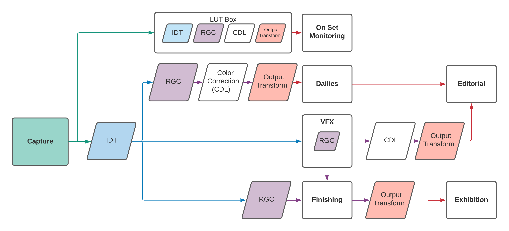
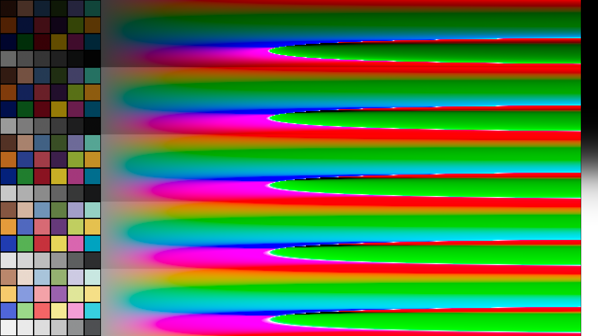
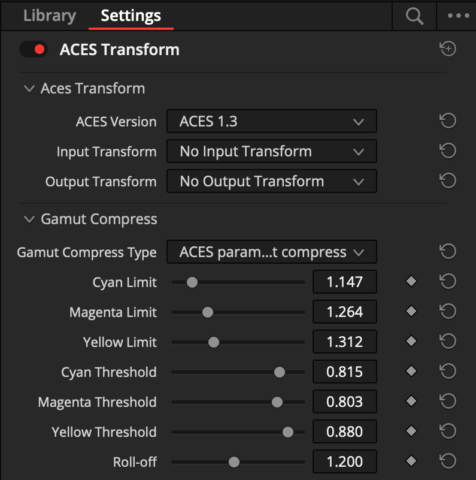

ACES Reference Gamut Compression Implementation Guide
================

Scope
----------------

The purpose of this document is to detail and define standards for user
interface and experience, workflow, tolerances, and tracking of the ACES
Reference Gamut Compression (RGC) published in [ACES
1.3](https://github.com/ampas/aces-dev/tree/v1.3). 

For detailed technical specifications, please refer to the [Specification](../../specification/index.md).


Introduction
----------------

The ACES Reference Gamut Compression was introduced to help solve ACES user
issues with out of gamut (negative) pixels introduced either in the conversion
from camera raw RGB via an Input Transform (IDT) into ACES AP0 or in the
conversion from ACES AP0 into ACES AP1 (ACEScg and ACEScct). These out of gamut
pixel values are problematic when their negative components cause issues in
compositing, and may also produce visual artifacts when viewed through an ACES
Output Transform.

<figure markdown>
  
  <figcaption>User Testing Footage Examples</figcaption>
</figure>

Target Audience
----------------

This document is targeted at software developers and product managers looking to
integrate the Reference Gamut Compression into their software package or
library. It will focus on the “how” as opposed to the “why”, which is covered in
the architecture documentation above.

Workflow Recommendations
----------------

<figure markdown>
  
  <figcaption>Workflow</figcaption>
</figure>

As visualized in the flowchart above, it is recommended (in the current absence
of AMF for tracking) that most productions utilize the gamut compression in
every area - from on set all the way to finishing.  This means that at this
time, the RGC is “always on” by default in any viewing pipeline.  Following the
general ACES workflow philosophy, the RGC is only baked into image data at the
appropriate stage in the pipeline - which varies based on the needs of the
production, as outlined in the flow chart above. For further workflow
specifications, please refer to the [User Guide](../rgc-user/index.md).

Reference Implementation Specifications
----------------

### Versioning and Naming

The Reference Gamut Compression published in ACES 1.3 uses the following ACES
Transform ID and ACES User Name in the
[CTL](https://github.com/ampas/aces-core/blob/v1.3/transforms/ctl/lmt/LMT.Academy.GamutCompress.ctl):


```
<ACEStransformID>urn:ampas:aces:transformId:v1.5:LMT.Academy.ReferenceGamutCompress.a1.v1.0</ACEStransformID>
<ACESuserName>ACES 1.3 Look - Reference Gamut Compress</ACESuserName>
```

Implementers should only make the RGC available in the UI when their application
has the ACES version set to 1.3 or higher.

### Project and Clip Level Setting
When an application has the ACES version set to 1.3 or higher, a simple
check-box (defaulting to **on**) should be exposed in the project settings which
applies the RGC to all clips in the project.

<figure markdown>
 { width="900" }
  <figcaption>DaVinci Resolve project level RGC setting</figcaption>
</figure>

An override should be provided at the clip level, so that the user can control
the RGC setting for individual clips, if required.


<figure markdown>
  { width="785" }
  <figcaption>DaVinci Resolve clip level RGC setting</figcaption>
</figure>

Implementers may also choose to offer a [parametric variation of the RGC](#parametric-version-implementation-specifications)).

### Export Settings
The user should be able to easily control whether rendered media will have the
RGC “baked in”. Options should be available so that exports can either follow
the global project setting, individual clip settings, or be forced to either on
or off for all clips. If an application offers export templates, then templates
should be provided which force the RGC off when rendering EXRs (following the
recommended workflow for VFX pulls) and follow the clip settings when rendering
deliverables with an Output Transform baked in.

Test Images and Tolerances
----------------

<figure markdown>
  
  <figcaption>Test image (without RGC) with sRGB Output Transform applied</figcaption>
</figure>

To aid with validation of implementations, a test image has been created which
covers a wide dynamic range (including negatives) and contains values which
exceed the AP1 gamut in every direction. It also includes ColorCheckers at
varying exposures, to confirm that the gamut compression does not alter colors
within the “zone of trust”.

The Python code to create the test image can be found in
[this Google Colab](https://colab.research.google.com/drive/15RyJCkSNz9rG-Z5DUVyphag5t9eTvmu7#scrollTo=s9pfiGWsEEHu).
The resulting test file can be downloaded from [here](https://www.dropbox.com/sh/u6z2a0jboo4vno8/AAB-10qcflhpr0C5LWhs7Kq4a?dl=0&preview=gc_test_image_v007.exr),
and the test image processed through the [CTL implementation](https://github.com/ampas/aces-core/blob/v1.3/transforms/ctl/lmt/LMT.Academy.GamutCompress.ctl)
of the RGC can be downloaded from [here](https://www.dropbox.com/sh/u6z2a0jboo4vno8/AAB-10qcflhpr0C5LWhs7Kq4a?dl=0&preview=gc_test_image_v007_gamut_compressed_ctlrender.exr)
 (Note: `ctlrender` adds an alpha channel to the result, which can be ignored.)

For comparison of an implementation with the reference, a relative error metric
has been defined (see [Appendix A](#appendix-a-relative-metric-detail)).

The command-line application `oiiotool`, which is installed as a component
of [OpenImageIO](https://github.com/OpenImageIO/oiio), can be used to compare
pixels between two images and evaluate the metric specified above, using the
following command line (with `test_target.exr`  replaced with the name of the
file under test):

```
oiiotool gc_test_image_v007_gamut_compressed_ctlrender.exr --dup test_target.exr --absdiff --swap --abs --maxc 0.1 --div --rangecheck 0,0,0 .002,.002,.002 -o /tmp/tmp.exr
```

A match within tolerances will produce the following output:

```

       0  < 0,0,0
       0  > .002,.002,.002
 2073600  within range
```

Implementers are of course free to use their own code to perform validation, as
long as it applies the same metric.


Tracking via ACES Metadata File (AMF)
----------------

The Reference Gamut Compression is trackable via a `lookTransform` element in the
[ACES Metadata File (AMF)](../../../amf/specification/index.md). If the RCG is used in the viewing pipeline, the `lookTransform` will
be listed in the associated AMF. If the AMF is accompanying rendered media, use
the `applied` flag to track whether or not the RGC has been “baked in”. See
below for an example AMF:

```
  <aces:inputTransform applied="true">
    …
  </aces:inputTransform>
  <aces:lookTransform applied="true">
    <aces:description>ACES 1.3 Look - Reference Gamut Compress</aces:description>
    <aces:transformId>urn:ampas:aces:transformId:v1.5:LMT.Academy. ReferenceGamutCompress.a1.v1.0</aces:transformId>
  </aces:lookTransform>
```

If using the RGC in a viewing pipeline, this `lookTransform` should appear
directly after the IDT, first in the list of any LMTs, to make sure other
operations benefit from the gamut compression. The Transform ID outlined in the
specification section should be included in any exported AMFs, with the
`applied` flag set as appropriate, and the description set to the `ACESuserName`
to enable proper tracking. Currently, only the Reference (i.e. static) Gamut
Compression is trackable via AMF.

Parametric Version Implementation Specifications {#parametric}
----------------

An implementation of the gamut compression transform which exposes the
parameters to the user should be treated differently than the ACES RGC and
grouped with other, creative color correction operators instead.

As a creative color correction tool, the parametric gamut compression transform
is expected to be used as part of a color correction operator stack. This
parametric transform can be useful to achieve a desired “look” or manage
out-of-gamut artifacts created earlier in the process chain that were not, or
could not, be addressed by the RGC.  The parametric version should not be used
as a replacement for the RGC since it cannot be tracked by AMF.

While such an operator is not explicitly endorsed, the following recommendations
are made to facilitate a common user experience across implementations:

!!! example "Parameters"
    |                       || UI Label  | Components                | Slider Range  | Default Value(s) / Slider Detents |
    |-----------------------||-----------|---------------------------|---------------|-----------------------------------|
    | Distance Limit        || Limit     | 3 (Cyan, Magenta, Yellow) | 1.001 - 2.000 | C:1.147, M:1.264, Y:1.312         |
    | Compression Threshold || Threshold | 3 (Cyan, Magenta, Yellow) | 0.000 - 1.000 | C:0.815, M:0.803, Y:0.880         |
    | Power Curve Exponent  || Roll-off  | 1                         | 0.500 - 2.000 |         1.200                     |

These default values will exactly match a parametric implementation to the RGC.

<figure markdown>
{ width="450" }
  <figcaption>DaVinci Resolve Parametric Gamut Compress Settings</figcaption>
</figure>

Appendices
----------------

### Appendix A: Relative metric detail

Where video and logarithmic encodings are typically sufficiently perceptually
uniform that a simple absolute error metric such as `(actual - aim)` may be
used, scene-linear encodings require a tolerance that is tighter for dark colors
and looser for bright colors. This is due to the approximately logarithmic
nature of human color perception (although the metric is actually computed per
channel).

When comparing an aim and actual value, a basic relative error metric has the
form:

$$\frac{(actual - aim)}{aim}$$

However this can become overly sensitive when the values being compared become
very small. In the limit, when the aim value is zero, the result is either
`infinity` or `NaN`. Therefore it is useful to use a “safe-guarded relative
error metric” that places a lower bound on the denominator:

$$\frac{(actual - aim)}{max(aim, lower\_bound)}$$

This effectively transitions the error metric from being a relative error metric
for bright and normal colors to an absolute error metric when approaching a
certain noise floor determined by the `lower_bound` constant. A reasonable
`lower_bound` constant for images in ACES2065-1 color space would be 0.1. It is
also necessary to handle the case where the aim value may be negative, in which
case the final error metric becomes:

$$\frac{abs(actual - aim)}{max(abs(aim), 0.1)} <= 0.002$$

This is essentially a relative tolerance of +/– one part in 500 above 0.1 and an
absolute tolerance of +/– 0.0002 below 0.1.


References
----------------

The following standards, specifications, articles, presentations, and texts are
referenced in this text:

* [ACES Gamut Mapping Architecture VWG - Technical Documentation Deliverable](https://paper.dropbox.com/doc/tZHiuOCj0RdYw8PPkrTam)


<!-- Include section numbering -->
<style>
    @import "../../stylesheets/sections.css"
</style>