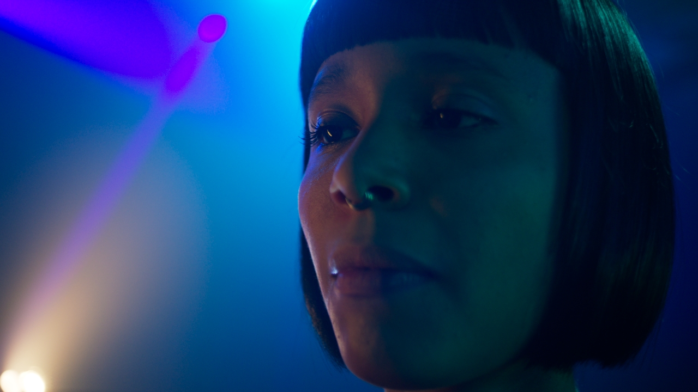
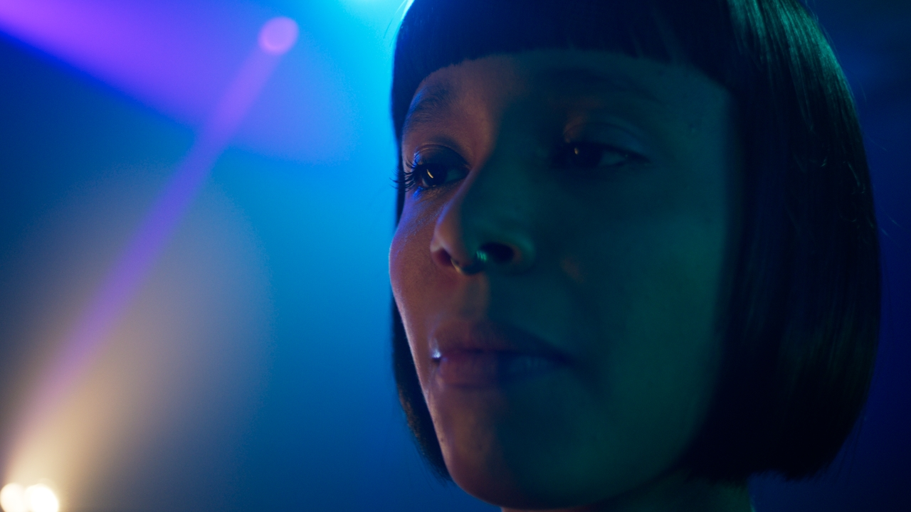

<!-- SPDX-License-Identifier: CC-BY-4.0 -->
<!-- Copyright Contributors to the ACES Documentation -->

Introduction
============

Background
----------
A common complaint from users of ACES v1 was artifacts resulting from out of gamut values in source images. These artifacts are most known for appearing in highly saturated, bright LED light sources such as police car lights, stoplights, etc - but also show up frequently in LED sources used to light scenes.

In an ACES workflow, these artifacts appear at two stages:

- The conversion from camera-native RGB into ACES AP0 via an Input Transform (IDT)
- The conversion from ACES AP0 (ACES2065-1) into ACES AP1 (ACEScg and ACEScct)

These out of gamut pixel values are problematic when their negative components cause issues in compositing, and may also produce visual artifacts when viewed through an ACES Output Transform.

<figure markdown="span">
    
    <figcaption>Without RGC</figcaption>
</figure>

<figure markdown="span">
    
    <figcaption>With RGC</figcaption>
</figure>

Prior to the development of the RGC, a Look Modification Transform (LMT) referred to as the "blue light artifact" fix was created as a temporary solution. However,  this solution affected all pixels in the image equally, rather than simply healing the problem areas. A new solution was needed which preserved colors within a “zone of trust”, thus only altering the most saturated and problematic values. Introduced in ACES 1.3, the Reference Gamut Compression algorithm was intended to replace and deprecate the "Blue Light Artifact" LMT.

Various options were investigated, and the working group finally settled on a simple RGB ratio based algorithm which compresses values based on their distance from the neutral axis. This makes no attempt to ascertain the “correct” value for a pixel, since the nature of the problem means that these pixels may have no correct color. The algorithm is intended as a technical correction rather than an aesthetic look. It “heals” the problem pixels, to produce new RGB values which are less problematic when used in subsequent compositing or grading operations. Creative modifications are left for the user to apply as necessary downstream of the RGC.

Further Resources
--------------------

[:octicons-arrow-right-24: Specification](./specification/index.md)

[:octicons-arrow-right-24: Technical Details](#)

[:octicons-arrow-right-24: Customization](#)