IDT Capture Guide for Prosumer Cameras
======================================

Overview
--------

This guide defines the correct procedure for capturing a grey card and “Macbeth” ColorChecker chart for generating Input Transforms (IDTs) for prosumer cameras. It ensures accurate chart exposure, consistent lighting, and a full bracketed response.

Following this procedure will produce reference material to use with the [*ACES IDT Calculator*](https://github.com/ampas/idt-calculator)

!!! warning "Important Note:"
    The quality of the IDT generated by this process is directly tied to the precision and care taken during the capture of the calibration targets. This is a scientific and meticulous procedure requiring focus and commitment. Do not attempt this alongside other camera tests or during production shooting on the back of a truck. A poorly generated IDT can be more detrimental than having no IDT at all.

What You'll Need
----------------

* Grey card (18% reflectance, spectrally neutral) (1)

* “Macbeth” 24-patch ColorChecker (2)
        
* Two identical, high-CRI diffuse light sources (3)
    
* Tripod-mounted camera

* Incident light meter and spot meter

* (Optional) CCT/SPD meter

* (Optional) Camera body cap or lens cap

1.  Recommended examples include the X-Rite ColorChecker Grey Balance card or the Lastolite EzyBalance 18% Grey Card.  Manufacturer websites:  [www.calibrite.com](https://www.calibrite.com/)  [www.lastolite.com](https://www.lastolite.com/)

2.  Must be an X-Rite model manufactured after 2014 to ensure standardized color targets.  Manufacturer website: [www.calibrite.com](https://www.calibrite.com/)

3.  If the aim is to create a generic IDT, we suggest wideband lights such as wide-band LED, Tungsten, HMI, or fluorescent

---

Pre-Shoot Setup
---------------

### 1. Prepare your camera

#### Warm up Camera Sensor

Before beginning, perform a **factory reset** of the camera to clear any lingering settings or color transformations.

Then, allow the camera to warm up for **20–30 minutes** in live view or standby mode. This ensures sensor stability for color response and noise floor.

#### Recommended Camera Settings

* Perform a full factory reset before starting the setup.

* Choose the recording format (e.g., log-based or raw) that corresponds to the IDT you intend to create.

* Turn off all unnecessary image processing, such as:

    * Noise reduction

    * Sharpening

    * Picture paint settings

    * In-camera LUTs or picture profiles

* Manually set white balance to match the measured CCT of the light source, unless otherwise required.

* Set the camera to full manual exposure mode.

* Disable auto-ISO, auto-exposure, and auto-white balance.

* Set ISO to the base or native ISO value for the chosen mode (commonly ISO 400, 800, etc.).

* Choose a frame rate (e.g., 24 fps or 25 fps) and shutter speed (e.g., 1/48 or 1/50 sec) that will:

    * Avoid light flicker with your fixtures

    * Leave headroom to adjust shutter and fps during exposure bracketing, keeping other settings fixed. 
    
        ??? example
            If your camera is set to 24 fps with a 1/48 shutter for the nominal exposure, you can shift the exposure by reducing the shutter to 1/96 (−1 stop), 1/192 (−2 stops), etc., or increasing it to 1/24 (+1 stop), 1/12 (+2 stops), etc. If your shutter duration becomes longer than the frame interval, you may raise the frame rate (e.g., to 50 or 60 fps) and remeasure. This approach avoids changes to aperture or ISO, which can affect optical behavior or the camera's EOTF. Be cautious that longer exposures might introduce noise, so test and note accordingly.

### 2. Setup Lighting (45/0 Geometry)

* Place both lights at **45-degree angles** to the subject, horizontally relative to the camera. This is known as 45/0 geometry, a standard lighting setup for color measurements. (1)

* The two lights should be:
    * Matched in output and color temperature
    * Diffuse (softboxes, bounced, or filtered)
    * Spectrally stable (avoid dimming unless verified)

* Place the camera **perpendicular** (0 degrees) to the chart surface.

* Background must be **neutral grey or black**.

1.  For a visual explanation, see the [45/0 geometry guidelines by X-Rite](https://www.xrite.com/blog/what-is-45-0-geometry).

[Figure 1](#fig-setup) shows an example of an ideal setup for the capture procedure.

<figure markdown>
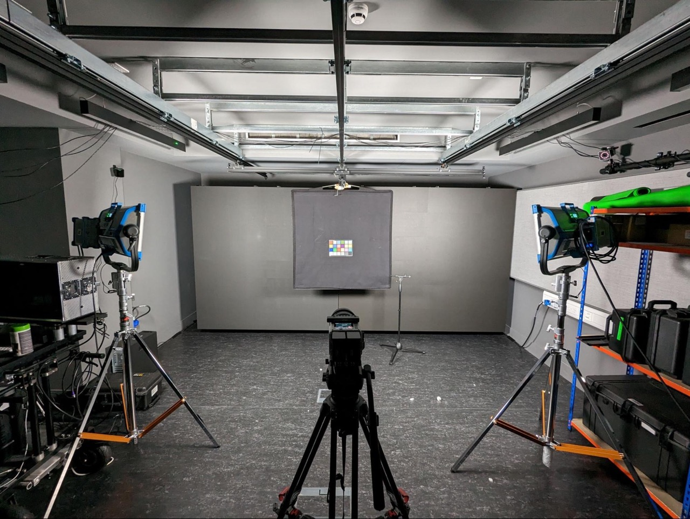
<figcaption>**Figure 1**</figcaption>
</figure>

### 3. Check Lighting Uniformity

The procedure in this section will help assure the final lighting setup is even across the chart. One light will be turned on at a time to independently measure its intensity and fall off. 

1.  **Turn on only one of the two lights** as in [Figure 2](#one-light).

    
    <figure markdown>
    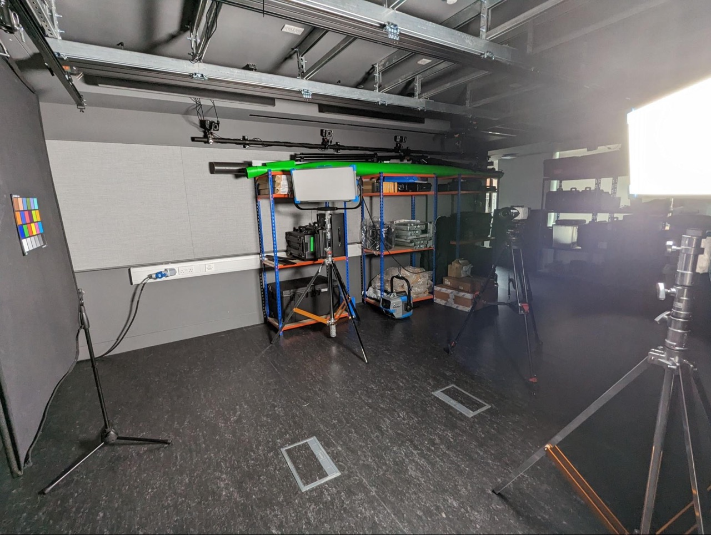
    <figcaption>**Figure 2**</figcaption>
    </figure>

2.  Measure the **4 corners** of the chart with an **incident light meter**, facing toward the camera.  
    (See [Figure 3](#measure-left) and [Figure 4](#measure-right))

    !!! note
        It's okay if one side is darker; adjust the lighting to minimise the fading off.

    
    <figure markdown>
    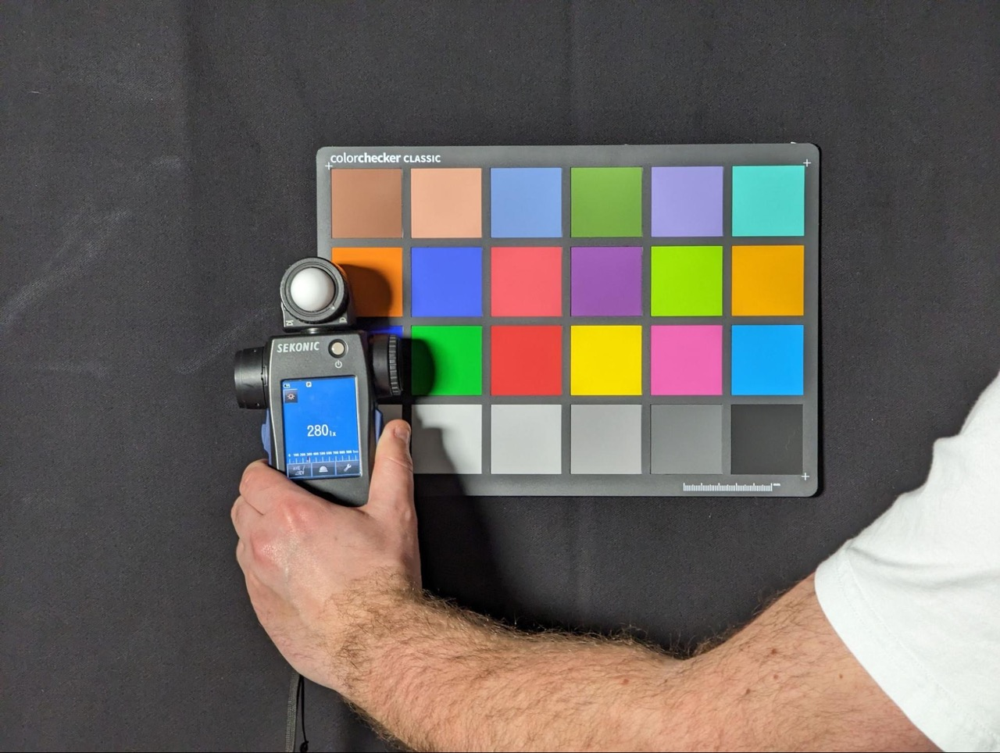
    <figcaption>**Figure 3**</figcaption>
    </figure>

    <figure markdown>
    
    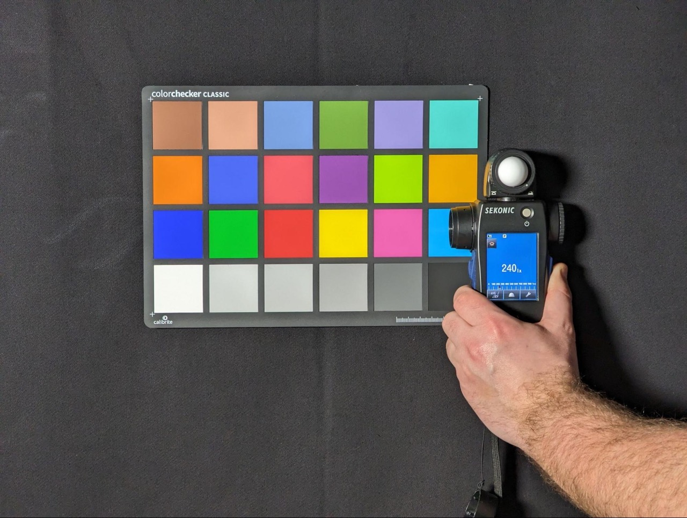
    <figcaption>**Figure 4**</figcaption>
    </figure>

3.  Now switch to the other **light and repeat**. Confirm that the readings are **mirror-symmetric** to the previous ones.  
    (See [Figure 5](#measure-left-2) and [Figure 6](#measure-right-2))

    
    <figure markdown="span">
    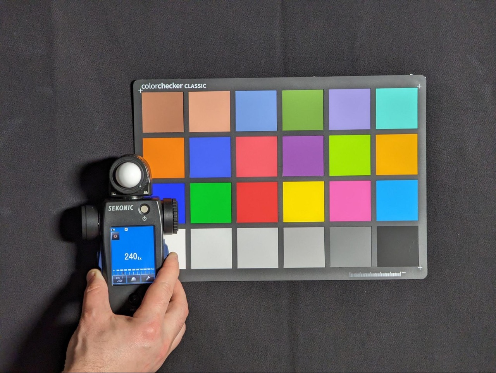
    <figcaption>**Figure 5**</figcaption>
    </figure>

    
    <figure markdown="span">
    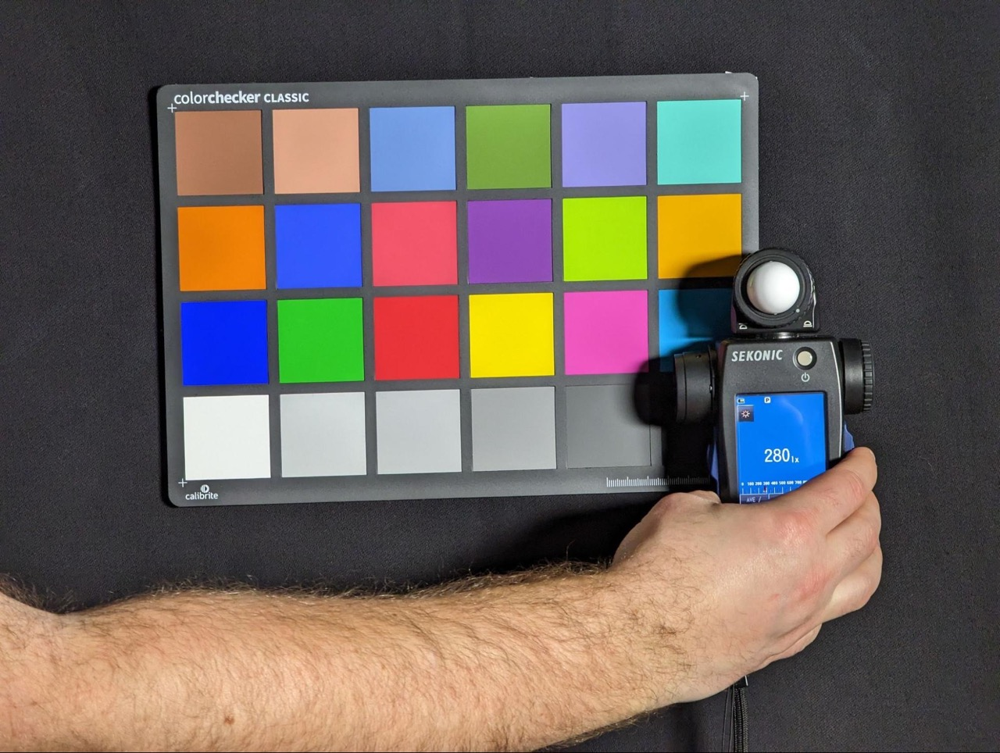
    <figcaption>**Figure 6**</figcaption>
    </figure>

4.  Turn on **both lights together** and measure all corners again. Readings should now be **even across all corners**.  
    Adjust light position and diffusion if needed.

---

Capture
-------

### Grey Card Capture

1.  Place the grey card **at the center of where the chart will go**.

2.  Stand directly **in front of the camera lens or right next to the sensor focal plane**.

    
    <figure markdown>
    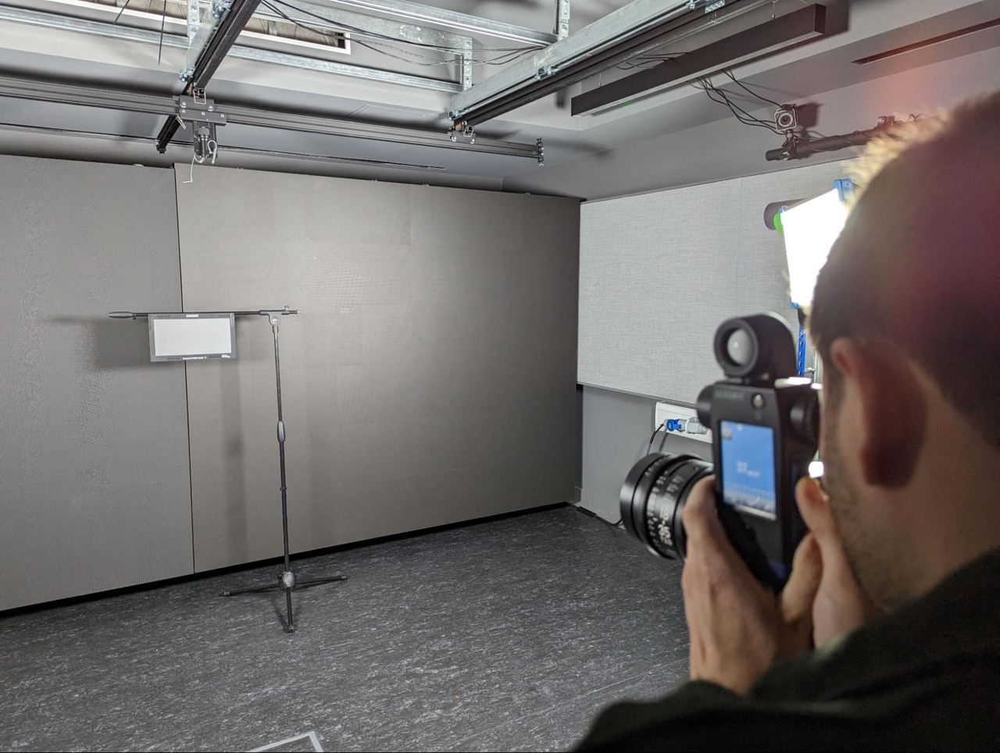
    <figcaption>**Figure 7**</figcaption>
    </figure>

3.  Use the **spot meter**, set to the same ISO and shutter speed as the camera.  

    
    <figure markdown>
    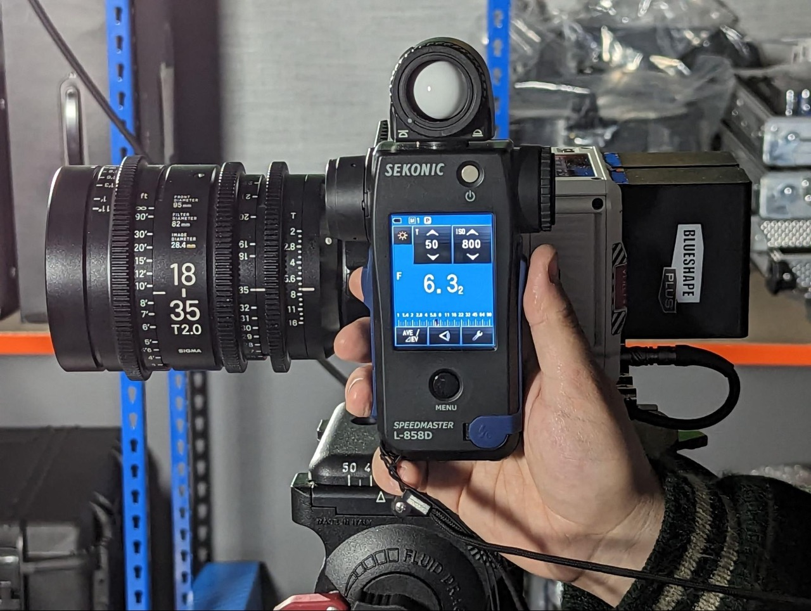
    <figcaption>**Figure 8**</figcaption>
    </figure>

4.  Measure the **grey card reflectance**.

5.  Set the **aperture** on the camera to match the reading.

6.  Record the following metadata:

    * Camera make and model

    * ISO, shutter speed, T-stop

    * Frame rate (fps)

    * Light source type, CCT

    * Any ND filters (discouraged)

    * Camera warm-up time

7.  Capture a still or very short clip (~1 second) of the grey card. If you're shooting with a film motion picture camera, wait, of course, for the camera to be at speed.  
    Keep the full card visible, evenly lit, and in focus.

---

### Colour Checker (Macbeth Chart) Capture

1.  Replace the grey card with the Colour Checker **"Macbeth” 24-patch chart** in the same position.

2.  Do not change **any** camera or lighting settings.

3.  Capture a still or short video clip of the “Macbeth” chart.  
    Keep the entire chart in view and in focus.

### Exposure Bracketing (Required)

To measure the camera's tone response:

* **Bracket exposures** from **\-3 to \+3 stops minimum**. (1)
* **Use only shutter speed or FPS** to vary exposure.  
* Maintain:  
    * Constant aperture  
    * Fixed ISO  
    * Stable lighting  
    * No ND filters added or changed

1.  If your camera's ISO and shutter speed settings do not land precisely on full-stop intervals, that is acceptable—as long as all relevant camera settings are accurately recorded. Precise exposure offsets can be calculated during IDT generation.

!!! note "Capture Duration"
    For still cameras, capture **at least two frames per setup** to ensure redundancy.  
    For video cameras, keep each clip **as short as possible**—ideally not longer than 1 second per exposure—to reduce data volume and simplify processing.

!!! note "Slates"
    Avoid traditional slates to reduce clip length and post-editing workload. Instead, consider using **a white tape or label** marked with the exposure stop (e.g., "+2", "Nominal") placed **just below the chart** and within the frame. This method applies equally to grey card and Macbeth chart captures and ensures that each setup is clearly identifiable without the need for additional editing.

#### Suggested Brackets

* -3, -2, -1, Nominal, +1, +2, +3  (1)

1.  If possible, extend to -4/+4 or -5/+5 stops

!!! note
    If your camera's ISO and shutter speed increments don't allow precise full-stop exposure shifts, that's okay. The IDT Calculator can compensate for **non-integer stop values**—just make sure to log all settings accurately.

For each bracketed frame, be sure to log:

* Shutter speed used  
* FPS (if different)  
* Relative exposure offset (1) 

1.  The exposure offset can be approximate; precise exposure offsets can be calculated afterward as long as all camera settings—shutter speed, ISO, FPS—are recorded accurately.

### Example Capture Results

<figure markdown>
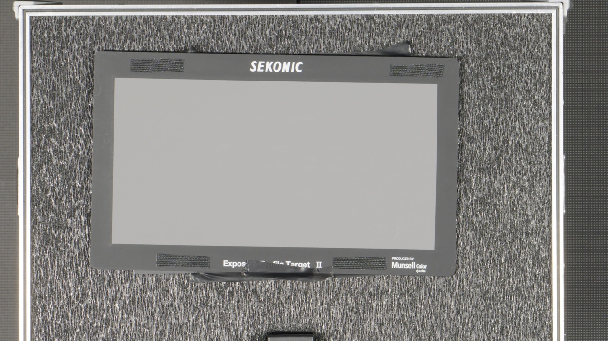
<figcaption markdown>**Grey Card**</figcaption>
</figure>

<figure markdown>
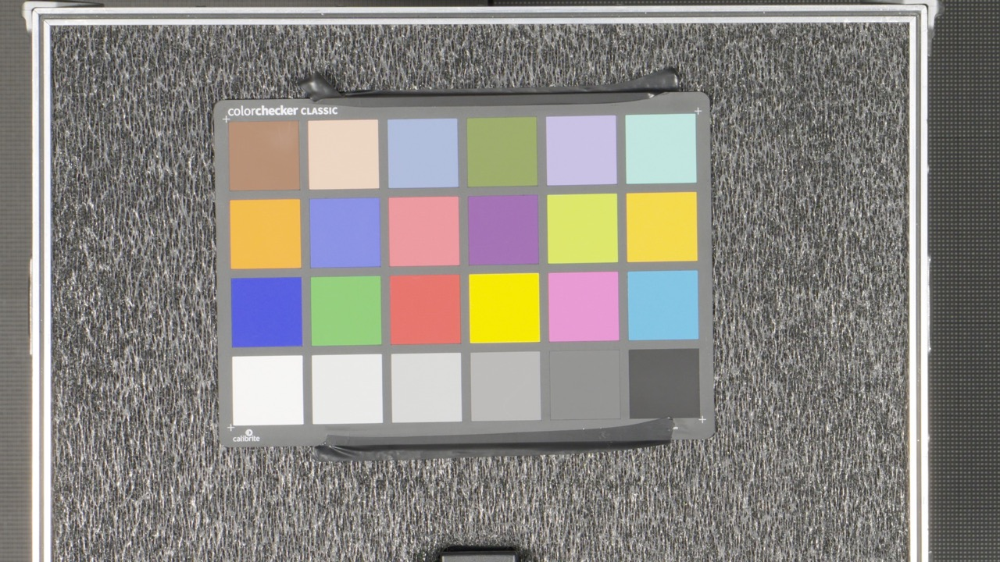
<figcaption markdown>**Nominal Exposure**</figcaption>
</figure>

<figure markdown>
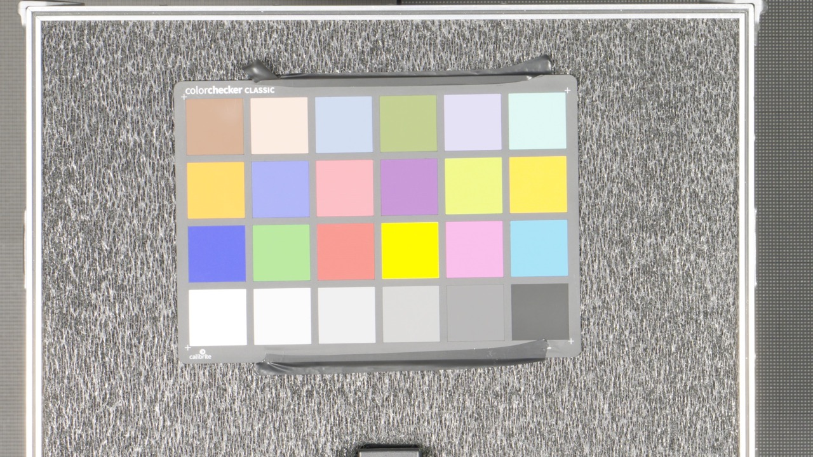
<figcaption markdown>**+1**</figcaption>
</figure>

<figure markdown>
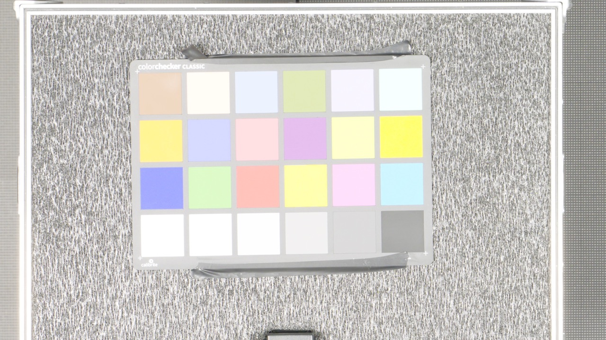
<figcaption markdown>**+2**</figcaption>
</figure>

<figure markdown>
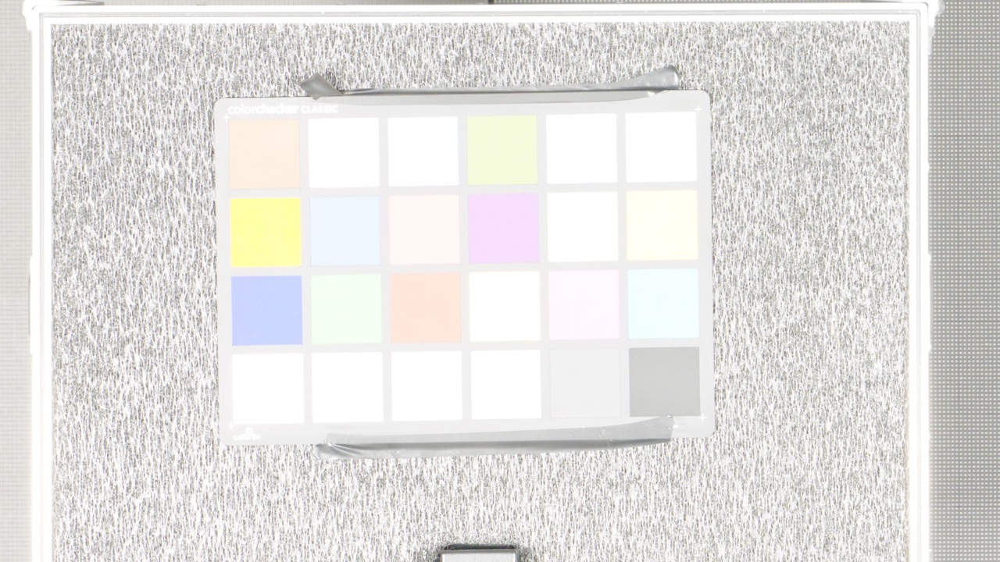
<figcaption markdown>**+3**</figcaption>
</figure>

<figure markdown>
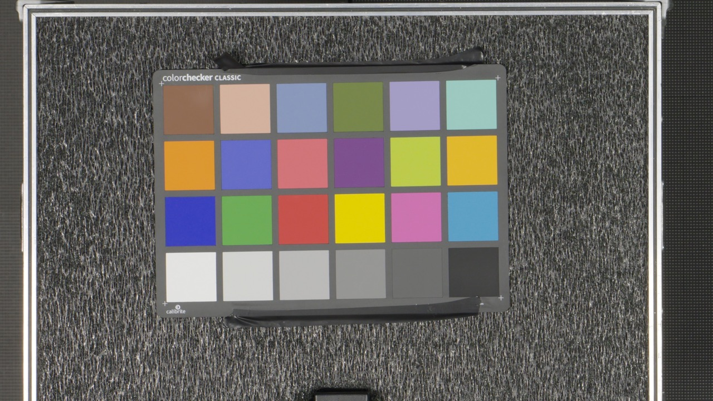
<figcaption markdown>**-1**</figcaption>
</figure>

<figure markdown>
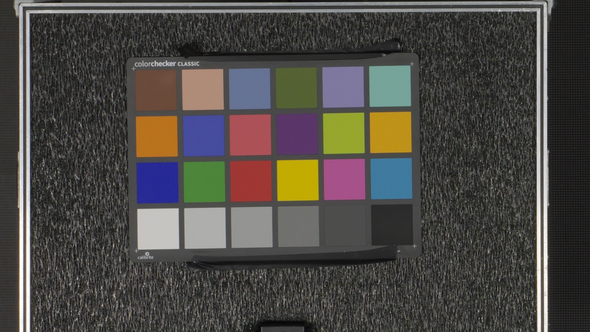
<figcaption markdown>**-2**</figcaption>
</figure>

<figure markdown>
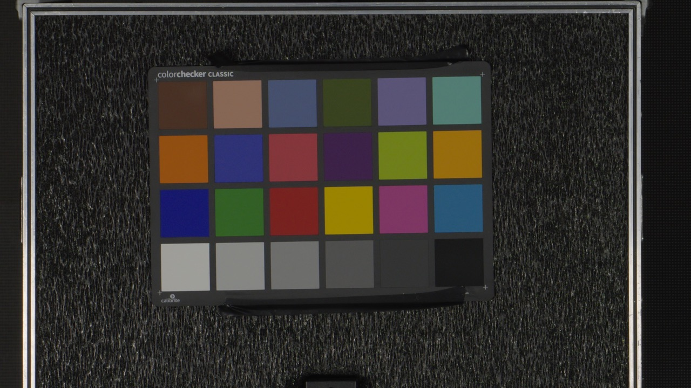
<figcaption markdown>**-3**</figcaption>
</figure>

---

### Black Clip (Optional)

This helps analyze black levels and sensor noise. 

1.  **Remove the lens** from the camera.

2.  Plug on the **camera body gate’s cap**. (1)

3.  Use the **same exposure and ISO** as the nominal chart shot.

4.  Capture a short black frame.

5.  Log as: "BLACK CLIP"

1.  You could in theory shoot the black clip with the lens on and a lens cap with the lens iris completely closed down, but we do suggest the camera sensor/gate’s cap as it should assure a tighter light block.

---

### White Clip (Optional)

The white clip finds the brightest value of your camera encoding function, so the objective of this additional capture is to clip the recording medium (sensor or film) in use. 

1. **Remove the lens** from the camera.

2. Use **same exposure and ISO** as the nominal chart shot. 

3. Capture a short white frame.

    !!! note
        If you are shooting with a digital camera, make sure that the sensor’s readings show clipping. If you are unsure or you don’t have a way to determine that (e.g., if you are shooting film), just point one of the two lights used for illuminating the charts straight into the camera. Do the next steps relatively quickly; you don’t want to ruin your sensor! 

4. Log as: "WHITE CLIP"

---

## Slate & Metadata Checklist

* Camera name / model

* Camera encoding transfer function and primaries

* ISO, T-stop, Shutter speed, FPS

* Lens info and any ND filters

* Light source type and measured CCT

* Bracket info (e.g. \-3 to \+3)