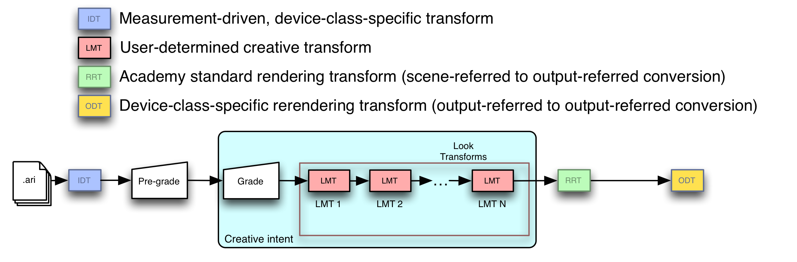

<!-- SPDX-License-Identifier: CC-BY-4.0 -->
<!-- Copyright Contributors to the ACES Documentation -->

Design, Integration and Use of ACES Look Transforms
================

Scope
----------------

This document describes the use of ACES Look Transforms for ACES-based color management. It provides several use cases for Look Transforms, defines how Look Transforms are expressed and are carried along with clips and projects, discusses Look Transform use in the context of a workflow employing ACES-based color management, and concludes with design guidelines for Look Transforms. This document also describes optimal use of Look Transforms and suggests several ways in which a Look Transform may be designed to support flexible mastering and archiving workflows.

References
----------------

The following standards, specifications, articles, presentations, and texts are referenced in this text:

* [ST 2065-1:2021 - SMPTE Standard - Academy Color Encoding Specification (ACES)](https://doi.org/10.5594/SMPTE.ST2065-1.2021), Society of Motion Picture and Television Engineers, New York, US, Standard, 2021.
* [Academy S-2013-001, ACESproxy - An Integer Log Encoding of ACES Data](../../encodings/acesproxy.md)
* [Academy S-2014-003, ACEScc – A Logarithmic Encoding of ACES Data for use within Color Grading Systems](../../encodings/acescc.md)
* [Academy S-2014-006, A Common File Format for Look-Up Tables](../../clf/specification/index.md)
* [Academy S-2019-001, ACES Metadata File (AMF)](https://www.dropbox.com/s/4phjfkae2gykctt/S-2019-001.pdf?dl=0)
* [ASC Color Decision List (ASC CDL) Transfer Functions and Interchange Syntax, ASC-CDL Release 1.2]

Specification
----------------

### Inputs

The inputs to a Look Transform are ACES2065 RGB relative exposure values.

### Outputs

The outputs of a Look Transform are ACES2065 RGB relative exposure values.

### Working Space

The internal working space of a Look Transform is unrestricted. A Look Transform may transform its inputs internally into a non-ACES2065 space and perform color operations there, as long as it transforms the results of those back to ACES2065 before yielding them as outputs.

### Syntax

Look Transforms are specified in Common LUT Format XML.

### Transport

Look Transform metadata is carried in the ACES Metadata File . Multiple Look Transforms are referenced in the `lookTransform` element and are applied in the order in which they are referenced.

Workflow Integration
----------------

### Application to entire image, pixel by individual pixel

As with all other ACES transforms, Look Transforms are applied across the entire image, and are not applied to any subset of the image. Similarly, as with all other ACES transforms, the outputs of the Look Transform depend solely on its inputs, with no contribution from neighboring regions of the image.

### Ubiquity

The Look Transform is a key transform in the ACES system, and must be supported in any system component supporting ACES workflows that allows for image alteration. (An example of an ACES system component not allowing image alteration would be a display that interpreted its inputs as being ACESproxy values.) The ability to specify, record, transport and/or apply Look Transform(s) can be present in almost any component of an ACES-based workflow, including applications for converting native camera output to ACES imagery, on-set grading and dailies tools, color correctors, displays and CG tools.

### Optimizations

When there are multiple Look Transforms making up a Look Transform, the hardware or software implementing the ACES viewing pipeline may optimize the application of the Look Transform by combining the Look Transforms into a single LUT; it may also combine this Look Transform LUT with the RRT and a selected ODT.

#### Composite transform sampling using a 3D LUT

Applications may also send a lattice of sample values through some set of adjacent transforms (anything from two or more adjacent Look Transforms in the Look Transform, to the full concatenation of Look Transform plus RRT and a selected ODT) to derive a single 3D LUT.

Artifact-free processing across the large range of ACES RGB relative exposure values requires shaper LUTs before and after the 3D LUT to minimize interpolation error.

### Retention

Look Transforms need to be saved with every clip or project, and loaded automatically into the user’s application so that the creatively established Look Transform is maintained at every step of production and post-production. Every Look Transform contains, as part of its description, an ACES Transform Identifier. To maintain portability of Look Transforms, the metadata identifying them – their ACES Transform Identifiers – must be included within the ACES Metadata File, and the order in which they are referenced in the ACES Metadata File is the order in which they should be applied.

### Nondestructive preview of displayed image appearance

Look Transforms are one of several types of transform applied to either camera-specific files in proprietary or standard format that have been converted into ACES by an IDT, or to ACES files in OpenEXR containers. In the most general of cases, the input image data will be processed first by zero or more pre-grades, then by the grading transform, then by zero or more Look Transforms, then by the RRT, then by a selected ODT, and then displayed to the user. This most general case is shown in Figure 9.

<figure align="center" markdown>
  {width="800"}
  <figcaption><b>Figure 9</b> </figcaption>
</figure> 

The syntax and semantics of Look Transforms are given in the Specification section above. The syntax and semantics of pre-grading and grading operations are outside the scope of this document; indeed, they are outside the scope of the ACES project itself.

### Archival of ACES imagery with and without baked in grading and/or Look Transform application

Every archived ACES image has an implied associated displayed image, namely, the result of processing that archived ACES image with the RRT and the ODT that was used when creative approval was given. Because of this it is critical that the selected ODT (including all relevant versioning information) be archived alongside any archived ACES imagery, whether or not that ACES imagery is the product of ‘baking in’ grades and/or the application of one or more Look Transforms making up a Look Transform.

Since many grading operations and Look Transforms may reduce the color volume in the original image to a smaller color volume that is then delivered to the RRT and a selected ODT, productions wishing to ‘future-proof’ their assets should store the original ACES files, along with all pre-grading information, grading information, the ordered set of Look Transforms that make up the Look Transform and the ODT that was selected at the time of creative approval. 

!!!example
	A Look Transform applying ASC CDL would be an example of such a color-volume-reducing transformation, as ASC CDL is applied in the ACEScc color space, a smaller color space than ACES.

Design
----------------

Simple Look Transforms are the best. A Look Transform should be as simple as possible while still achieving the desired modification to the displayed image.

### Overall principles

####  Support high dynamic range

ACES image data can represent luminances from far below the detectability threshold of the human visual system all the way up to luminances causing physical pain – the maximum ACES luminance is about 65,505 times as bright as a diffuse white object in the scene. A Look Transform should endeavor to preserve this luminance range as much as is possible.

#### Handle a wide color gamut

Creation of ACES imagery by CGI renderers, or by grading operations on live-action capture, can create ACES image values containing colors not found in nature or colors on the spectral locus that only became readily producible with the advent of the laser. A Look Transform should handle as wide a color gamut as is possible and practical, and avoid imposing arbitrary limits on hue or saturation.

#### Use high-level constructs to enable optimizations

The Common LUT Format allows the ACES system release to provide a tool chest of predefined operations. Look Transform authors should use these rather than writing their own for several reasons:

* They were developed as part of the ACES project, have well-defined semantics, and are tested.
* They obey the two principles above (support high dynamic range and handle the full color gamut) to the maximum extent possible.
* Future releases might introduce performance or quality optimizations that depend on recognition of predefined operations.

### Analytic and empirical approaches

Broadly speaking, Look Transforms can be characterized as either analytic or empirical.

#### Analytic Look Transforms

Analytic Look Transforms usually have concise mathematical definitions. The prime example of an analytic Look Transform is probably the ACES-system-provided Look Transform that applies ASC CDL to ACES data. Another (hypothetical) analytic Look Transform might be one that changes saturation with luminance at certain hue angles. Analytic Look Transforms are typically expressed as a set of ordered mathematical operations or 1D LUT lookup operations on colors or color component values.

#### Empirical Look Transforms

Empirical Look Transforms usually are derived by sampling the results of some other color reproduction process, such as normal or special film processing. Empirical Look Transforms are often provided as 3D LUTs that record a regular subsampling of the results of such processes.

A challenge arises when using ACES values to index the 3D LUT, as ACES values are radiometrically linear and have a very wide floating point range. The Common LUT Format provides for forward and inverse ‘shaper LUT’ operations that (when wrapped around an appropriately constructed 3D LUT) effectively solve this problem. Implementers should review the [`LUT1D` section of the Common LUT Format specification](../../clf/specification/index.md#lut1d).

### Importing ‘looks’ from non-ACES-color-managed workflows

Importing a ‘look file’ or LUT from a color system not defined using ACES can be quite difficult. Such look files contain transforms to be applied in color spaces other than ACES or the ACES working space, often presume the relationship between scene and encoded values is encoded with some (possibly proprietary) power function or log function, and likely are designed to supply a display device with code values directly rather than hand off the image to an ACES Output Transform.

For all of these reasons, it is typically better (and often much more efficient over the course of a production) to establish new Look Transforms within a workflow that is built around ACES-based color management rather than to try and mathematically translate a ‘look file’ or LUT intended for use with a workflow based on some other color management system.

<!-- Include section numbering -->

