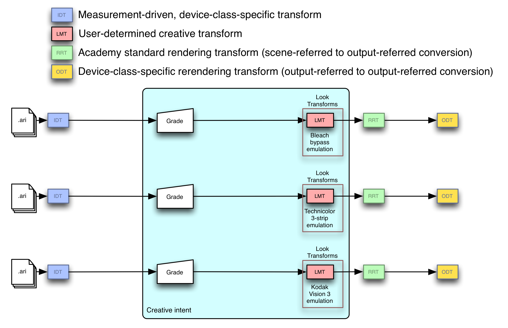
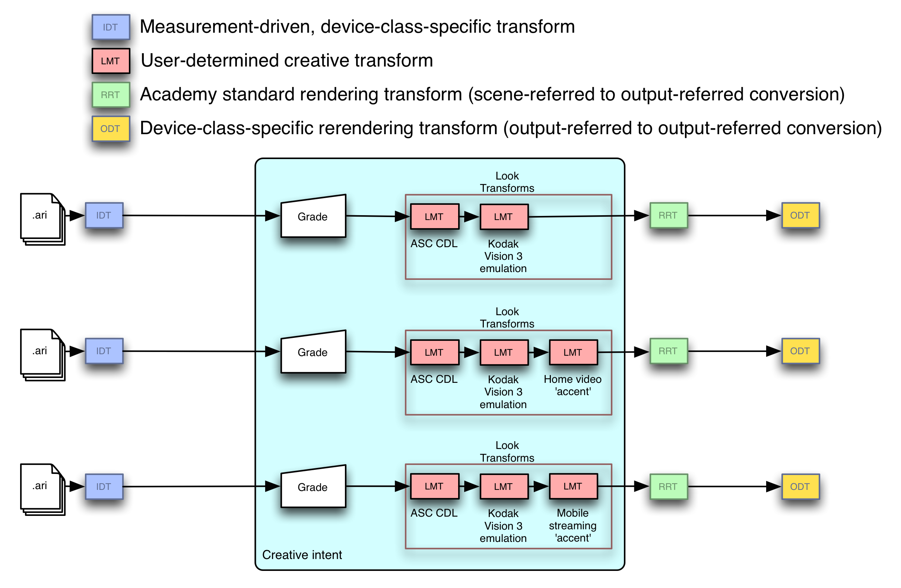
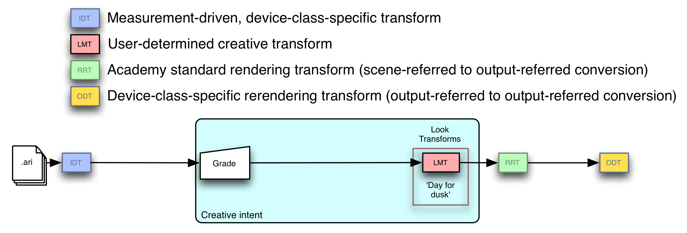
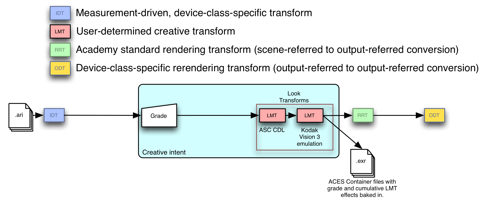

<!-- SPDX-License-Identifier: CC-BY-4.0 -->
<!-- Copyright Contributors to the ACES Documentation -->

Look Transform Use Cases
========================

Introduction
------------
Two styles of image modification are common in post-production: 

- interactive modification, either across the entire frame or in isolated regions of interest, and 
- a preset systematic modification across the entire frame. 

The interactive image modification is termed ‘grading.’ The ACES term for preset systematic, full-frame image modification is ‘look modification.’ Look modification is performed using a Look Transform.

??? note "Note on Nomenclature"
	In early development of the ACES system, Look Transforms were abbreviated LMT (from 'Look Modification Transform'). Occasionally the 'LMT' acronym will still be used although the preferred terminology is 'ACES Look Transform' or simply 'Look Transform'.

Emulation of photochemical processing
-------------------------------------

Though modern grading systems are very powerful, some whole-frame color transformations are too complex for even a skilled colorist to accomplish using grading system controls. Often the complexity arises when the creative intent is to simulate, for frames captured with digital cinema cameras, the nonlinear color and exposure relationships used in film laboratory photochemical processing, especially nonstandard photochemical processing. Examples of such color transformations include:

* ‘Bleach Bypass’ emulation: modification of image color values to achieve a unique desaturated appearance mimicking projection of a print that had skipped a normal laboratory bleaching step
* Technicolor 3-strip emulation: modification of image color values to achieve a saturated, higher-contrast appearance mimicking projection of a print from Technicolor's imbibition dye transfer process (c. 1938)
* Kodak Vision 3 print film emulation: modification of image color values to achieve a reproduction of the relationship between scene exposure values and projected film imagery resulting from the use of Kodaks latest film stocks

Figure 1 illustrates how a colorist could prepend one or more emulation Look Transforms to the RRT (which itself precedes a selected ODT), so that his or her time could be spent on sequence, shot and/or region-specific color requests from the client. The grade modifies the image first, followed by the process emulation provided by the Look Transform.

<figure align="center" markdown>
  {width="800"}
  <figcaption><b>Figure 1</b> </figcaption>
</figure> 

Systematic Color Correction (and application of ASC CDL)
--------------------------------------------------------

The Look Transform takes as input an image in the ACES color space and yields a modified image that is still in the ACES color space. As a consequence, Look Transforms can be ‘chained’ together, one after another. Figure 2 shows a grading workflow where, prior to applying the ‘Kodak Vision 3 emulation’ Look Transform described above, the colorist applies an ‘ASC CDL’ Look Transform - very likely one whose parameter values were chosen by the cinematographer on-set to modify the default ‘look’ of emulated Kodak Vision 3 stock.

<figure align="center" markdown>
  {width="800"}
  <figcaption><b>Figure 2</b> </figcaption>
</figure> 

!!! note
	The values of the ASC CDL in this case are only valid in the context of the selected ‘Kodak Vision 3 emulation’ Look Transform. If this Look Transform were removed, the ASC CDL values would no longer be valid.

Note that the ASC CDL Look Transform incorporates a conversion from ACES to ACEScc before the ASC CDL operations will be applied, and likewise incorporates a conversion from ACEScc to ACES after the ASC CDL operations have been applied. This ‘wrapping’ of ASC CDL operations is a key capability available in the Academy/ASC Common LUT Format (CLF).

Trim Pass Grading
-----------------

Content today is delivered across a wide range of output devices, each of which has their own color space and characteristic brightness. Creative adjustments to the look of shots are often needed to enhance the content’s appearance beyond the original creative intent. The client might desire to accentuate the difference between the results of the viewing pipeline for theatrical exhibition, the results of the viewing pipeline appropriate for home video and the results of the viewing pipeline appropriate for mobile streaming. This could be done by having three workflows that differed only in that the first had no Look Transform ‘accentuating’ the image for any nonstandard viewing environment, the second had a Look Transform just prior to the application of an Output Transform designated as appropriate for home video viewing, and the third had a Look Transform just prior to the application of an Output Transform designated as appropriate for viewing with content streamed to mobile devices, as shown in Figure 3.

<figure align="center" markdown>
  {width="800"}
  <figcaption><b>Figure 3</b> </figcaption>
</figure> 

Flexible pre-sets for creative modifications
--------------------------------------------

Separation of grading and Look Transform(s) allows for a production to make significant changes in creative decisions that affect the entire frame equally, without requiring the colorist to start from scratch, or ideally without even requiring a trim pass. For example, the client might start a production shooting ‘day for night’ and use a Look Transform to accomplish this result (Figure 4).

<figure align="center" markdown>
  {width="800"}
  <figcaption><b>Figure 4</b> </figcaption>
</figure> 

A change in creative direction (say, after a test screening) might place the captured action two hours earlier, so ‘day for night’ might become ‘day for dusk’. Since the Look Transform is separate from the grade, the change may be made without requiring lengthy and expensive colorist intervention. A new Look Transform is simply swapped into the old Look Transform’s place (Figure 5).

<figure align="center" markdown>
  {width="800"}
  <figcaption><b>Figure 5</b> </figcaption>
</figure> 

Permanent Color Modification (Archival)
---------------------------------------

The workflows above all show a ‘transient’ processing of image file to displayed output, with the display being a calibrated grading monitor or projector. It is also completely valid and correct to archive the input to the RRT as an ACES container file, ‘baking in’ the grade and any Look Transform application(s), as shown in Figure 6.

<figure align="center" markdown>
  {width="800"}
  <figcaption><b>Figure 6</b> </figcaption>
</figure> 

A person who retrieves an ACES file need not know about the grades and Look Transform(s) applied to produce the desired creative result; by virtue of being an ACES file, the image ‘speaks for itself’ when the RRT and a selected ODT are applied.

It is extremely important that the Look Transform authors preserve as much of the dynamic range of the Look Transforms input ACES RGB relative exposure values as is possible. This provides the maximum amount of latitude for a colorist grading through the Look Transform. It also preserves the maximum amount of grading latitude for someone who later retrieves stored ACES container files created by baking in the effect of the Look Transform to the graded ACES images, when remastering for a radically different display or viewing environment (e.g. for grading on a higher-dynamic-range display than previously available). While full preservation of dynamic range and gamut is almost never possible, when faced with an engineering decision in which all other considerations are equal, the Look Transform author should choose the option that retains more of the Look Transform input's dynamic range and color gamut.

Preserving the integrity of the ACES RGB relative exposure values representing the scene means more than just not clipping highlight luminances or very deep shadow tones. It also means avoiding severe distortions of the distributions of ACES values, such as the distortion caused by a strong ‘gamma’ operation, e.g. by a very large or very small value for one or more CDL ‘power’ parameters.

Because Look Transforms are customizable and unique, and because it is essential to maintain the portability and archivability of an ACES project, it is always necessary to preserve the Look Transforms within any project where they are used.

!!! note 
	If a production wishes to preserve maximum flexibility for later remastering, it should archive the original ACES images, any clip-level metadata-bearing container encapsulating the original image files, any IDT(s), any pre-grading adjustments (see the following ‘Look Transforms and pre-grading for Visual Effects’ section), any project-wide and shot-specific grading parameters, and the Look Transform (that is, the set of all Look Transforms employed to achieve the creative result, in their proper sequence).

Portability
-----------

Look Transforms are expressed and transported using the Common LUT Format (also known as the Academy/ASC Common LUT Format or CLF).

The building blocks of an Look Transform include basic arithmetical operations, simple matrix application, 1D LUTs and 3D LUTs. Straightforward color transforms can often be expressed analytically using the first three of these building blocks. More complex (and typically empirically derived) Look Transforms may be conveyed as 3D LUTs. The Common LUT Format was chosen because it can express, in a portable encoding, all of the above-mentioned operations and LUTs.

!!! note 
	Using the floating point ACES RGB relative exposure values directly as 1D LUT indices requires a more complex lookup mechanism than found in traditional 1D LUT implementations. The Common LUT Format supports this type of lookup by using the halfDomain attribute of the LUT1D process node. See the [Common LUT Format specification](../../clf/specification/index.md) for more information.

Look Transforms and pre-grading for Visual Effects
--------------------------------------------------

In some cases, color corrections may be created prior to the colorist session in a scene-balancing ‘pre-grade.’ This allows for all shots in a sequence to share identical Look Transforms ‘downstream’ in the color modification pipeline. A motivating case would be a long sequence of daylight shots with varying color temperature. An example of this workflow, with two illustrations, is shown below. The first illustration shows what might happen at a visual effects facility that receives a number of shots that will be edited together to make up a sequence.

<figure align="center" markdown>
  {width="800"}
  <figcaption><b>Figure 7</b> </figcaption>
</figure> 

When the visual effects are complete, the frames supplied to the colorist have both the pre-grade and the visual effect(s) ‘baked in.’ The Look Transform is not ‘baked in’ to this imagery, since it must be applied after the grade, but is instead carried as metadata, and is referenced by the ACES Metadata File.

<figure align="center" markdown>
  {width="800"}
  <figcaption><b>Figure 8</b> </figcaption>
</figure> 
