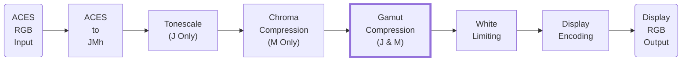
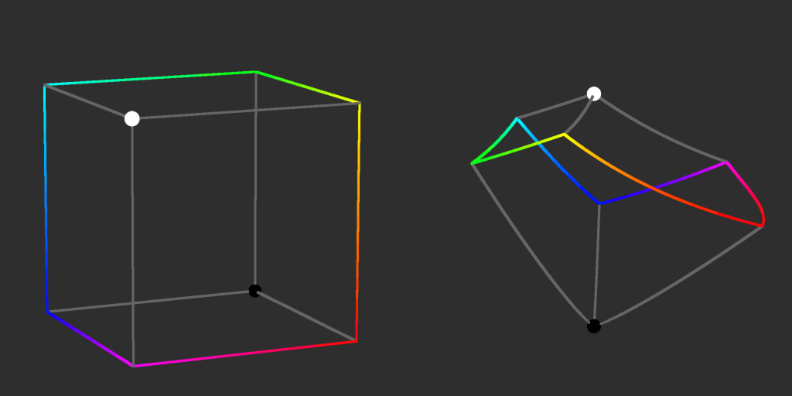
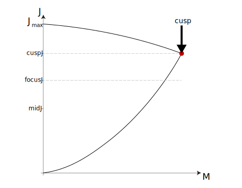
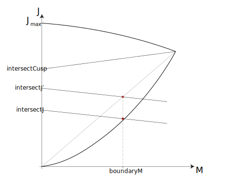
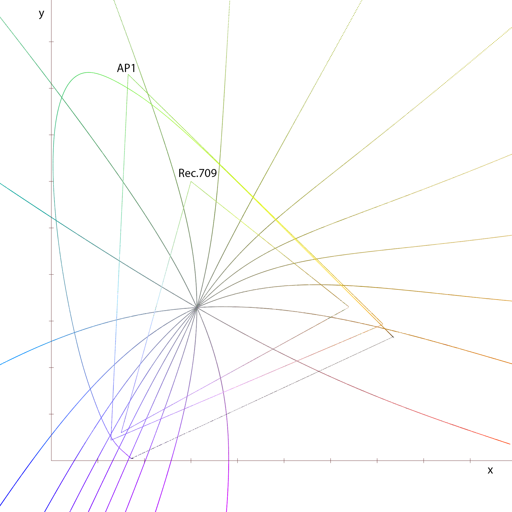
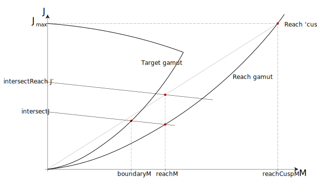

<!-- SPDX-License-Identifier: CC-BY-4.0 -->
<!-- Copyright Contributors to the ACES Documentation -->

Gamut Compression
================

Introduction 
----------------

Gamut compression aims to compute a representation of a color which lies outside a target gamut (the range of colors a particular display is able to reproduce) such that the new representation lies within the target gamut, while maintaining as much of the perceived appearance of the original color as possible.

A base assumption is that when compressing a color to within the gamut available on a given target display, the correlate of hue should be left unchanged. Therefore compression will take place in a two dimensional space, whose axes are the $M$ and $J$ correlates of the simplified [Hellwig 2022](https://doi.org/10.1002/col.22792) Color Appearance Model (CAM), representing a 'slice' in hue. The boundary of the corresponding slice of the target gamut has been shown to be well approximated by curved lines using a power law (gamma) function joining the maximum and minimum values on the J-axis to a cusp which represents the lines joining the primary and secondary colors in the RGB cube of the target gamut.

<figure markdown>
 { width="900" }
  <figcaption>The cusp path shown in an RGB cube and JMh 3D polar plot</figcaption>
</figure>

<figure markdown>
 { width="900" }
  <figcaption>A 'hue slice' of a gamut plotted in M vs. J </figcaption>
</figure>

To bring a color within the target gamut, it must be moved towards the J-axis. In order to reach the gamut boundary at a larger $M$ value, thus preserving more colorfulness, it has been found to be beneficial to compress along a vector which is not perpendicular to the J-axis. While intuitively it might seem that values above the cusp should be compressed along a vector which decreases $J$, and those above it with one which increases $J$, it has been found by experimentation that an aesthetically preferable result is achieved by choosing a $J$ value ($focusJ$) part way between that of the cusp and that of mid grey, and compressing $J$ values above that downwards, and values below it upwards.

The Compression Vector 
----------------

The compression vector is defined by a straight line, so has an equation with the classic form of a straight line, $y = m\cdot x + c$. In this case the y-axis represents $J$, and the x-axis represents $M$, so the equation becomes:

$$
J = slope\times M + intersectJ
$$

Where $slope$ is the gradient of the line and $intersectJ$ is the $J$ value where it hits the J-axis.

For the line to have positive slope above $focusJ$, and negative slope above it, it must be horizontal (zero slope) at $focusJ$. It has also been agreed that it is desirable for the slope to be zero at $J$ values of zero and $J_{max}$, where $J_{max}$ is the J value for the peak white of the target gamut. The formula for slope chosen to achieve this is:

$$
slope=\begin{cases}\frac{intersectJ\times(intersectJ-focusJ)}{slopeGain\times focusJ}&\text{if } intersectJ\leq focusJ\\
\frac{(J_{max}-intersectJ)\times(intersectJ-focusJ)}{slopeGain\times focusJ}&\text{if }intersectJ>focusJ
\end{cases}
$$

Where $slopeGain$ is a constant controlling how steep the slope becomes between the horizontals. An interactive version of the above equation can be seen in [this Desmos plot](https://www.desmos.com/calculator/bhvlapsoyz).

In the ACES 2.0 transform, the base value of $slopeGain$ is calculated from a parameter (called $focusDistance$) multiplied by $J_{max}$, to scale it with peak lightness.

Invertibility
----------------

This equation for compression slope is controlled only by $intersectJ$ ($slopeGain$ being a user parameter and $focusJ$ being a constant for a given hue). So if the value of $intersectJ$ which produces a line passing through a particular set of $(M, J)$ coordinates is solved for, and new coordinates $(M^\prime, J^\prime)$ are calculated by compressing along that line, the same value will be found when solving for the $intersectJ$ which leads to a line passing through $(M^\prime, J^\prime)$. Thus, providing an invertible compression curve is used, an inverse compression will map $(M^\prime, J^\prime)$ back along the same line, and result in $(M, J)$.

Because the slope is zero when $intersectJ$ is equal to $focusJ$, when solving for $intersectJ$ at $(M, J)$ the value of $J$ can be used in place of $intersectJ$ in the condition for the slope equation. Thus, substituting the slope value into the equation of the line:

When $J\leq focusJ$:

$$
J=\frac{intersectJ\times M \times(intersectJ - focusJ)}{slopeGain \times focusJ} + intersectJ
$$

This can be rearranged to:

$$
intersectJ^2\times\frac{M}{slopeGain\times focusJ}+intersectJ \times\left( 1-\frac{M}{slopeGain}\right)-J=0
$$

This has the form of a quadratic equation in $intersectJ$, and therefore the solution can be found using one of the variations of the quadratic formula.

Similarly when $J>focusJ$:

$$
J=\frac{M\times(J_{max}-intersectJ)\times(intersectJ-focusJ)}{slopeGain\times focusJ}+intersectJ
$$

This can be rearranged to:

$$
intersectJ^2\times\frac{M}{slopeGain\times focusJ}-intersectJ\times\left(1+\frac{M}{slopeGain}+\frac{J_{max}\times M}{slopeGain\times focusJ}\right)+\frac{J_{max}\times M}{slopeGain}+J=0
$$

This also has the form of a quadratic equation in $intersectJ$, and the two can be expressed using the form of the quadratic equation required for use of a formula solution:

$$
a\cdot x^2+b\cdot x + c = 0
$$

Where the values of a, b and c are:

$$
\begin{aligned}
a&=\frac{M}{slopeGain\times focusJ}\\\\
b&=\begin{cases}1-\frac{M}{slopeGain}&\text{ if }J\leq focusJ\\
-\left(1 + \frac{M}{slopeGain} + \frac{J_{max}\times M}{slopeGain\times focusJ}\right)&\text{ if }J>focusJ
\end{cases}\\\\
c&=\begin{cases}-M&\text{ if }J\leq focusJ\\
\frac{J_{max}\times M}{slopeGain}+M\phantom{123456789012345678.}&\text{ if }J>focusJ
\end{cases}
\end{aligned}
$$

Due to division of small numbers as $J$ and $M$ both approach zero, the ‘classic’ quadratic equation formula can suffer from numerical precision issues when this solve is implemented in single precision 32-bit float. So an alternate formulation is preferable.

This is:

$$
x=\frac{2\cdot c}{-b\pm\sqrt{b^2-4\cdot a\cdot c}}
$$

Although quadratic equations have two roots, in this instance it is not necessary to find both roots for each condition. In each case, one of the roots is always outside the zero to $J_{max}$ range for input $J$ and $M$ values in the meaningful range for this use case.

Thus in this case:

$$
intersectJ=\begin{cases}\frac{2\cdot c}{-b+\sqrt{b^2-4\cdot a\cdot c}}&\text{ if }J\leq focusJ\\
\frac{2\cdot c}{-b-\sqrt{b^2-4\cdot a\cdot c}}&\text{ if }J>focusJ
\end{cases}
$$

This result can then be used in the slope equation to give both constants needed for the equation of the line along which compression is to take place.

Although the approach described above produces a analytically invertible compression, testing showed that the slope did not approach zero fast enough to burn very bright saturated colors out to white smoothly. Thus a modification to $slopeGain$ was added above a threshold. A multiplier is calculated as follows:

$$
gainAdjustment = \left(log_{10}\left(\frac{J_{max} - analyticalThreshold}{max(0.0001, J_{max} - J)}\right)\right)^2 + 1
$$

Where $analyticalThreshold$ varies with the cusp $J$ value as:

$$
analyticalThreshold = lerp(cuspJ, J_{max}, 0.3)
$$

This means that above this threshold the gamut compression is no longer perfectly analytically invertible, as the slope now depends on the original $J$ value, which will not be known until after the compression is inverted. However it has been found that although a slope calculated from the compressed value is not exactly the same as the slope used in the forward compression, it can be used as an Approximation of the slope in a first iteration of inverse gamut compression. The resulting $J$ value is close to the true original value, and can be used to calculate the slope for a second iteration. Further iterations were found to be unnecessary, as the gain only becomes significant for high $J$ values, where the slope is already small, meaning the approximation error is also small.

Boundary Intersection
----------------

Since the gamut boundary curvature is approximated by a power law (gamma) curve with non-integer exponent, and it is not possible to analytically find the intersection of such a curve with a straight line, an approximation of the intersection is needed. As the gamma curve itself is only an approximation of the true gamut boundary, provided that the approximation method for the intersection leads to points which lie on a curve similar in shape to the gamma curve, the result is as valid an approximation as the gamma curve. As the slope and offset of the compression line are defined in terms of the J-axis intersection ($intersectJ$) rather than the source $J$ and $M$ values, and the compressed and uncompressed values both lie on that same line, an intersection method based only on slope and offset will yield the same result in both directions, ensuring invertibility of the compression.

The intersection of two straight lines is mathematically simple to find. So a first order approximation of the intersection of the curved gamut boundary with the compression line would be the intersection of that line with the straight line joining the cusp to the origin (black) or to the peak of the target gamut (white) depending on whether the line passes above or below the cusp. This can be easily ascertained by substituting the cusp $M$ value into the compression line equation, and determining whether the resulting $J$ value is greater or less than the cusp $J$ value.

The straight line intersection approximation will give a value which is too small, assuming the gamma curve is bending the boundary outwards. A method is needed to increase the value found in the middle part of the curve, but converging to return exactly the straight line intersection result at either end. Looking only at the lower part of the boundary (an inverted version of the same thing will work for the upper part) a good approximation of the necessary modification of the straight line intersection can be found by raising the $intersectJ$ value to the reciprocal of the exponent used by the boundary curve, and then finding the straight line intersection. This will not alter the result at the origin, but an appropriate normalization factor is needed to divide $intersectJ$ by prior to exponentiation, and to then multiply it by afterwards, so that the result at the cusp is not affected either. This normalization factor is found as the J-axis intersection of the compression line which passes through the cusp, by putting the $J$ and $M$ values of the cusp into the same [quadratic intersection solve formula](#invertibility) as was used to find the J-axis intersection for the source. This value is referred to as $intersectCusp$.

So:

$$
intersectJ^\prime=intersectCusp\times\left(\frac{intersectJ}{intersectCusp}\right)^{\frac{1}{\gamma}}
$$

At the intersection of a line from $intersectJ^\prime$ with gradient $slope$ and a line from the origin to $(cuspM, cuspJ)$:

$$
intersectJ^\prime+boundaryM\times slope=boundaryM\times \frac{cuspJ}{cuspM}
$$

Solving for $boundaryM$:

$$
boundaryM=\frac{intersectJ^\prime\times cuspM}{cuspJ-slope\times cuspM}
$$

<figure markdown>
 { width="640" }
  <figcaption>Approximation of intersection with a gamma curve</figcaption>
</figure>

As can be seen from the figure above, the value of $boundaryM$ is not precisely the $M$ value of the true intersection with the curve. However, as mentioned previously, because the approximation follows a path similar in shape to the gamma curve, this can be used as an approximation of the true gamut boundary. For the upper part, the same methodology can be used, simply replacing $intersectJ$ with $Jmax - intersectJ$, and the same for the cusp intersection.

So if $intersectJ+slope\times cuspM>cuspJ$:

$$
intersectJ^\prime=J_{max}-(J_{max}-intersectCusp)\times\left(\frac{J_{max}-intersectJ}{J_{max}-intersectCusp}\right)^\frac{1}{\gamma}
$$

Thus:

$$
boundaryM=\frac{cuspM\times(J_{max}-intersectCusp)\times\left(\frac{J_{max}-intersectJ}{J_{max}-intersectCusp}\right)^\frac{1}{\gamma}}{slope\times cuspM+J_{max}-cuspJ}
$$

A constant $\gamma$ value of 1.14 was found to approximate the lower part of the gamut hull well. However the shape of the upper hull varies sufficiently that a table of $\gamma$ values, varying with hue, needs to be pre-calculated and used as a [lookup](#lookup-tables).

[This Desmos plot](https://www.desmos.com/calculator/fy6jgmigmi) shows the intersection solves, slope calculation and boundary approximation, as the source $(M, J)$ and cusp are dragged interactively.

In order to smooth the abrupt change of compression across the cusp, smoothing is applied by finding the intersections with both the upper and lower boundary lines, and then taking a [smooth minimum](https://www.desmos.com/calculator/a1uny6zrtf) between them. Simply using this value will round off the cusp, thus cutting into the gamut volume. In order to ensure that the smoothed approximation contains the whole true gamut, the cusp used in the boundary calculations must be moved out slightly from the actual cusp position. This 'puffing out' of the approximated boundary has the additional benefit that the exact value of the gamma used to approximate it is less crucial.

The $cuspM$ value is moved out by multiplying it by $1 + 0.27 \times smoothness$, and using the following smooth minimum function:

$$
h = \frac{max(smoothness - |a - b|, 0)}{smoothness}
$$

$$
smin(a, b) = min(a, b) - \frac{h^3 \times smoothness}{6} 
$$

A $smoothness$ value of 0.12 was selected.

Compression
----------------

The compression method operates by taking the $M$ value of the source color, and normalizing by the $M$ value of the intersection of the compression line and target gamut boundary ($boundaryM$). A parametric compression curve is then applied, with the three parameters being threshold ($t$), limit ($l$) and exponent ($p$). The threshold is the normalized value below which the input is unchanged. The limit is the normalized value which will be compressed to the gamut boundary (a normalized value of 1.0). The exponent controls the aggressiveness of the roll-off above the threshold.

The compression curve originally used in the ACES 2.0 display rendering gamut compression is referred to as the powerP curve. This is the same curve as used in the ACES 1.3 [Reference Gamut Compression](../../../../rgc/guides/rgc-implementation/index.md) (RGC). The equations are as follows.

First a scale factor is calculated:

$$
s=\frac{\left(l-t\right)}{\left(\left(\frac{1-t}{l-t}\right)^{-p}-1\right)^{\frac{1}{p}}}
$$

This is then used in the compression function:

$$
f(x)=\begin{cases}x&\text{ if }x < t\\
t+\frac{x-t}{\left(1+\left(\frac{x-t}{s}\right)^{p}\right)^{\frac{1}{p}}}&\text{ if }x\geq t
\end{cases}
$$

It was found that using a $p$ value of 1.0 in these equations, rather than the 1.2 used in the RGC produced an acceptable result, meaning the equations could be simplified and making the curve equivalent to a scaled and offset [Reinhard](https://doi.org/10.1145%2F566654.566575) curve.

After compression the compressed $M$ value is multiplied back by the normalization factor ($boundaryM$). The compressed $J$ value can then be found by using the compressed $M$ value in the compression straight line equation.

'Reach-mode' gamut compression
----------------

For the compression function, constant values may be used for the threshold and limit. However it was decide that for the ACES DRT it is beneficial if the limit is set such that compression maps the boundary of a particular 'reach gamut' (ACES AP1 was decided to be suitable) to the target gamut boundary. This ensures that when the inverse gamut compression is applied, values within the target gamut will be mapped to values inside the reach gamut. This mapping will map points on the boundary of one gamut to the boundary of the other, but will not necessarily map the primaries of one gamut to those of the other, because the mapping occurs along lines of constant perceptual hue as defined by the JMh space.

<figure markdown>
 { width="512" }
  <figcaption>CIE 1931 Chromaticity plot of lines of constant JMh hue</figcaption>
</figure>

To achieve this, another boundary intersection needs to be found - that of the compression vector with the reach gamut boundary. This boundary will have the same shape as the lower part of the target gamut but, being scene-referred, it is unbounded so the curve will continue up indefinitely, rather than tapering above a cusp, as the target gamut does.

Therefore a point on the reach gamut boundary at the hue under consideration must be found, which can then be treated in the same way as the target gamut cusp for the purposes of fitting a power law approximation to the true shape. The model gamma from the Hellwig model is used.

$$
\gamma = surroundGamma \times \left(1.48 + \sqrt{\frac{Y_b}{Y_w}}\right)
$$

Where $surroundGamma$ is the second surround parameter for dim surround, with a value of 0.59, from [CAM16](https://doi.org/10.1002/col.22131). $Y_b$ is the background luminance and $Y_w$ is the adapting luminance, with values of 20 and 100 respectively.

If the sampled point used as a cusp for the reach gamut has a $J$ value equal to $J_{max}$, then the compression vector for this point will be horizontal. Thus $J_{max}$ can be used as the normalization factor for intersectJ in the same boundary intersection approximation as used for the target gamut.

Thus:

$$
intersectReachJ^\prime=J_{max}\times\left(\frac{intersectJ}{J_{max}}\right)^{\frac{1}{\gamma}}
$$

<figure markdown>
 { width="900" }
  <figcaption>Intersections with the target and reach gamuts</figcaption>
</figure>

and:

$$
reachM=\frac{intersectReachJ^\prime\times reachCuspM}{J_{max}-slope\times reachCuspM}
$$

and the limit value for reach-mode compression is:

$$
limit=\frac{reachM}{boundaryM}
$$

The compression threshold ($t$) was originally set to a constant value of 0.75, but it was found that, particularly for HDR renderings, a variable threshold was preferable, approaching 1.0 as the target and reach gamut boundaries got closer. The following formula is used:

$$
t = max\left(0.75, \frac{boundaryM}{reachM}\right)
$$

Lookup Tables
----------------

Since the JMh gamut, being perceptually uniform, has an irregular shape, the values of the target and reach cusps at a given hue cannot be found mathematically. Therefore 1D lookup tables, indexed on hue, are populated during initialization with cusp JMh values.

For the target gamut these are derived by iterating around the gamut cusp in HSV hue (with $S$ and $V$ set to 1.0), converting to RGB and then to JMh. For the reach gamut the table is built at equal intervals of JMh hue, with additional entries at the hues of the primaries and secondaries, to ensure these are not clipped by interpolation.

For the upper hull gamma, the lookup table is populated by iterating at each hue, with increasing gamma values, and finding the point at which the resulting gamma curve encloses the true gamut boundary by sampling at selected points along it, and testing for any RGB component derived from the JMh value being negative.

<!-- Include section numbering -->

