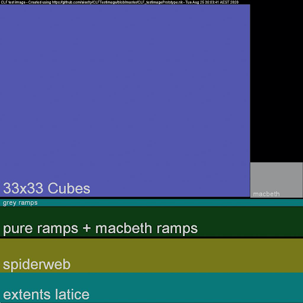

<!-- Include acronyms-->
--8<-- "mkdocs/includes/acronyms.md"

<!-- Include section numbering -->
<style>
    @import "../../stylesheets/sections.css"
</style>


Common LUT Format (CLF) Implementation Guide
================


Introduction 
----------------
Look-up tables, or LUTs, are a common method for communicating color transformations. Many software and hardware providers develop LUT formats uniquely designed for use in their systems. Since these formats were designed to work in specific use cases, they often prove inadequate for interchangeability between applications or systems. To further complicate matters, some LUT formats use the same file extensions which make them appear to be compatible when they are not. If there are already a dozen or more confusing LUT formats, why should you as a developer consider adding support for yet another one?

While the myriad LUT formats already available are fundamentally useful in theory, each lacks one or more features that can be critical in meeting the demands of today’s sophisticated workflows. Existing formats can lack the quality, versatility, and metadata required to meet the demands of modern systems. 

The Common LUT Format (CLF) provides flexibility to enclose transforms from simple to complex. Due to a lack of interchangeability of color transforms between tools, LUTs are frequently abused as a catch-all. Even simple color-space transformations, such as the application of a matrix or a logarithmic shaper function are often “baked” to crude LUT formats resulting in unfortunate losses in precision. As a solution, CLF allows for a range of common mathematical operators to be specified precisely, in addition to supporting traditional 1D- and 3D-LUTs in the file. 

Because CLF files are floating-point capable, extremely flexible, and well documented, they are an excellent candidate for use in modern workflows. CLFs are also ideal for archival purposes because the format is well-specified and documented. There is also a high-quality, open source implementation freely available on GitHub.

### Format Comparison Table

| **Features/Formats** | CLF | 3dl | Adobe (Iridas) cube | Resolve cube | Truelight cube | Cinespace cube | ASC CDL | Imageworks spi3d | ICC Profile |
| --- | :---: | :---: | :---: | :---: | :---: | :---: | :---: | :---: | :---: |
| Provider | Academy / ASC | Discreet | Adobe | Blackmagic | Filmlight | Rising Sun | ASC | Imageworks | ICC |
| Maintained public documentation | ✅ | ❌ | ✅ | ✅ | ✅ | ❌ | ✅ | ❌ | ✅ |
| Implementation guide | ✅ | ❌ | ❌ | ❌ | ❌ | ❌ | ✅ | ❌ | ✅ |
| Allows shaper LUT | ✅ | ❌ | ❌ | ✅ | ✅ | ✅ | ❌ | ❌ | ✅ |
| Is not limited to log or video data on input | ✅ | ❌ | ❌ | ✅ | ✅ | ✅ | ❌ | ❌ | ❌ |
| Unconstrained ordering of processing elements | ✅ | ❌ | ❌ | ❌ | ❌ | ❌ | ❌ | ❌ | ❌ |
| Floating-point table values | ✅ | ❌ | ✅ | ✅ | ✅ | ✅ | ✅ | ✅ | ✅ |
| Rich metadata | ✅ | ❌ | ❌ | ❌ | ❌ | ❌ | ❌ | ❌ | ✅ |
| Test suite provided | ✅ | ❌ | ❌ | ❌ | ❌ | ❌ | ✅ | ❌ | ✅ |
| Text-based | ✅ | ✅ | ✅ | ✅ | ✅ | ✅ | ✅ | ✅ | ❌ |
| Can define operations in linear floating-point space | ✅ | ❌ | ❌ | ❌ | ❌ | ❌ | ✅ | ❌ | ✅ |
| GUID support | ✅ | ❌ | ❌ | ❌ | ❌ | ❌ | ✅ | ❌ | ✅ |
| Supports mathematical operators | ✅ | ❌ | ❌ | ❌ | ❌ | ❌ | ❌ | ❌ | ❌ |

Target Audience
---------------
This document is primarily intended for application developers who want to add CLF support to their product. It defines requirements, tests, and provides recommendations that, if followed, will lead to robust support for CLF. Implementers who follow the guidance in this document can have confidence that their product is implementing the specification correctly.

The document may also be of interest to those using CLF to author transforms and who want to understand how the CLFs will be used by applications.

This guide should be read in conjunction with the [CLF Specification (v 3.0)](/specification/clf). 

!!! note
    The specificataion was previously referred to by it's document number - "S-2014-006". Although the spec had "2014" in the name, the document has been updated more recently than that. Version 3 of CLF was introduced with the release of ACES 1.2 in 2020 and the most recent editorial updates were in 2021. The current version of the specification now lives at the above link.


A Quick Introduction to CLF
---------------------------
Below is a basic example of a simple CLF file. Despite the word 'LUT' in the name of the format, these very simple examples do not contain any type of LUT whatsoever. Instead, the CLF is being used to communicate a set of ASC CDL adjustments ([Example 1](#example-1)), and encapsulate a YCbCr to RGB conversion ([Example 2](#example-2)).

There are a few key points that these examples demonstrate:

 - CLF is an XML document and therefore conforms to the requirements of any XML document.
 - There is one `ProcessList`, which can contain any number of `ProcessNodes`. (A `ProcessNode` is an operator such as a `Matrix` or `LUT3D`.)
 - A CLF may or may not contain “LUTs” (despite the name).
 - Some parts are optional and others are required.
 - CLF provides a richer metadata model than other LUT formats - it’s not just numbers. Good metadata is highly encouraged and helps make the CLF file self-documenting.
 - Every CLF must have a unique `id` attribute.
 - The bit-depth attributes control formatting but not precision.

Color coding: <span style="color:red">red</span> is required, <span style="color:blue">blue</span> is optional, <span style="color:green">green</span> are comments.

#### Example 1: ASC CDL Implementation {#example-1}
```xml
<?xml version="1.0" encoding="UTF-8"?>
<!-- Required: XML Version and Encoding declaration -->

<!-- Required: ProcessList element with ‘id’ and ‘compCLFversion’ -->
<!-- name and xmlns are optional -->
<ProcessList 
  compCLFversion="3.0" 
  id="b4cca59a-9428-49c0-8e91-868718c4e526" 
  name="FwdNoClamp style" 
  xmlns="urn:AMPAS:CLF:v3.0">

  <Description>CDL with FwdNoClamp style</Description>

  <ASC_CDL 
    id="clf/ctf no-clamp fwd" 
    inBitDepth="10i" 
    outBitDepth="8i" 
    style="FwdNoClamp">

    <SOPNode>
      <Slope>  1.000000  1.000000  0.800000</Slope>
      <Offset>-0.020000  0.000000  0.150000</Offset>
      <Power>  1.050000  1.150000  1.400000</Power>
    </SOPNode>

    <SatNode>
      <Saturation>0.750000</Saturation>
    </SatNode>
  </ASC_CDL>
</ProcessList>
```

#### Example 2: BT.709 YCbCr (SMPTE/legal range) to RGB (full range) {#example-2}
```xml
<?xml version="1.0" encoding="UTF-8"?>
<!-- Line above is required: XML Version and Encoding declaration -->
 
<!-- Required: ProcessList element with ‘id’ and ‘compCLFversion’ -->
<ProcessList 
  id="0befc138-3757-45f0-a080-83bebb77baf2"
  compCLFversion="3.0">
 
  <!-- Optional: ProcessList Description -->
  <Description>BT.709 YCbCr (legal) to RGB (full)</Description>
 
  <!-- Optional: InputDescriptor / OutputDescriptor -->
  <InputDescriptor>YCbCr</InputDescriptor>
  <OutputDescriptor>RGB</OutputDescriptor>
    
  <!-- Required: One or more ProcessNode elements -->
  <!-- inBitDepth and OutBitDepth are required, id is optional -->
  <!-- If in/outBitDepth values are different, the scale factor
    between them must also be applied to the matrix coefficients! -->
  <Matrix 
    id="815ebbac-550a-453b-a1e6-bf93779fc9c8" 
    inBitDepth="32f" 
    outBitDepth="32f">
    
    <!-- Optional: ProcessNode description -->
    <Description>Input offsets for legal range luma and color
      difference channels</Description>
 
    <!-- White space formatting is recommended, but optional -->
    <!-- Array element is required for a Matrix ProcessNode -->
    <Array dim="3 4">
      <!-- when dim=”3 4”, the 4th column is offset terms -->
      1.0 0.0 0.0 -0.0625
      0.0 1.0 0.0 -0.5
      0.0 0.0 1.0 -0.5
    </Array>
  </Matrix>
 
  <!-- Additional ProcessNodes are applied in order -->
  <Matrix 
    id="deceda6e-8fee-471a-8599-fa513c17f3cf"
    inBitDepth="32f" 
    outBitDepth="32f">
    <Description>BT.709 YCbCr to RGB matrix</Description>
    <Array dim="3 3">
      1.16893193493151  0.000000000000000  1.799743966238840
      1.16893193493151 -0.214081616673236 -0.534991005624129
      1.16893193493151  2.120653355189730 -0.000000000000000
    </Array>
  </Matrix>
</ProcessList>
```


Open Source Example Implemention
--------------------------------

As you explore CLF and work to implement it into your product(s), it may be helpful to refer to some existing tools that already provide full CLF functionality. The tools described here are included in the open source project OpenColorIO (OCIO) v2. More details and the full installation process for OCIO can be found at <https://www.opencolorio.org>.


### `ociochecklut` {#ociochecklut}
The command-line utility `ociochecklut` can be used to load a CLF file and process an RGB triplet through the CLF file. It will report any errors that are encountered in parsing the file. If no RGB triplet is provided to process through the CLF file, then a list of the `ProcessNodes` contained in the LUT are returned. This tool is installed as part of OCIO v2.

Here is sample output using the CLF in the example section (assuming it is saved as a file called `709_ycbcr-to-rgb.clf`):

Summarizing the contents of the CLF:
```
$ ociochecklut 709_ycbcr-to-rgb.clf
Transform operators: 
    <MatrixTransform direction=forward, fileindepth=32f, fileoutdepth=32f, matrix=1 0 0 0 0 1 0 0 0 0 1 0 0 0 0 1, offset=-0.0625 -0.5 -0.5 0>
    <MatrixTransform direction=forward, fileindepth=32f, fileoutdepth=32f, matrix=1.16893193493151 0 1.79974396623884 0 1.16893193493151 -0.214081616673236 -0.534991005624129 0 1.16893193493151 2.12065335518973 -0 0 0 0 0 1, offset=0 0 0 0>
```

Evaluating the RGB value [0.5, 0.4, 0.3]:
```
$ ociochecklut 709_ycbcr-to-rgb.clf 0.5 0.4 0.3
0.1514589 0.6398141 0.2993424
```

### `ocioconvert`
The command-line utility `ocioconvert` can be used to apply a CLF file to an image. To apply a CLF file, use the `--lut` option. A variety of image file formats are supported. This tool is installed as a part of OCIO v2, although it first requires installation of OpenImageIO.

Processing the input image `syntheticChart.01.exr` to the output image `output_image.exr` through the CLF from the previous example:
```
$ ocioconvert --lut 709_ycbcr-to-rgb.clf syntheticChart.01.exr output_image.exr
```

### `ociomakeclf`
The command-line utility `ociomakeclf` will convert any LUT format supported by OpenColorIO into CLF format. The `--csc` option may be used to create an ACES Look Transform that is compatible with the ACES Metadata File (AMF). This tool is installed as a part of OCIO v2.

Convert the LUT oldLUT.3dl to CLF format:
```
$ ociomakeclf oldLUT.3dl oldLUT.clf
```

Convert the look LUT acescctLUT.3dl that expects and produces ACEScct values to an ACES Look Transform in CLF format that expects and produces ACES2065-1 values:
```
$ ociomakeclf acescctLUT.3dl LMT.clf --csc ACEScct
```


Minimum Requirements
--------------------

### Introduction
The products anticipated to implement CLF can be categorized into two broad categories: one for final production-level finished images and one for preview/proxy images. Due to the fundamental differences in the products, different requirements are provided for the two categories.

### Finishing Tier
The primary category of products, dubbed the *Finishing Tier*, includes software implementations that have the logic and processing power available to parse and apply `ProcessNode` operations using floating-point calculations and in sequential order. Finishing Tier products provide the highest quality image processing and have the tightest tolerances, prioritizing accuracy in computation results. Finishing Tier products should be used to create images when the highest image fidelity is required in pipelines utilizing CLF files.

#### Minimum Requirements
Products in the Finishing Tier category shall:

1. Pass all the Read Tests
2. Pass the Finishing Tier Apply Tests

In addition to the minimum requirements, Finishing Tier products should review the "[**Writing CLFs**](#writing)" section and conform their CLF implementation to those recommendations wherever possible.

### Preview Tier
The second category of implementations are described as *Preview Tier* devices. These are products that, due to limited processing power or technical constraints, cannot implement a CLF `ProcessList` exactly and instead require that CLF files be ”baked” or collapsed into a simpler representation (for example, a single 3D-LUT). Hardware devices such as on-set LUT boxes would be an example of devices that might fall into this category. 

As the name implies, Preview Tier products are suitable for creating images such as for on-set viewing, where the requirements for accuracy and/or flexibility are lower than for the Finishing Tier.

CLF is designed as a modern LUT format that can handle floating-point input and output pixels. However, the current ecosystem of devices still includes many products that work primarily on integer-encoded signals (e.g. HD-SDI and HDMI video) and do not support floating-point image data, including scene-linear encodings such as ACES2065-1. These types of devices would fall in the Preview Tier and CLF may be used to encapsulate any of the LUTs that are currently used in such devices. But there is no expectation that these devices will be able to accurately process other CLFs that contain transforms expecting scene-linear inputs or outputs.

Note that although the processing requirements are lower for the Preview Tier, the read requirements are not. In other words, even Preview Tier devices must be able to read all of the files in the test suite. But as described in the section "[**Applying CLFs**](#applying)", if a Preview Tier device detects `ProcessNodes` that it does not support, there are two options:

1. Inform the user of this situation and do not attempt to process the file.
2. Attempt to bake the CLF down into a representation supported by the device. The user should be given some indication that they are seeing an approximation of the original CLF.

#### Minimum Requirements
Products in the Preview Tier category shall:

1. Pass all the Read Tests
2. Pass the Preview Tier Apply test


Reading CLFs
------------
This section describes the general requirements for parsing CLF files, the provided test suite, and the steps for validating an implementation using the test suite.

### General Parsing Requirements

#### Requirements:

1. **Version Support**

    Implementations are expected to support v3 of the [CLF Specification](/specifications/clf). Backwards compatibility for versions prior to v3 is optional.

2. **Error Handling**

    An implementation must check that a file is valid, and if not, issue an error or warning to the user hinting at what the problem is. The tool `ociochecklut` ([described above](#ociochecklut)) provides good examples of the types of errors that could be issued when illegal syntax is detected.

3. **Metadata reading**

    An implementation must (at a minimum) be able to display to the user the contents of these key metadata fields:
    
    1. Top-level ProcessList `Description` elements
    2. `InputDescriptor`, `OutputDescriptor`

4. **Precision and formatting of numeric values**

    Implementations must be able to read at least 32-bit float precision, though 64-bit precision is desirable for ProcessNodes other than `LUT1D` and `LUT3D`. Note that the CLF specification defines the numeric values as “xs:float” type, that is, XML Schema floats. Parsers should be able to handle all of the details of this format (e.g., integers without a decimal point, missing leading 0 on decimal values, the presence of a leading “+”, etc.). Note that an integer is a legal xs:float.

#### Recommendations
XML is designed to be extensible, and XML files often contain data that was not defined in the specification. However, the desire for extensibility must be balanced against the need to detect erroneous content. On occasion, unrecognized XML elements may be detected. In those instances, the following logic is recommended:

* If the unrecognized element is at the `ProcessNode` level (in other words, the top level of the `ProcessList`), it should produce an error, or at least a warning.
* If the unrecognized element is within a `ProcessNode`, a warning should be issued.
* If the unrecognized element is within the `Info` block, it may be ignored.


### CLF File Test Suite
A number of test files are provided for implementers to test their system and demonstrate that their implementation can robustly handle all features of CLF v3. The tests provided in the [**OpenColorIO repository on Github**](https://github.com/AcademySoftwareFoundation/OpenColorIO/tree/master/tests/data/files/clf) include both legal and illegal test files. The file name and description in each file identifies what the file is testing.

The test files confirm that each `ProcessNode` is functioning per the CLF specification. For `ProcessNodes` that allow for different styles or parameters, either separate test files or single test files with multiple `ProcessNode` variations are provided to check that all styles and parameters are functional. Standard files are expected to be processed without error. 

A number of "illegal" test files with various syntax errors are also provided to test the error handling capability of implementations. Illegal files should not be processed and the system should generate an appropriate error message.

### Test Procedure
Download the OpenColorIO repository from GitHub at the URL:
<https://github.com/AcademySoftwareFoundation/OpenColorIO>

If you are not familiar with Git, that’s fine. Simply click on the green button that says Code and select “Download ZIP”. Unzip this file on your computer and you will have all of the test files. 

The test files are in the directory:
`OpenColorIO/tests/data/files/clf`

You may refer to a description of each test file in [Annex B]().

For each legal test file:

1. Read the file into your product and verify that it loads successfully.

For each illegal test file (these are the files in the `clf/illegal` subdirectory):

1. Read the file into your product and ensure that the user is notified that it is not a legal CLF file. Ideally, the nature of the problem should be communicated to the user.
2. Verify that none of these files load successfully. They should not result in a processed image. If an implementation needs to pass through the unprocessed image, it should communicate clearly to the user in some other way that there was an error.


Applying CLFs {#applying}
-------------------------

### General
For CLF to be useful, it is important that different products output the same results when applying the same CLF to the same input. This section describes the different expectations for Finishing Tier and Preview Tier products. Each category has their own metric and defined tolerances.

### Finishing Tier

#### Tolerances
The Finishing Tier is intended to cover software-based implementations such as products for tasks including color correction and compositing. It is expected that these implementations will use floating-point math to apply the contents of the CLF, without converting it into a significantly different representation. Hence fairly tight tolerances may be expected.

A CLF may be used to apply arbitrary color space conversions and so the input and output images may be in arbitrary color spaces, including video, logarithmic, and scene-linear color encodings. Both integer and wide-range floating-point pixel values are expected. Video and logarithmic encodings are typically sufficiently perceptually uniform that a simple absolute error metric such as `(actual – aim)` may be used. However, scene-linear encodings require a tolerance that is tighter for dark colors and looser for bright colors - in other words, a relative rather than absolute metric. This is due to the approximately logarithmic nature of human color perception (although the metric is actually computed per channel).

When comparing an aim and actual value, a basic relative error metric has the form: 

`(actual – aim) / aim`

However this can become overly sensitive when the values being compared become very small. In the limit, when the aim value is zero, the result is either infinity or NaN. Therefore it is useful to use a “safe-guarded relative error metric” that places a lower bound on the denominator:  
`actual – aim) / max(aim, lower_bound)`. 

This effectively transitions the error metric from being a relative error metric for bright and normal colors to an absolute error metric when approaching a certain noise floor determined by the `lower_bound` constant. A reasonable `lower_bound` constant for images in ACES2065-1 color space would be 0.1. It is also necessary to handle the case where the aim value may be negative, in which case the final error metric becomes: 

`abs(actual – aim) / max(abs(aim), 0.1) <= 0.002`

This is essentially a relative tolerance of +/– one part in 500 above 0.1 and an absolute tolerance of +/– 0.0002 below 0.1.

It is expected that implementations in the Finishing Tier will be using floating-point software calculations and the processing will be applied this way regardless of whether the color encodings involved are video, logarithmic, or scene-linear. Since relative tolerances are well-suited to verifying floating-point math, the safe-guarded relative error metric will be used for all Finishing Tier tolerances even though this may be perceptually either too tight or too loose when processing video or logarithmic pixel values.

Above the lower bound transition, the tolerance for implementations in the Finishing Tier is a relative error of plus or minus one part in 500. For comparison, half-float numbers are spaced at a relative distance of one part in 1024. (In the literature on the subject of floating-point math, this distance is called a “unit of least precision,” or ULP.) So the tolerance for the metric is only slightly more loose than the precision imposed by the storage of images as half-float OpenEXR files.

To validate the tolerance, testing was conducted using various processing modes in OpenColorIO. For example, various forms of CPU optimization were applied and the results were compared to the unoptimized reference version. These included optimizations such as concatenating adjacent matrices and approximating standard library logarithm and power functions with faster but less precise versions. Likewise, processing on the GPU was compared to the CPU reference version. The test image that was used is the one described in Annex A, so it sampled the full range of half-float numbers. The fact that all of these processing variations passed the specified error tolerance indicates that it should be an achievable performance level for a wide range of products.

#### Test Procedure
The collection of test CLF files are included in the OpenColorIO repository, as described in [Annex B](#annexB). Process the source image (whose contents are described in [Annex A](#annexA)) through your implementation for each of the CLFs described in [Annex C](#annexC).

The processed reference frames to be used for comparison may be downloaded as described in [Annex C](#annexC), or you may generate them yourself using the steps described in [Annex K](#annexK)

The command-line application `oiiotool`, which is installed as a component of OpenImageIO, can be used to compare pixels between two images and evaluate the metric specified in this section. A Python script for doing this is provided with OpenColorIO. Here are the steps for how to install and run it:

1. Install OpenImageIO.
2. Download the OpenColorIO source code from the URL: 
    <https://github.com/AcademySoftwareFoundation/OpenColorIO>

3. Unzip the downloaded source code package. 
4. In a shell, `cd` to the directory where the OpenColorIO source code was unzipped, and then `cd` into the sub-directory `share/clf`. This directory contains the Python script.
5. In the shell, type:

    `$ python compare_clf_test_frames.py <PATH-TO-REFERENCE-IMAGES> <PATH-TO-ACTUAL-IMAGES>`

    replacing the two items in brackets with the path to the downloaded reference images and the path to your implementation's actual images. 

The script iterates over the images in the directory and prints the oiiotool command being run. It will then print either 'Test passed' or 'Test failed' after each command and then at the end will summarize with 'All tests passed' or 'These tests failed' with a list of the failed images.

#### Alternate Test Procedure
Implementers may also choose to use other tools or implement their own tools to compare pixel values and calculate the metrics. In that case, proceed as follows to compare your actual images to the aim reference images described in [Annex C](#annexC):

For each CLF identified in the Finishing Tier test list in [Annex C](#annexC):

1. Use your implementation to process the test frame through each legal CLF file.
2. Calculate the error metric:  `abs(actual – aim) / max(abs(aim), 0.1)`
3. Verify that:
    1. max error <= 0.002
    2. no Infinity or NaN values are created

### Preview Tier

#### LUT Baking
Preview Tier devices/implementations typically are not able to handle the full flexibility of the CLF processing model. If the contents of the CLF correspond to what the device may natively apply, then it is reasonable to expect fairly tight processing tolerances. However, if the CLF contains many ops that must be converted (or "baked") into some other representation in order to be applied in device hardware, then it may be unreasonable to demand the same level of performance. 

Different tolerances would need to be established for each CLF in the test suite depending on the contents and complexity of each CLF and on the details of how it is baked. Therefore, the current version of this guide only tests the ability to process a single `LUT3D` (e.g. a baked result, not the baking process itself).

So all Preview Tier devices must at least handle the `LUT3D` apply test but implementers will need to decide how to handle CLFs that are more complicated. One approach is to simply inform the user that the CLF contains operators that cannot be processed by that implementation. Another approach is to attempt to bake the CLF into a form that the implementation is able to process. [Annex E](#annexE) provides an introduction to the topic of baking.

Implementations should notify users if their CLF is being baked into a significantly different structure in order to be processed by the device. (Simple adjustments such as concatenating adjacent matrices into a single matrix do not fall into this category, but combining multiple operators into a single `LUT3D` certainly does.)

Implementers are strongly advised to document the CLF structures that they are able to apply exactly, without need of baking. This would allow users to plan their processing accordingly in order to make best use of the device. Advanced users will be able to generate CLFs in order to obtain the best accuracy possible, given the restrictions.

#### Tolerances
The Preview Tier is intended to cover devices such as on set LUT boxes that work on live SDI video signals. These devices are intended to process video or logarithmic encodings and typically do not handle floating-point pixel values. Therefore, a simple absolute error metric may be used. Integer values should be normalized to [0,1] by dividing by the maximum integer value (e.g., 1023, 4095, 65535), yielding an absolute error metric applied to normalized values:

\[
{\text{abs}(actual – aim) <= 0.002}
\]

This is essentially a tolerance of +/– two 10-bit code values, if applied to a 10-bit signal, or equivalently +/– eight 12-bit code values, if applied to a 12-bit signal, etc.

#### Test Procedure
The process of verification for the Preview Tier is to check for correct implementation of a `LUT3D` with tetrahedral interpolation using an integer test image.

For the CLF identified in the Preview Tier test list in [Annex D](#annexD):

1. Use your implementation to process the Preview Tier DPX source image (see [Annex D](#annexD)) and produce an integer DPX result.
2. Compare your result to the DPX reference frame provided (see [Annex D](#annexD)), and calculate the error metric described in the preceding paragraphs:
    1. If using OpenImageIO, the command would be:

        ```
        $ oiiotool <aim-image> <actual-image> --absdiff --rangecheck 0,0,0 .002,.002,.002 -o /tmp/tmp.dpx
        ```
        
3. This command will print something like this:
    
    ```
    0 < 0,0,0
    0 > .002,.002,.002
    1048576 within range
    ```
        
    If the second line of the result indicates that there are 0 pixels greater than 0.002, then the test passed. 

    (Note that `oiiotool` works in normalized units, so 0.002 is actually equivalent to 0.002 x 1023 = 2.046 10-bit code values.)


Writing CLFs {#writing}
-----------------------
Not all products must support writing CLFs, depending on the way they are used. If your product supports the writing of CLF files, it must adhere to the CLF specification. Some important highlights and recommendations for implementation default behavior, or for users authoring CLFs by hand, are described in the following sections.

### File Extension
The extension used for CLF files should be a  `.clf`  at the end of the file name.

### Indentation
CLF files may be opened and read by users during troubleshooting, so readability is desirable. In particular, the following formatting is recommended for indentation: 

1. Use 2-4 spaces to indent relative to a parent item.
2. A new indented line should be used after the starting element tag for complex XML types. For compactness, simple XML types may be placed on a single line.
3. Arrays (contained in `Matrix`, `LUT1D`, `LUT3D`) should use line breaks to present data visually (e.g., by aligning columns of R, G, B). Large blocks of lines of numbers do not need to be indented since they are already visually distinct and there is no point adding spaces in front of thousands of lines (e.g., in the case of large LUTs).
4. Long text strings (e.g. in a `Description` tag) should not contain embedded wrapping and indentation. It is better to let the application software determine where to wrap long lines of text in order to present them best in its own user interface.

#### Indentation example (using made-up element names):
```
<aTag>
   <simpleType>This does not require a line break.</simpleType>
   <complexType>
      <simpleType>This is a simpleType in a complexType.</simpleType>
      <simpleType>Here's a long text line that shouldn't be wrapped in the CLF since the app will decide where to wrap it.</simpleType>
   </complexType>
   <simpleTypeWithParam param=0.5 />
   <Array dim="3 4">
1.0  0.0  0.0  -0.3
0.0  1.0  0.0  -0.5
0.0  0.0  1.0  -0.5
   </Array>
</aTag>
```

### Use of XML Comments
CLF authors should avoid using XML comments to encapsulate metadata or important information. Most parsers ignore comments, so if a CLF gets read and rewritten, comments that were previously there may go missing. Any important information should be enclosed in provided metadata XML elements and attributes (e.g., the ProcessList's `Info` element). 

### Discrete Operations
Finishing Tier products should, whenever possible, encapsulate discrete math operations with one or more `ProcessNodes` in a `ProcessList` rather than simply exporting a 1D- and/or 3D-LUT. For example, a common color space conversion should use discrete `Log` and `Matrix` nodes, where appropriate, rather than a single `LUT3D`.

### Precision and Range of Numeric Values
Ensure your implementation writes a sufficient number of digits. Even though image processing will typically be done at 32-bit floating-point precision, intermediate calculations (for example, combining matrices) may be done at higher precision.

Also, take note that the bit-depth attributes do not impose range or quantization limits. Hence you should not impose these limits unnecessarily. For example, for a LUT1D with an `outBitDepth` of `10i`, the normal range would be expected to be 0 to 1023. However, it is legal to exceed this range and also to use fractional values. Thus, values such as `[-10.5, 0.01, 1055.2]` could be legal values. Please refer to the [Implementation Notes on Bit Depth section of the CLF specification](/specifications/clf/#bit-depth) for more detail.

### The `id` Attribute
Every CLF is required to have an `id` attribute at the `ProcessList` level. The specification does not impose any restrictions on the formatting of this attribute. However, it should be noted that an ACES Metadata File that references a CLF file prefers that the `id` attribute contains a UUID object according to RFC 4122. Therefore, it is recommended that implementations use a UUID to fill the `id` attribute when writing new CLF files. Note that the `id` attribute is optional at the `ProcessNode` level.

### Storage of Proprietary Metadata
If an application wants to store "dark metadata" that is meaningful only for a special purpose within proprietary products or workflows, this is easily accomplished. Indeed this is one of the frequently cited benefits of the XML encoding. However, it is important that CLF writers are respectful of certain guidelines to ensure the CLF file remains usable by other readers. If you need to add proprietary metadata, please respect the following:

1. Check the CLF spec to see if there is already an element whose purpose matches what you are trying to store.
2. If not, you may create a custom XML element to store your metadata. As described in the spec, this should typically be placed within the `Info` block. You may add additional custom elements and attributes under your main element as needed in order to easily represent your information.
3. Avoid using the standard existing elements such as `Description` in a way that is inconsistent with their purpose.
4. Avoid placing custom elements at the `ProcessNode` level since that would make it an illegal file that most parsers will reject.

### Other Metadata Considerations
Inaccurate metadata is worse than no metadata. Implementers should make it as regular and easy as possible for the user to set required CLF metadata when writing a file. Accurate metadata is critical for other users to be able to understand the intended usage of the CLF file, especially the `Description`, `InputDescriptor`, and `OutputDescriptor` tags. If known by the application, the application should fill in the `InputDescriptor` and `OutputDescriptor` tags automatically. At this time, no standard list of values (i.e., text strings) for color spaces or other common settings is defined. 

When writing a CLF to represent an ACES Look Transform, the CLF should adhere to the structure and metadata described in [Annex F](#annexF).

If translating an ACES CTL (Color Transformation Language) file into CLF, set the `ACESTransformID` and `ACESUserName` (under the `Info` block of metadata) using the corresponding strings from the CTL header. [Examples 13] and [14] in [section 6] of the specification show CLFs using this feature.


Helpful Hints for a Successful Implementation
---------------------------------------------

### `Matrix` Order
Take note that the order of coefficients in the `Matrix` ProcessNode follows the usual convention in color science but that this is the transposition of both the order sometimes used in computer graphics and the order used in CTL. The [`Matrix` section of the CLF Specification](/specifications/clf/#matrix) clearly documents the ordering of matrix coefficients that must be used. Also, note that the 3x4 matrix includes an offset value after each of the three matrix values.

### `LUT3D` Serialization Order
As described in the [`LUT3D` section of the CLF Specification](/specifications/clf/#lut3d), take note that the `LUT3D` ProcessNode serializes the LUT entries in blue-fastest order. This is a commonly used ordering (for example it is used by the common .3dl format) but some other formats use red-fastest ordering (e.g., .cube format).

### Gamma Polarity
As described in the [`Exponent` section of the CLF Specification](/specification/clf/#exponent), take note that the `Exponent` ProcessNode uses the specified parameter directly in the power function for the forward direction. This is the same usage as in an ASC CDL power. But take care since often "gamma" operators in color processing software apply the inverse of the power for the forward direction.

### Bit-Depth Attributes Don't Affect Processing Precision
As called out in the CLF specification, the `inBitDepth` and `outBitDepth` attributes of `ProcessNodes` are not intended to control the processing precision, which should normally be 32-bit floating-point. Rather, these attributes simply determine the scaling of various parameter values such as matrix and LUT entries. Please refer to the [Bit Depth section of the CLF Specification](/specification/clf/#bit-depth) for the details.

### Conversion Between Bit-Depths
When interpreting the `inBitDepth` and `outBitDepth` attributes, conversions happen using "power of two minus 1" scaling rather than "power of 2" scaling. Please refer to the [section on conversion between bit depths in the CLF Specification](/specifications/clf/#scaling) for the details.

Appendices
----------

### Annex A: Test Image {#annexA}



A 16-bit OpenEXR test image was designed with many ramps and other values which should be useful for testing any CLF and/or CLF implementation. The image includes:

* 33x33 cube spanning -1.0 to 1.0 
* 33x33 cube spanning -65504 to 65504
* an ACES2065-1 ColorChecker chart
* 0-1 grayscale ramps
* ColorChecker values and primaries/secondaries ramped in ½ stop increments
* a set of ramps designed to generate a spiderweb when viewed on a vectorscope
* extents lattice ramps designed to produce a bounding box around all possible normal positive and negative values when viewed in 3D

Specific details for each of the image subsections can be found in the README at <https://github.com/alexfry/CLFTestImage>

The test image (named `CLF_Finishing_SourceImage_v008.exr`) is included along with the processed reference images in the download referenced in [Annex C](#annexC) and [D](#annexD).

### Annex B: CLF Test Suite Listing {#annexB}
These test files may be found in the OpenColorIO repository on GitHub:
<https://github.com/AcademySoftwareFoundation/OpenColorIO>

The files are in the sub-directory: `OpenColorIO/tests/data/files/clf`

Note: Some of the test files intentionally use unusual or difficult syntax to give a thorough test for parsers. They are not all intended as "best practice" examples.

#### Legal test files
An implementation should be able to load and process these files successfully.

| Index | Filename                           | Ops tested              | Description                                                  | Notes                                                                                                                                    |
|-------|------------------------------------|-------------------------|--------------------------------------------------------------|------------------------------------------------------------------------------------------------------------------------------------------|
|  0010 | aces_to_video_with_look.clf        | Matrix, Log, CDL, Lut3D | ACES2065-1 to ACEScct, CDL, then ACES Output Transform       | Interpolation=tetrahedral                                                                                                                |
|  0020 | cdl_all_styles.clf                 | CDL                     | One ASC CDL of each style                                    |                                                                                                                                          |
|  0030 | cdl_clamp_fwd.clf                  | CDL                     | Basic single CDL                                             | Has newlines in Slope element                                                                                                            |
|  0040 | cdl_missing_sat.clf                | CDL                     | Basic single CDL without SatNode                             |                                                                                                                                          |
|  0050 | cdl_missing_sop.clf                | CDL                     | Basic single CDL without SOPNode                             |                                                                                                                                          |
|  0060 | cdl_missing_style.clf              | CDL                     | Basic single CDL, relying on default style                   |                                                                                                                                          |
|  0070 | difficult_syntax.clf               | Matrix, Lut1D           | Legal file with lots of unusual formatting to stress parsers |                                                                                                                                          |
|  0080 | exponent_all_styles.clf            | Exponent, Range         | One Exponent of each style                                   |                                                                                                                                          |
|  0090 | info_example.clf                   | Matrix                  | Info metadata element with app-specific elements             |                                                                                                                                          |
|  0100 | inverseOf_id_test.clf              | Lut1D                   | Example of inverseOf ProcessList attribute                   |                                                                                                                                          |
|  0110 | log_all_styles.clf                 | Log, Range              | At least one Log op of each style and LogParams usage        |                                                                                                                                          |
|  0120 | lut1d_32f_example.clf              | Lut1D                   | Basic 65x1 32f/32f Lut1D                                     | Array is monotonic decreasing                                                                                                            |
|  0130 | lut1d_comp.clf                     | Lut1D                   | Two Lut1D ops, 2x1 8i/8i and 32x3 8i/32f                     | Channels of the 32x3 are unequal                                                                                                         |
|  0140 | lut1d_example.clf                  | Lut1D                   | Basic 65x1 8i/12i Lut1D                                      | Array values exceed nominal 12i range and must not be clamped                                                                            |
|  0150 | lut1d_half_domain_raw_half_set.clf | Lut1D                   | Lut1D 65536x1 16f/16f using halfDomain and rawHalfs          |                                                                                                                                          |
|  0160 | lut1d_long.clf                     | Lut1D                   | Lut1D 131072x1 32f/16f                                       | Array contains occasional duplicate/quantized values                                                                                     |
|  0170 | lut3d_17x17x17_10i_12i.clf         | Lut3D                   | Typical Lut3D 17x17x17 10i/12i                               | No interpolation set (should use trilinear)                                                                                              |
|  0180 | lut3d_bizarre.clf                  | Lut3D                   | Unusual 3x3x3 10i/10i Lut3D, interpolation=tetrahedral       | Array values exceed nominal 10i range and must not be clamped                                                                            |
|  0190 | lut3d_identity_12i_16f.clf         | Lut3D                   | Basic identity 2x2x2 12i/16f Lut3D                           | Interpolation=tetrahedral                                                                                                                |
|  0200 | lut3d_preview_tier_test.clf        | Lut3D                   | Typical Lut3D 33x33x33 32f/10i, tetrahedral                  | This is the file used for the Preview-tier processing test. Values clamped to [4,1019].                                                  |
|  0210 | matrix_3x4_example.clf             | Matrix                  | Matrix 3x4 10i/12i, includes "+" and "e-1" in Array          | The 10i/12i depths requires normalizing the Array values by 1023/4095                                                                    |
|  0220 | matrix_example_utf8.clf            | Matrix                  | Matrix 3x3 32f/32f                                           | Matrix Description uses non-ASCII characters                                                                                             |
|  0230 | matrix_example.clf                 | Matrix                  | Matrix 3x3 32f/32f                                           | Uses the legal dim="3 3 3" syntax allowed for CLF v2 compatibility                                                                       |
|  0240 | matrix_no_newlines.clf             | Matrix                  | Matrix 3x4 10i/10i, compact formatting with no newlines      |                                                                                                                                          |
|  0250 | matrix_windows.clf                 | Matrix                  | Identity Matrix 3x3 16f/12i, Windows line-endings            | Per section 3.2.6 of the spec, Linux newlines should be used. But for maximum robustness, ideally other line-endings should be tolerated |
|  0260 | multiple_ops.clf                   | All ops                 | Tests at least one of all ops                                |                                                                                                                                          |
|  0270 | range_test1_clamp.clf              | Range                   | Range 8i/32f with Clamp style                                | The 8i minIn/maxIn values require normalizing by 1/255                                                                                   |
|  0280 | range_test1_noclamp.clf            | Range                   | Range 8i/32f with noClamp style                              |                                                                                                                                          |
|  0290 | range_test2.clf                    | Range                   | Range 32f/16f, minValue only, with Clamp style               |                                                                                                                                          |
|  0300 | range.clf                          | Range                   | Range 16i/16i, relying on default style (Clamp)              | The 16i values require normalizing by 1/65535                                                                                            |
|  0310 | tabulation_support.clf             | Lut3D                   | Lut3D 3x3x3 10i/10i, interpolation=tetrahedral               | The Array RGB values are only separated by tabs                                                                                          |
|  0320 | xyz_to_rgb.clf                     | Matrix, Range, Lut1D    | Matrix 3x3 32f/32f, Range, and Lut1D 128x3 32f/32f           | The Lut1D Array columns are unequal                                                                                                      |

#### Illegal test files
These files should not load successfully and the implementation should indicate that it is not a legal file. The files are in the directory: `OpenColorIO/tests/data/files/clf/illegal`

| Index | Filename                             | Ops tested           | Description                                                         | Notes                                                               |
|-------|--------------------------------------|----------------------|---------------------------------------------------------------------|---------------------------------------------------------------------|
| 0010  | array_bad_dimension.clf              | Matrix               | Array dim attribute has 10 numbers                                  |                                                                     |
| 0020  | array_bad_value.clf                  | Matrix               | Array has "P" for the 4th value rather than a number                |                                                                     |
| 0030  | array_missing_values.clf             | Matrix               | Array has 3 values instead of 9                                     |                                                                     |
| 0040  | array_too_many_values.clf            | Matrix               | Array has 18 values instead of 9                                    |                                                                     |
| 0050  | cdl_bad_power.clf                    | CDL                  | One of the power values is 0                                        |                                                                     |
| 0060  | cdl_bad_sat.clf                      | CDL                  | Saturation has 2 values instead of 1                                |                                                                     |
| 0070  | cdl_bad_slope.clf                    | CDL                  | Slope has 2 values rather than 3                                    |                                                                     |
| 0080  | cdl_bad_style.clf                    | CDL                  | Style is "invalid_cdl_style"                                        |                                                                     |
| 0090  | cdl_missing_offset.clf               | CDL                  | The SOPNode is missing the Offset element                           |                                                                     |
| 0100  | cdl_missing_power.clf                | CDL                  | The SOPNode is missing the Power element                            |                                                                     |
| 0110  | cdl_missing_slope.clf                | CDL                  | The SOPNode is missing the Slope element                            |                                                                     |
| 0120  | exponent_bad_param.clf               | Exponent             | The basicFwd style may not use the offset attribute                 |                                                                     |
| 0130  | exponent_bad_value.clf               | Exponent             | The monCurveFwd style requires exponent to be >= 1                  |                                                                     |
| 0140  | image_png.clf                        | None                 | File is a binary PNG image, not actually a CLF file                 |                                                                     |
| 0150  | indexMap_test2.clf                   | Lut3D                | The IndexMap element is no longer allowed in CLF v3                 |                                                                     |
| 0160  | log_bad_param.clf                    | Log                  | The linToLog style may not contain the linSideBreak parameter       |                                                                     |
| 0170  | log_bad_style.clf                    | Log                  | Style is "invalidStyle"                                             |                                                                     |
| 0180  | log_bad_version.clf                  | Log                  | The compCLFversion = 2.0, Log was introduced in v3                  |                                                                     |
| 0190  | log_missing_breakpnt.clf             | Log                  | The cameraLogToLin style must have the linSideBreak parameter       |                                                                     |
| 0200  | lut1d_half_domain_missing_values.clf | Lut1D                | A half-domain LUT must have 65536 values                            |                                                                     |
| 0210  | lut1d_half_domain_set_false.clf      | Lut1D                | The halfDomain attribute may only have the value "true"             |                                                                     |
| 0220  | lut1d_raw_half_set_false.clf         | Lut1D                | The rawHalfs attribute may only have the value "true"               |                                                                     |
| 0230  | lut3d_unequal_size.clf               | Lut3D                | The Array dimension is 2x2x3x3                                      |                                                                     |
| 0240  | matrix_end_missing.clf               | Matrix               | There is no </Matrix> element                                       |                                                                     |
| 0250  | process_list_bad_version.clf         | Matrix               | The compCLFversion = "three"                                        |                                                                     |
| 0260  | process_list_higher_version.clf      | Matrix               | The compCLFversion = "3.2"                                          |                                                                     |
| 0270  | process_list_missing.clf             | Matrix               | The ProcessList element is missing                                  |                                                                     |
| 0280  | range_bad_noclamp.clf                | Range                | The noClamp style must have both min and max values                 |                                                                     |
| 0290  | range_bad_values.clf                 | Range                | The minInValue must be less than the maxInValue                     |                                                                     |
| 0300  | range_empty.clf                      | Range                | The Range element must have at least min or max values              |                                                                     |
| 0310  | range_nonmatching_clamp.clf          | Range                | A one-sided Range must use the same normalized value for in and out | Because the bit-depths differ, the values are not actually the same |
| 0320  | transform_bad_outdepth.clf           | Matrix               | The outBitDepth is "16d"                                            |                                                                     |
| 0330  | transform_bitdepth_mismatch.clf      | Matrix, Lut1D        | The inBitDepth does not match the previous outBitDepth              | Also missing the XML header (though this is legal)                  |
| 0340  | transform_corrupted_tag.clf          | Matrix               | The closing ProcessList element is incorrect                        |                                                                     |
| 0350  | transform_element_end_missing.clf    | Matrix               | The closing ProcessList element is missing                          |                                                                     |
| 0360  | transform_empty.clf                  | None                 | The ProcessList must have at least one ProcessNode operator         |                                                                     |
| 0370  | transform_id_empty.clf               | Log                  | The ProcessList id attribute must not be empty                      |                                                                     |
| 0380  | transform_missing_id.clf             | Log                  | The ProcessList id attribute must be present                        |                                                                     |
| 0390  | transform_missing_inbitdepth.clf     | Lut1D                | The inBitDepth attribute is missing                                 |                                                                     |
| 0400  | transform_missing_outbitdepth.clf    | Lu1D                 | The outBitDepth attribute is missing                                |                                                                     |
| 0410  | transform_missing.clf                | None                 | There is nothing except the XML header                              |                                                                     |
| 0420  | unknown_elements.clf                 | Matrix, Lut1D, Lut3D | The ProcessList contains unknown elements outside the Info element  |                                                                     |


### Annex C: Finishing Tier Apply Test CLF List {#annexC}
The list of CLF files for the Finishing Tier apply test is the complete list of legal files in [Annex B](#annexB).

Processed reference images may be downloaded from here: [CLF Apply Test Images](https://www.dropbox.com/s/qy4zm8g06uz7drc/CLF_ApplyTestImages_v01.zip?dl=0)


### Annex D: Preview Tier Apply Test CLF List {#annexD}
The CLF file for the Preview Tier apply test is simply: 
`lut3d_preview_tier_test.clf`

Processed reference images may be downloaded from here: [CLF Apply Test Images](https://www.dropbox.com/s/qy4zm8g06uz7drc/CLF_ApplyTestImages_v01.zip?dl=0)


### Annex E: Baking a CLF for Preview Tier Implementation {#annexE}
Because CLF allows a fairly powerful set of processing operators that may be assembled into pipelines of any ordering and any length, it will not be possible to exactly evaluate all CLFs on hardware or software that has a fixed processing pipeline. (In other words, the implementation must allow the CLF file itself to specify the pipeline of operators for a given color transform.)

Converting color transforms into a simpler structure to make them simpler to evaluate is known as *baking*. This is often done to meet the needs of a particular hardware implementation. 

There are a number of factors that make the process of accurately baking color transforms a difficult and complicated subject:

* CLF is intended to support the needs of floating-point scene-linear color spaces and therefore the range of possible input and output values extends from very small to very large numbers (both positive and negative).
* A given CLF may expect virtually any color space (scene-linear, camera log, video, etc.) on input and another completely different space on output.
* The flexible nature of CLF and the way a chain of operators is built up makes it fairly easy for the function to have abrupt changes in slope. For example, at the edge of a gamut boundary, or due to a conversion into an internal working space for a look transform. These slope changes are usually not captured accurately when the transform is baked.
* The human visual system is often able to detect fairly small errors in color reproduction, particularly in dark colors.

All of that said, there are many successful products that have used a baking process. For example, this technique is often used in products designed for on-set production monitoring involving look transforms. So it is highly likely that baking of CLFs could be a successful strategy for Preview Tier products. The key will be to clearly document the types of color transforms that may be successfully baked and those that the user should avoid.

Integer-based implementations in the Preview Tier will typically be processing video or logarithmic color space encodings. So for example, if the documentation suggests avoiding use of CLFs expecting scene-linear color spaces on input, that is probably fine since (hopefully!) no one will be trying to send raw scene-linear values through an integer connection such as SDI video.

The accuracy of the baking process may be judged by sending images through both the original CLF and the baked CLF and comparing them. OpenColorIO or any product that passes the Finishing Tier tests could be used for this type of comparison. But keep in mind that the result will depend on many factors, including the input and output color spaces and the internal structure of the original CLF. So even though one CLF may bake accurately through a given baking process, it certainly does not mean that all of them will. Testing with a range of user transforms is essential.

OpenColorIO may be used to experiment with baking CLFs using the command-line tool `ociobakelut`. For example, here is a command that takes an original CLF named `complicated.clf` and bakes it into a single `LUT3D` with a cube dimension of 33x33x33 called `simple.clf`:

```
$ ociobakelut --lut complicated.clf --cubesize 33 --format "Academy/ASC Common LUT Format" --v simple.clf
```

You may edit the resulting CLF XML file in a text editor to add the `interpolation="tetrahedral"` attribute to the `LUT3D` and any desired metadata.

For CLFs that convert from one perceptually uniform color space to another (i.e., between most logarithmic and video color spaces), this will often be reasonably accurate for Preview Tier devices. Increasing the cube size will improve accuracy (the default `cubesize` is 64x64x64).

However, this would not work well for baking a CLF that expects a scene-linear color space on input. In those situations, the usual technique is to add some kind of a "shaper" `LUT1D` or other non-linear transform in front of the `LUT3D` that will convert the linear values into something more perceptually uniform. A more modern and compact technique that takes advantage of the CLF capabilities would be to insert a `Log` ProcessNode rather than a `LUT1D`, but the most appropriate technique would be based on the needs of the given implementation.

The `ociobakelut` tool is able to bake with shaper LUTs, but it requires an OCIO config file to define the input, output, and shaper spaces. But for the use-case here, the input is just a single CLF file, so there is no OCIO config file to use. OpenColorIO could still be used to do these more advanced types of baking, but it would require some scripting. One approach would be to create a config file that references the original CLF as a file transform and includes an appropriate shaper space. Another approach would be to just use the OCIO API directly to write your own baking tool, using the `ociobakelut` code for inspiration. (And if so, we encourage you to contribute it back to the OCIO project!)

The `ociobakelut` command supports many arguments; use the `-h` argument for a summary. For example, note that you may supply many `--lut` arguments on the command line and they will all be baked together into the result. You may also consult the [Baking LUT’s](https://opencolorio.readthedocs.io/en/latest/tutorials/baking_luts.html#userguide-bakelut) section of the OCIO documentation for a tutorial on using `ociobakelut`.


### Annex F: Using CLF to represent ACES Look Transforms {#annexF}
Historically, look workflows have been based on applying a look in some kind of logarithmic color space, for example, a camera log space. This is partly because the existing infrastructure was built for integer pixel formats and did not support floating-point pixel formats. (The Preview Tier described above is an attempt to define requirements for these integer-based devices.) And until CLF, previous LUT formats did not support scene-linear color spaces well.

However, the input values and output values of ACES Look Transforms (also known as "LMTs") must be ACES2065-1. This is to maintain universality of Look Transforms and not link them to project-specific working spaces. Look Transforms may then convert ACES2065-1 to some other working space internally (e.g., a camera log space) for look application. This is the vision for the future and the ACES Metadata File (AMF) format expects implementations to work this way.

As an aside, it is recommended that the `InputDescriptor` and `OutputDescriptor` be set to ACES2065-1 when authoring Look Transforms as CLFs so it is always clear what the expected input and output color spaces are. The `Description` tag and other metadata may also be used to provide a more complete description of the look.

When look operations are to be performed in a working space other than ACES2065-1, then appropriate conversions to and from the required working space can be prepended and appended within a CLF to communicate the transform. For accuracy, whenever possible, these conversions should be implemented using discrete operations such as `Log` and `Matrix` ProcessNodes rather than `LUT1D` or `LUT3D`. 

By using ProcessNodes such as `Log` and `Matrix`, a CLF author makes it easier for an implementation to detect and remove any unnecessary conversions when applying the CLF. For example, OpenColorIO will do this when optimizing transform chains.

The OCIO tool `ociomakeclf` can create an ACES Look Transform by prepending and appending the appropriate color space conversions to an existing look LUT file. For example, if an existing look LUT expects ACEScct input and outputs ACEScct, the `--csc ACEScct` option will add appropriate conversions from ACES2065-1 to ACEScct at the beginning and from ACEScct back to ACES2065-1 at the end.

**Example:**

Convert the look `CDL cdl_test2.cc` that expects and produces ACEScct values to an ACES Look Transform in CLF format that expects and produces ACES2065-1 values:
```
$ ociomakeclf OpenColorIO/tests/data/files/cdl_test2.cc LMT.clf --csc ACEScct
```

This generates the following CLF:

```xml
<?xml version="1.0" encoding="UTF-8"?>
<ProcessList compCLFversion="3" id="669980ac1ecd97ab18c1707250a13d20">
 
<!-- Header metadata -->
	<Description>ACES LMT transform built from a look LUT expecting color space: ACEScct</Description>
	<Description>Original LUT name: OpenColorIO/tests/data/files/cdl_test2.cc</Description>
	<InputDescriptor>ACES2065-1</InputDescriptor>
	<OutputDescriptor>ACES2065-1</OutputDescriptor>
 
<!-- Convert from ACES2065-1 to ACEScct -->
	<Matrix inBitDepth="32f" outBitDepth="32f">
    	    <Array dim="3 3">
 1.45143931614567    -0.23651074689374   -0.214928569251925
-0.0765537733960206	1.17622969983357   -0.0996759264375522
 0.00831614842569772 -0.00603244979102103 0.997716301365323
    	    </Array>
	</Matrix>
	<Log inBitDepth="32f" outBitDepth="32f" style="cameraLinToLog">
    	    <LogParams base="2" linSideSlope="1" linSideOffset="0" logSideSlope="0.0570776255707763" logSideOffset="0.554794520547945" linSideBreak="0.0078125" />
	</Log>
 
<!-- Apply the user's CDL look in the ACEScct working space -->
	<ASC_CDL id="cc0001" inBitDepth="32f" outBitDepth="32f" style="FwdNoClamp">
    	<SOPNode>
        	<Slope>1.0 1.0 0.9</Slope>
        	<Offset>-0.03 -0.02 0.0</Offset>
        	<Power>1.25 1.0 1.0</Power>
    	</SOPNode>
    	<SatNode>
        	<Saturation>1.7</Saturation>
    	</SatNode>
	</ASC_CDL>
 
<!-- Convert from ACEScct back to ACES2065-1 -->
	<Log inBitDepth="32f" outBitDepth="32f" style="cameraLogToLin">
    	    <LogParams base="2" linSideSlope="1" linSideOffset="0" logSideSlope="0.0570776255707763" logSideOffset="0.554794520547945" linSideBreak="0.0078125" />
	</Log>
	<Matrix inBitDepth="32f" outBitDepth="32f">
    	    <Array dim="3 3">
  0.695452241357452    0.140678696470294    0.163869062172254
  0.0447945633720377   0.859671118456422    0.0955343181715404
 -0.00552588255811354  0.00402521030597866  1.00150067225213
    	    </Array>
	</Matrix>
</ProcessList>
```

Note that an ACES Look Transform is usually just one component in a larger pipeline of transforms. For example, Preview Tier implementations involving on-set LUT boxes will typically incorporate the Look Transform into a chain of transforms that expect a camera log color space on input and produce a video color space on output. As noted above, the use of explicit `Log` and `Matrix` ProcessNodes in a CLF transform allows an implementation to detect unnecessary operations. For example, if an ACES Input Transform were added in front of an ACES Look Transform that begins with the inverse of that Input Transform, the redundant operations could be optimized out for efficiency. Though in some implementations, this will all be baked into a single `LUT3D`, making such optimizations less necessary.


### Annex G: Using CLF with AMF {#annexG}
The ACES Metadata File (AMF) is a "sidecar" XML file designed to encapsulate the metadata required to recreate ACES viewing pipelines. An AMF can carry references to one or more CLF files as external ACES Look Transform files. 

When using a CLF file for ACES applications and especially when in conjunction with AMF, it is recommended that the CLF `id` attribute of the `ProcessList` be populated with a `uuid`. 

Multiple CLFs can be included by using multiple `lookTransform` elements in the AMF file. The CLFs are applied in the order in which they appear in the AMF.

See the [AMF Handbook](/guides/amf) for more details.


### Annex H: Identity (no-op) CLF example {#annexH}
To avoid doubt in cases where CLF files are exchanged as “sidecar” files to batches of media, it may be desirable to use a standard CLF form even when no transform or color modification has been assigned to certain media clips / files. In these cases it may be useful that a “No-Op” CLF file be included as the associated sidecar file to communicate to downstream users that no transform is assigned. This may be preferred to not providing a sidecar CLF file, as the absence of CLF files for a subset of a larger media batch often raises questions in certain workflows about whether an expected file is missing.

For this situation, implementers may generate a minimal CLF file like that shown below, where the `ProcessList` has a single `ProcessNode` of the `Matrix` type with a 3x3 identity matrix. (Implementers do not need to copy this exactly, for example there are other operators that also give an identity and details like the `id` string will differ.)

```xml
<?xml version="1.0" encoding="UTF-8"?>
<ProcessList id="37efa85b-5bc8-40dc-8ffe-b488a3c013ea" name="No-Op" compCLFversion="3.0">
    <Description>No-Op CLF</Description>
    <Matrix name="identity matrix" inBitDepth="32f" outBitDepth="32f">
        <Array dim="3 3">
          1.0 0.0 0.0
          0.0 1.0 0.0
          0.0 0.0 1.0
        </Array>
    </Matrix>
</ProcessList>
```


### Annex I: Infinity and NaN handling {#annexI}
The CLFs used for the apply tests were specially chosen to avoid floating-point overflows that could turn pixels in the test target image into infinity or NaN. However, with other CLFs, the comparison script described in the other sections may fail if the resulting images have infinity or NaN pixels.

The handling of infinity and NaN is challenging in a number of regards. For example:

* There is not always consensus on what the ideal behavior is. For example, should overflows be clamped to a large finite value or allowed to produce an infinity.  
* There are sometimes performance penalties to be extra rigorous about the handling which are not always warranted.  
* The handling on GPUs tends to vary a lot and often does not match the CPU (where there are clearer specs for what is supposed to happen).  
* Once these values get into a chain of color processing, there can be somewhat unexpected results. For example, `(Inf – Inf)` is NaN, likewise, `(0 x Inf)` is NaN, so quite often an infinity going into a matrix or other operator that mixes the channels results in NaNs coming out.

Due to issues such as these, neither the Academy reference CTL for ACES transforms nor OpenColorIO have ideal behavior with respect to the handling of floating-point infinity and NaN. We expect this is true of most other practical implementations and so this initial version of the Implementation Guide does not attempt to validate handling of these values.


### Annex J: Python code for creating the Preview Tier test LUT {#annexJ}
Here is some Python code that uses OCIO to create the test LUT for the Preview Tier.

``` python
# This script builds the file for the Preview Tier test from the CLF test suite.
 
import PyOpenColorIO as ocio
import numpy as np
 
v = np.linspace(0,1,33)
# v =
# array([ 0. 	,  0.03125,  0.0625 ,  0.09375,  0.125  ,  0.15625,
#     	0.1875 ,  0.21875,  0.25   ,  0.28125,  0.3125 ,  0.34375,
#     	0.375  ,  0.40625,  0.4375 ,  0.46875,  0.5	,  0.53125,
#     	0.5625 ,  0.59375,  0.625  ,  0.65625,  0.6875 ,  0.71875,
#     	0.75   ,  0.78125,  0.8125 ,  0.84375,  0.875  ,  0.90625,
#     	0.9375 ,  0.96875,  1. 	])
 
# Convert the vector into the values for a Lut3D.  Uses blue-fastest order.
a1, a2, a3 = np.meshgrid(v,v,v)
gr = np.column_stack((a2.ravel(), a1.ravel(), a3.ravel()))
 
# At this point, gr is a 35937 x 3 array with min=0 and max=1.
 
# Build transforms to convert from ACEScct to Rec.709 using an ACES Output Transform.
bt1 = ocio.BuiltinTransform(style='ACEScct_to_ACES2065-1')
bt2 = ocio.BuiltinTransform(style='ACES-OUTPUT - ACES2065-1_to_CIE-XYZ-D65 - SDR-VIDEO_1.0')
bt3 = ocio.BuiltinTransform(style='DISPLAY - CIE-XYZ-D65_to_REC.1886-REC.709')
dvt = ocio.GroupTransform( [bt1, bt2, bt3] )
 
# Set up an OCIO Processor and process the values.
config = ocio.Config.CreateRaw()
proc = config.getProcessor(dvt)
cpu = proc.getDefaultCPUProcessor()
tmp = gr.astype(np.float32)
cpu.applyRGB(tmp)   # replaces tmp with output
 
# For this example, the goal was to quantize to 10-bits and clamp to [4,1019]
# since hardware involving SDI video may not be able to process these values.
vals = np.round(tmp * 1023)
# vals[0:10,:] =
# array([[   0.,   0.,    0.],
#        [   0.,   0.,    0.],
#        [   0.,   0.,    0.],
#        [   0.,   0.,    0.],
#        [   0.,   0.,   35.],
#        [   0.,   0.,   52.],
#        [   0.,   0.,   68.],
#        [   0.,   0.,   88.],
#        [   0.,   0.,  114.],
#        [   0.,   0.,  148.]], dtype=float32)
vals2 = vals.clip(4,1019)
 
# Now renormalize to [0,1], vectorize, and set the data into a Lut3D.
vals2 = vals2 / 1023.
lut = ocio.Lut3DTransform()
lut.setData(vals2.ravel())
 
# Set some LUT attributes.
lut.setFileOutputBitDepth(ocio.BIT_DEPTH_UINT10)
lut.setInterpolation(ocio.INTERP_TETRAHEDRAL)
fmd = lut.getFormatMetadata()
fmd.addChildElement('Description','This LUT is an ACEScct to Rec.709 Output Transform, clamped to [4,1019]')
# print(lut)
# <Lut3DTransform direction=forward, fileoutdepth=10ui, interpolation=tetrahedral, 
#  gridSize=33, minrgb=[0.00391007 0.00391007 0.00391007], maxrgb=[0.99609 0.99609 
#  0.99609]>
 
# Add the LUT to a GroupTransform, set the metadata and write.
grp = ocio.GroupTransform()
grp.appendTransform(lut)
fmdg = grp.getFormatMetadata()
fmdg.setID('00001')
fmdg.setName('Preview-tier Lut3D test')
fmdg.addChildElement('Description','Test LUT for Preview-tier CLF validation test suite')
fmdg.addChildElement('InputDescriptor','ACEScct')
fmdg.addChildElement('OutputDescriptor','Rec.1886 / Rec.709 video')
# print(grp)
# <GroupTransform direction=forward, transforms=
#     	<Lut3DTransform direction=forward, fileoutdepth=10ui, interpolation=tetrahedral, 
#       gridSize=33, minrgb=[0.00391007 0.00391007 0.00391007], 
#       maxrgb=[0.99609 0.99609 0.99609]>>
 
grp.write(formatName='Academy/ASC Common LUT Format', config=config, fileName='/tmp/lut3d_preview_tier_test.clf')
```

### Annex K: Generation of the reference images {#annexK}
The processed reference images may be downloaded from the URL provided in [Annex C](#annexC) and [D](#annexD) above. This section documents how those images were generated.

#### Finishing Tier Reference Images
Since OpenColorIO is an actively maintained open source implementation of CLF, it has been used to generate the processed reference images. There is a Python script in the OCIO repository that may be run to generate these images. The script is run as follows (these steps assume a Linux or Mac platform but could also be done on Windows):

1. Install OpenImageIO
2. Install OpenColorIO from source, following the instructions in the OCIO documentation available from opencolorio.org.  Given that OIIO was installed in step 1, this should build the ocioconvert command-line tool, which is needed by the Python script.
3. In a shell, cd to the directory where OpenColorIO was installed and then cd into the sub-directory share/clf. This directory contains the Python script as well as a copy of the source target image described in [Annex A](#annexA).
4. In the shell, type:
```
$ python process_clf_test_frames.py <OUTPUT-DIR>
```
replacing `<OUTPUT-DIR>` with a directory that you want to write the images to.

(There are also some other optional arguments that are described if you run the script with just a "-h" option, but these are not necessary to generate the reference image set.)

#### Preview Tier Source Image
The Preview Tier test uses an integer source image in DPX format. That image was generated from the main Finishing Tier floating-point source image by applying a conversion from ACES2065-1 to ACEScct. It may be generated using the command-line tool `oiiotool` that is included with OpenImageIO using the following steps (these steps assume a Linux or Mac platform but could also be done on Windows):

1. Install a recent version of OpenImageIO and `oiiotool`, compiled with OpenColorIO support.
2. Download the OpenColorIO source code, which contains an OCIO config file to use with `oiiotool`.
3. In a shell, `cd` to the directory where OpenColorIO was installed and then `cd` into the sub-directory `share/clf`. This directory contains a copy of the source target image described in [Annex A](#annexA).
4. Set the OCIO environment variable to point to the following config file in the OCIO repository: `docs/configurations/ocio-v2_demo.ocio`
5. Run the command: 
```
$ oiiotool CLF_Finishing_SourceImage_v008.exr --colorconvert ACES2065-1 ACEScct -d uint10 -o CLF_Preview_SourceImage_v008.dpx
```

#### Preview Tier Reference Image
The Preview Tier reference image may then be generated as follows:

1. Follow steps 1-5 in the previous section. At this point the current directory will be the `share/clf` sub-directory of the OpenColorIO source code.
2. Run the command: 
```
$ oiiotool CLF_Preview_SourceImage_v008.dpx --ociofiletransform ../../tests/data/files/clf/lut3d_preview_tier_test.clf -d uint10 -o lut3d_preview_tier_test.dpx
```